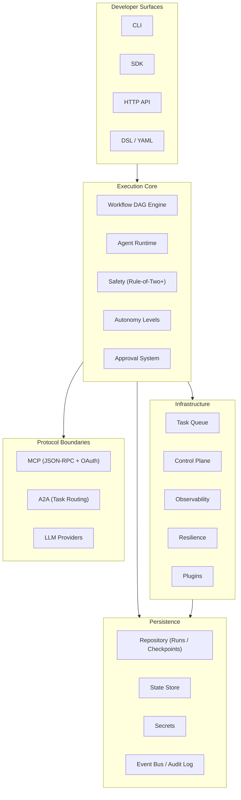

# Pylon


**Autonomous AI Agent Orchestration Platform**

## Overview

Pylon is a Python-first framework for building, executing, and governing multi-agent AI workflows. It compiles agent pipelines into deterministic DAGs with built-in safety enforcement (Rule-of-Two+), approval gates, and autonomy levels, giving teams control over what agents can do and when human oversight is required. Pylon ships with protocol adapters for MCP and A2A, a pluggable provider layer for LLMs, and reference implementations of infrastructure primitives (task queue, sandbox, secrets, tenancy) that can be swapped for production backends.

## Architecture



## Key Features

- **DAG Workflow Engine** -- Compiled graph execution with `ALL_RESOLVED` / `ANY` / `FIRST` join policies, patch-based state commits, node-scoped checkpoints, pause/resume, and deterministic replay with state hash verification.
- **Safety (Rule-of-Two+)** -- No execution frame may combine untrusted input, secret access, and external writes. Dynamic capability checks via `SafetyContext` and `ToolDescriptor`, plus a prompt guard pipeline.
- **Approval System** -- Plan/effect binding with drift detection, executor-integrated approval waits, and replayable approval context.
- **Autonomy Levels** -- Graduated autonomy ladder (A0--A4) controlling agent independence and required human oversight.
- **MCP Protocol** -- JSON-RPC server with OAuth 2.1 + PKCE scopes for tool integration.
- **A2A Protocol** -- Agent-to-agent task routing with peer delegation boundary checks.
- **Multi-Tenant Isolation** -- Tenant-scoped context, resource limits, and namespace separation.
- **Observability** -- Structured metrics, tracing hooks, and audit logging across all execution paths.
- **Resilience** -- Rate limiting, circuit breaker, retry policies, and bulkhead isolation.
- **Sandbox Policies** -- Configurable execution sandbox (Docker, process) with tool-level restrictions.
- **Versioned Secrets** -- Secret storage with scrubbing enforcement at safety boundaries.
- **Plugin System** -- Extensible plugin registry for custom agents, tools, and providers.
- **Task Queue & Scheduler** -- Wave-based dispatch planning over the compiled DAG for queued or distributed runners.

## Quick Start

```bash
pip install pylon-ai
```

Create a `pylon.yaml` in your project directory:

```yaml
version: "1"
name: my-project

agents:
  coder:
    model: anthropic/claude-sonnet-4-20250514
    role: "Write clean, tested code"
    autonomy: A2
    tools: [file-read, file-write]
    sandbox: docker

  reviewer:
    model: anthropic/claude-sonnet-4-20250514
    role: "Review code for quality and security"
    autonomy: A3
    tools: [file-read]

workflow:
  type: graph
  nodes:
    plan:
      agent: coder
      next: [review]
    review:
      agent: reviewer
      next:
        - target: plan
          condition: "state.needs_revision == True"
        - target: END

policy:
  max_cost_usd: 10.0
  max_duration: 60m
  require_approval_above: A3
```

Run the workflow:

```bash
pylon run
```

## Project Structure

```
src/pylon/
  agents/          # Agent lifecycle, registry, pool, supervisor
  api/             # Lightweight HTTP API server and middleware
  approval/        # Approval manager with plan/effect binding
  autonomy/        # Autonomy level definitions and gates
  cli/             # CLI commands (init, run, inspect, replay, ...)
  coding/          # Coding loop and code generation utilities
  config/          # Configuration loading and management
  control_plane/   # Control plane store (memory, JSON, SQLite backends)
  dsl/             # YAML/JSON workflow parser
  events/          # Event bus and audit log
  observability/   # Metrics, tracing, and structured logging
  plugins/         # Plugin registry and loader
  protocols/
    mcp/           # MCP JSON-RPC server with OAuth 2.1
    a2a/           # A2A task routing and peer delegation
  providers/       # LLM provider abstraction layer
  repository/      # Workflow runs, checkpoints, audit records
  resilience/      # Retry, circuit breaker, bulkhead
  resources/       # Rate limiting and resource pooling
  runtime/         # Shared runtime and dispatch planning
  safety/          # Rule-of-Two+, capability checks, prompt guard
  sandbox/         # Sandbox policy enforcement
  sdk/             # PylonClient SDK for programmatic use
  secrets/         # Versioned secret storage and scrubbing
  state/           # State store abstraction
  taskqueue/       # Task queue and scheduler wave planning
  tenancy/         # Multi-tenant context and isolation
  types.py         # Shared enums and dataclasses
  errors.py        # Error hierarchy
```

## Documentation

- [Architecture Overview](docs/architecture.md) -- Layered module structure
- [Runtime Flows](docs/architecture/runtime-flows.md) -- Execution paths for workflow, MCP, A2A, CLI, and approval
- [Module Map](docs/architecture/module-map.md) -- Package-by-package reference with maturity guide
- [Getting Started Guide](docs/getting-started.md) -- Installation, first project, programmatic API
- [API Reference](docs/api-reference.md) -- REST routes and middleware
- [Specification](docs/SPECIFICATION.md) -- Full technical specification
- [ADR Index](docs/adr/) -- Architecture decision records (001--009)
- [vNext Target Architecture](docs/architecture/pylon-vnext-target-architecture.md) -- Target three-layer runtime-centered architecture
- [vNext Implementation Plan](docs/architecture/pylon-vnext-implementation-plan.md) -- Ordered delivery plan for bounded autonomy
- [Production Readiness Plan](docs/architecture/production-readiness-implementation-plan.md) -- Moving from reference implementations to production backends

## Development

```bash
# Install with dev dependencies
pip install -e ".[dev]"

# Run tests
make test          # Unit tests
make test-all      # All tests

# Code quality
make lint          # ruff check src tests
make typecheck     # mypy src/pylon/
make format        # ruff format src tests
```

## Contributing

See [CONTRIBUTING.md](CONTRIBUTING.md) for guidelines.

## License

MIT
