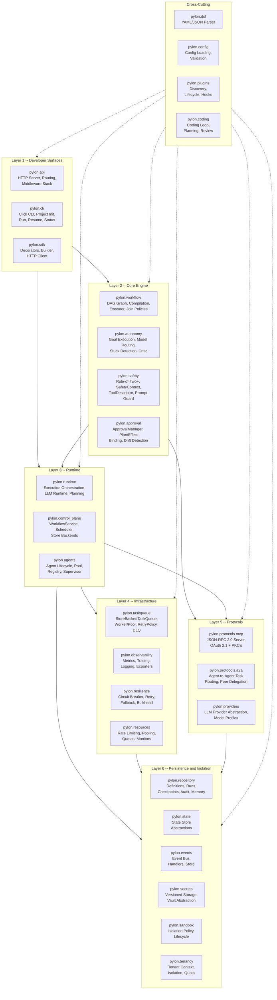
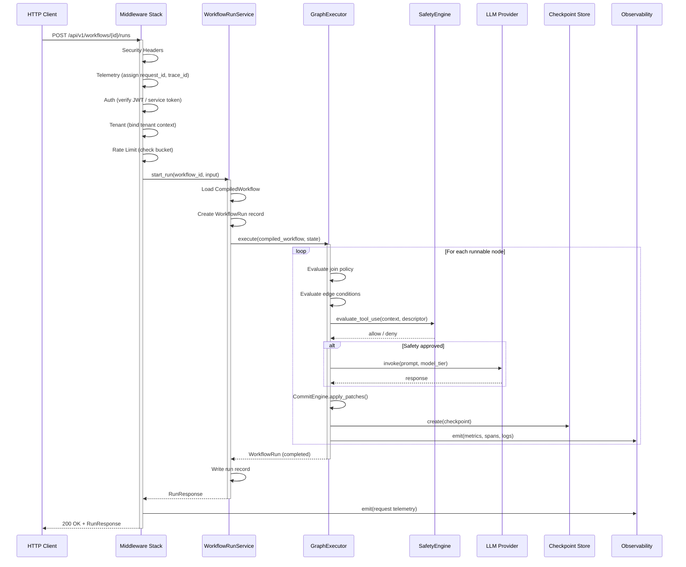
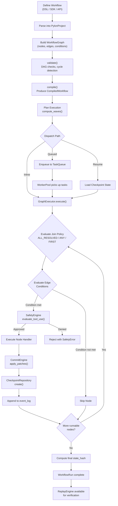
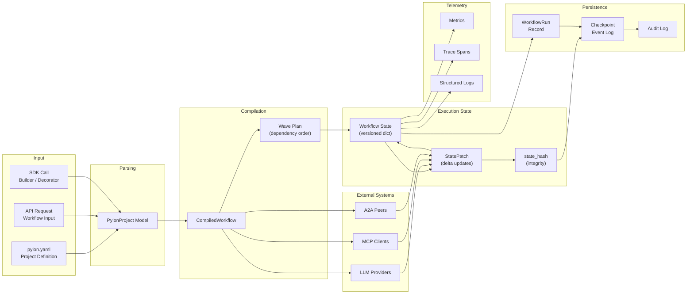

# Pylon Architecture

**Version:** 0.2.0
**Status:** Living document

Pylon is an Autonomous AI Agent Orchestration Platform built in Python. It provides a layered, modular architecture for defining, executing, and governing agent-driven workflows with deterministic replay, safety enforcement, and multi-protocol interoperability.

This document describes the system architecture across six layers, their interactions, and the data flows that connect them.

---

## Table of Contents

- [System Architecture Overview](#system-architecture-overview)
- [Layer 1 -- Developer Surfaces](#layer-1----developer-surfaces)
- [Layer 2 -- Core Engine](#layer-2----core-engine)
- [Layer 3 -- Runtime](#layer-3----runtime)
- [Layer 4 -- Infrastructure](#layer-4----infrastructure)
- [Layer 5 -- Protocols](#layer-5----protocols)
- [Layer 6 -- Persistence and Isolation](#layer-6----persistence-and-isolation)
- [Cross-Cutting Modules](#cross-cutting-modules)
- [Request Flow](#request-flow)
- [Workflow Execution Lifecycle](#workflow-execution-lifecycle)
- [Data Flow](#data-flow)
- [Safety Architecture](#safety-architecture)
- [Persistence and Replay Model](#persistence-and-replay-model)
- [Further Reading](#further-reading)

---

## System Architecture Overview

Pylon is organized into six horizontal layers. Each layer depends only on layers below it, with cross-cutting modules available to all layers.

---

## Layer 1 -- Developer Surfaces

Developer surfaces are the entry points through which users and external systems interact with Pylon.

### pylon.api

HTTP API server providing the primary programmatic interface.

| Component | Responsibility |
|-----------|---------------|
| Router | Route registration, path matching, handler dispatch |
| Auth Middleware | HS256/RS256 JWT verification, JWKS/OIDC discovery, service token validation |
| Rate-Limit Middleware | Pluggable bucket identity (tenant/principal/token), memory and Redis backends |
| Telemetry Middleware | Request/correlation/trace ID propagation, JSONL emission |
| Tenant Middleware | Tenant context binding from authenticated principal or header |
| Security Headers Middleware | Standard security response headers |
| RouteStore | API facade over the control-plane store contract |
| Factory | Assembles the middleware stack from configuration |

The API server exposes `/ready` and `/metrics` endpoints for operational visibility and projects request telemetry through the observability subsystem.

### pylon.cli

Click-based command-line interface for local development workflows.

| Command | Description |
|---------|-------------|
| `pylon init` | Scaffold a new project with `pylon.yaml` |
| `pylon run` | Load project, register in control-plane store, execute workflow |
| `pylon resume` | Resume a paused or approval-gated workflow run |
| `pylon status` | Query run state, execution summary, approval status |

Local state is persisted under `$PYLON_HOME` (default `~/.pylon`) using `JsonFileWorkflowControlPlaneStore`.

### pylon.sdk

Programmatic authoring and client library.

| Component | Responsibility |
|-----------|---------------|
| `@workflow` decorator | Declarative workflow definition from functions |
| `WorkflowBuilder` | Fluent builder pattern for graph construction |
| `PylonClient` | In-process embedded client |
| `PylonHTTPClient` | Remote HTTP client targeting the same API contract |

SDK-defined workflows materialize into `PylonProject` and execute on the same runtime as DSL and API workflows.

---

## Layer 2 -- Core Engine

The core engine provides workflow semantics, autonomous execution, safety enforcement, and approval governance.

### pylon.workflow

Deterministic DAG-based workflow execution engine.

| Component | Responsibility |
|-----------|---------------|
| `WorkflowGraph` | Node and edge definition, graph topology |
| `compile()` | DAG validation, cycle detection, produces `CompiledWorkflow` |
| `GraphExecutor` | Executes runnable nodes under join policies |
| `CommitEngine` | Applies `StatePatch` updates deterministically |
| `CheckpointRepository` | Stores node-scoped event logs |
| `ReplayEngine` | Reconstructs state, verifies `state_hash` integrity |

**Join Policies:**

- `ALL_RESOLVED` -- Wait for all upstream nodes to complete
- `ANY` -- Proceed when any single upstream completes
- `FIRST` -- Proceed on the first upstream result, discard others

**Determinism guarantees:**

- Graph topology is validated before execution
- Conditions are compiled from a restricted AST (no `eval`)
- Parallel writes to the same state key fail fast
- Join policies are explicit, never inferred

### pylon.autonomy

Goal-directed autonomous execution layer.

| Component | Responsibility |
|-----------|---------------|
| Goal Executor | Drives agent loops toward declared objectives |
| Model Router | Routes to LIGHTWEIGHT, STANDARD, or PREMIUM LLM tiers |
| Termination Conditions | Configurable stopping criteria (max steps, convergence, timeout) |
| Stuck Detection | Identifies loops and stalled progress |
| Critic | Evaluates intermediate outputs for quality |
| Verifier | Validates final results against goal criteria |

### pylon.safety

Capability-based safety enforcement implementing the Rule-of-Two+ principle.

**Rule-of-Two+** states that no single execution frame may combine all three of:

1. Untrusted input handling (`can_read_untrusted`)
2. Secret access (`can_access_secrets`)
3. External writes (`can_write_external`)

Additionally, the pair of untrusted input + secret access is forbidden in a single frame.

| Component | Responsibility |
|-----------|---------------|
| `SafetyContext` | Runtime context: data taint, effect scopes, secret scopes, delegation ancestry, approval token |
| `ToolDescriptor` | Declares dynamic effects of tool invocation |
| `CapabilityValidator` | Validates capability combinations at agent creation and tool grants |
| `SafetyEngine` | Evaluates tool use and delegation requests against policy |
| Prompt Guard Pipeline | Pre-dispatch validation of prompts and tool arguments |

**Enforcement points:**

1. Agent creation and dynamic tool grants
2. Workflow and autonomy approval checks
3. MCP `tools/call` request validation
4. A2A `tasks/send` and `tasks/sendSubscribe`
5. Router pre-dispatch validation hooks

### pylon.approval

Human-in-the-loop approval governance.

| Component | Responsibility |
|-----------|---------------|
| `ApprovalManager` | Manages approval lifecycle and state transitions |
| Plan/Effect Binding | Associates approval tokens with planned effects |
| Drift Detection | Detects divergence between approved plan and actual execution |
| A3+ Enforcement | Enforces approval for high-risk operations |

---

## Layer 3 -- Runtime

The runtime layer orchestrates execution, manages workflow lifecycle, and coordinates agent pools.

### pylon.runtime

Execution orchestration with three dispatch paths.

| Path | Description |
|------|-------------|
| Inline | Direct `GraphExecutor` invocation within the calling process |
| Queued | Wave-based dispatch through `StoreBackedTaskQueue` and `WorkerPool` |
| Resume | Reload checkpointed state and continue from last committed node |

| Component | Responsibility |
|-----------|---------------|
| LLM Runtime | Manages LLM invocation lifecycle, token accounting, streaming |
| Planning Module | Wave-based dispatch planning via `WorkflowScheduler.compute_waves()` |
| `QueuedWorkflowDispatchRunner` | Bridges `distributed_wave_plan` to queue/worker execution |

### pylon.control_plane

Workflow lifecycle management and scheduling.

| Component | Responsibility |
|-----------|---------------|
| `WorkflowRunService` | Start, resume, approve, reject, replay, list transitions |
| `WorkflowScheduler` | Computes dependency waves for dispatch planning |
| `InMemoryStore` | Ephemeral store for testing and embedded use |
| `JsonFileWorkflowControlPlaneStore` | Durable JSON-backed store for definitions, runs, checkpoints, approvals |
| `SQLiteWorkflowControlPlaneStore` | Relational backend with schema versioning, CAS, idempotency keys |
| `build_workflow_control_plane_store()` | Factory selecting `memory`, `json_file`, or `sqlite` backends |
| Registry | Workflow definition registration and lookup |

**Command vs Query separation:**

- Command side stores raw run records
- Query side derives `execution_summary`, `approval_summary`, and replay metadata
- All surfaces (CLI, API, SDK) read through the same query projection

### pylon.agents

Agent lifecycle and coordination.

| Component | Responsibility |
|-----------|---------------|
| Agent Lifecycle | Creation, initialization, execution, shutdown |
| Agent Pool | Concurrency-managed pool of active agents |
| Agent Registry | Type-based agent registration and lookup |
| Supervisor | Monitors agent health, restarts failed agents |

---

## Layer 4 -- Infrastructure

Infrastructure modules provide operational capabilities that support the runtime layer.

### pylon.taskqueue

Durable task queue with worker management.

| Component | Responsibility |
|-----------|---------------|
| `StoreBackedTaskQueue` | Priority queue with durable persistence |
| `Worker` / `WorkerPool` | Task consumers with concurrency control |
| `RetryPolicy` | Fixed interval and exponential backoff strategies |
| `DeadLetterQueue` | Captures tasks that exceed retry limits |

The task queue provides lease ownership and heartbeat recovery semantics for reliable execution.

### pylon.observability

Comprehensive operational telemetry.

| Component | Responsibility |
|-----------|---------------|
| `MetricsCollector` | Counter, gauge, histogram metric collection |
| `Tracer` / `Span` | Distributed tracing with span lifecycle |
| `StructuredLogger` | JSON-structured logging with context propagation |
| Console Exporter | Human-readable console output |
| JSONL Exporter | Durable structured telemetry files |
| Prometheus Exporter | Prometheus-compatible metrics rendering at `/metrics` |
| InMemory Exporter | Testing and inspection |

### pylon.resilience

Fault tolerance patterns.

| Component | Responsibility |
|-----------|---------------|
| Circuit Breaker | Fail-fast on repeated downstream failures |
| Retry | Configurable retry with backoff strategies |
| Fallback | Alternative execution paths on failure |
| Bulkhead | Concurrency isolation between workloads |

### pylon.resources

Resource governance.

| Component | Responsibility |
|-----------|---------------|
| Rate Limiter | Token bucket and sliding window rate limiting |
| Resource Pool | Managed pools for connections and handles |
| Quota Manager | Per-tenant resource quotas |
| Resource Monitor | Usage tracking and alerting |

---

## Layer 5 -- Protocols

Protocol modules define the external communication boundaries of the system.

### pylon.protocols.mcp

Model Context Protocol server implementing the JSON-RPC 2.0 specification.

| Component | Responsibility |
|-----------|---------------|
| JSON-RPC Router | Method routing and request/response lifecycle |
| Session Manager | Client session creation, tracking, expiration |
| OAuth 2.1 + PKCE | Scoped access control with proof key for code exchange |
| Tool Handler | Tool discovery, argument validation, invocation |
| Resource Handler | Resource listing and content retrieval |
| Prompt Handler | Prompt template management |
| Sampling Handler | LLM sampling delegation |

**Validation pipeline:**

1. DTO shape validation
2. Output-validator safety check on tool arguments
3. `SafetyEngine.evaluate_tool_use()` enforcement
4. Tool handler invocation

### pylon.protocols.a2a

Agent-to-Agent protocol for inter-agent task delegation.

| Component | Responsibility |
|-----------|---------------|
| Task Lifecycle | State machine for task creation, execution, completion, cancellation |
| Agent Cards | Agent capability advertisement and discovery |
| Peer Registry | Peer agent registration and allowlist management |
| Async Server | Handlers for send, get, cancel, push-notification |
| Rate Limiting | Per-peer request throttling |

**Delegation flow:**

1. Incoming task request received
2. Peer allowlist and authenticated sender checks
3. Rate-limit evaluation
4. Build or load sender `SafetyContext`
5. `SafetyEngine.evaluate_delegation()` enforcement
6. Accept task and transition lifecycle state

Remote metadata may contribute hints, but local policy remains authoritative.

### pylon.providers

LLM provider abstraction layer.

| Component | Responsibility |
|-----------|---------------|
| Provider Interface | Uniform API across LLM vendors |
| Model Profiles | Model capability metadata (context window, cost, latency) |
| Tier Routing | Maps LIGHTWEIGHT / STANDARD / PREMIUM to concrete models |

---

## Layer 6 -- Persistence and Isolation

Persistence and isolation modules manage state, secrets, events, and execution boundaries.

### pylon.repository

Workflow and operational data persistence.

| Repository | Responsibility |
|------------|---------------|
| Workflow Definitions | Stores compiled workflow definitions |
| Workflow Runs | Persists run records with status, state, and version tracking |
| Checkpoints | Node-scoped event logs with state hashes |
| Audit Logs | Immutable records of security-relevant operations |
| Memory | Agent memory persistence and retrieval |

### pylon.state

State store abstractions.

| Component | Responsibility |
|-----------|---------------|
| Key-Value Store | Generic typed state storage |
| State Machine | Finite state machine with transition validation |
| Snapshots | Point-in-time state capture |
| Diffs | State comparison and delta computation |

### pylon.events

Event-driven communication.

| Component | Responsibility |
|-----------|---------------|
| Event Bus | In-memory publish/subscribe with topic routing |
| Event Handlers | Typed handler registration and dispatch |
| Event Store | Event persistence and replay |
| Dead Letters | Captures undeliverable events |

### pylon.secrets

Secret management.

| Component | Responsibility |
|-----------|---------------|
| Versioned Store | Secret storage with version history |
| Vault Abstraction | Pluggable backend protocol (in-memory reference, external vault) |
| Audit | Secret access logging |
| Rotation | Secret rotation lifecycle helpers |

### pylon.sandbox

Execution isolation.

| Component | Responsibility |
|-----------|---------------|
| Sandbox Manager | Sandbox creation, lifecycle, teardown |
| Isolation Policy | Resource and network constraint definitions |
| Executor | Sandboxed code execution |
| Registry | Sandbox type registration |

Note: The current implementation provides an in-memory manager with a policy model. Concrete gVisor and Firecracker runtime integrations are planned but not yet implemented.

### pylon.tenancy

Multi-tenant isolation.

| Component | Responsibility |
|-----------|---------------|
| Tenant Context | Request-scoped tenant identity propagation |
| Isolation Manager | Cross-tenant data isolation enforcement |
| Quota Manager | Per-tenant resource quota tracking and enforcement |
| Lifecycle Manager | Tenant provisioning and deprovisioning |

---

## Cross-Cutting Modules

These modules are available to all layers and do not belong to a single tier.

### pylon.dsl

Project definition parser.

- Parses `pylon.yaml` and JSON project definitions into `PylonProject` models
- Validates project structure, node references, and edge connectivity

### pylon.config

Configuration management.

- Hierarchical configuration loading (defaults, file, environment, runtime)
- Schema validation for all configuration sections
- Configuration registry for dynamic access

### pylon.plugins

Plugin system.

- File-system and entry-point based plugin discovery
- Plugin manifests with dependency declarations
- Lifecycle management (load, initialize, start, stop, unload)
- Hook system for extension points across all layers

### pylon.coding

AI-assisted coding workflows.

- Coding loop orchestration (plan, implement, review, commit)
- Planning phase with task decomposition
- Code review with safety and quality checks
- Commit integration with version control

---

## Request Flow

The following diagram traces a workflow execution request from an HTTP client through the full middleware and execution stack.

---

## Workflow Execution Lifecycle

This diagram shows the complete lifecycle of a workflow from definition through execution and checkpointing.

---

## Data Flow

This diagram shows how state and data flow through the system during a workflow execution.

---

## Safety Architecture

### Static Capability Envelope

`AgentCapability` declares three dangerous capabilities:

| Capability | Description |
|------------|-------------|
| `can_read_untrusted` | Agent may process untrusted external input |
| `can_access_secrets` | Agent may access secrets or credentials |
| `can_write_external` | Agent may write to external systems |

**Rule-of-Two+ forbids:**

- All three capabilities in a single execution frame
- The pair `can_read_untrusted` + `can_access_secrets` in a single frame

### Runtime Safety Context

Static capabilities alone are not sufficient. `SafetyContext` provides runtime state:

| Field | Purpose |
|-------|---------|
| Data Taint | Tracks whether current data originates from untrusted sources |
| Effect Scopes | Constrains which external effects are permitted |
| Secret Scopes | Constrains which secrets are accessible |
| Delegation Ancestry | Records the chain of agents that delegated the current task |
| Approval Token | References human approval for elevated operations |

`ToolDescriptor` declares the dynamic effects of each tool:

| Field | Purpose |
|-------|---------|
| Untrusted Input | Whether the tool processes untrusted input |
| Secret Access | Whether the tool requires secret access |
| External Writes | Whether the tool performs external writes |
| Effect Scopes | Which external systems are affected |
| Secret Scopes | Which secrets are accessed |
| Approval Required | Whether human approval is required |

### Enforcement Pipeline

Safety evaluation occurs before any handler invocation:

1. **Agent creation** -- `CapabilityValidator` checks capability combinations
2. **Tool grants** -- Dynamic capability additions are validated
3. **Workflow execution** -- Approval checks before node execution
4. **MCP tool calls** -- DTO validation, output-validator check, `SafetyEngine` evaluation
5. **A2A delegation** -- Peer authentication, sender context derivation, delegation evaluation

---

## Persistence and Replay Model

### Event Log Structure

Workflow persistence is event-log oriented. Each `WorkflowRun` maintains:

| Field | Purpose |
|-------|---------|
| `status` | Current run lifecycle state |
| `state` | Versioned state dictionary |
| `state_version` | Monotonically increasing version counter |
| `state_hash` | SHA-256 hash of the current state for integrity verification |
| `event_log[]` | Ordered sequence of checkpoint events |

### Checkpoint Event Record

Each checkpoint captures a complete node execution record:

| Field | Description |
|-------|-------------|
| `seq` | Sequence number within the run |
| `attempt_id` | Unique attempt identifier for retry tracking |
| `node_id` | The executed node |
| `input` / `input_state_version` / `input_state_hash` | Input state snapshot |
| `state_patch` | Delta applied to state |
| `edge_decisions` | Which outgoing edges were activated |
| `llm_events` | LLM invocations and responses |
| `tool_events` | Tool calls and results |
| `artifacts` | Produced artifacts |
| `metrics` | Node-level execution metrics |
| `state_version` / `state_hash` | Post-execution state snapshot |

### Replay

`ReplayEngine` reconstructs state by replaying the event log from the beginning, recomputing state hashes at each step. A hash mismatch raises an integrity violation, indicating that either the events or the replay logic are inconsistent.

Persisted metadata is secret-scrubbed before storage.

---

## Further Reading

- [Runtime Flows](architecture/runtime-flows.md)
- [Module Map](architecture/module-map.md)
- [Production Readiness Plan](architecture/production-readiness-implementation-plan.md)
- [Workflow/Safety Implementation Plan](architecture/workflow-safety-implementation-plan.md)
- [Pylon vNext Target Architecture](architecture/pylon-vnext-target-architecture.md)
- [Pylon vNext Type Design](architecture/pylon-vnext-type-design.md)
- [Pylon vNext Implementation Plan](architecture/pylon-vnext-implementation-plan.md)
- [ADR-009: Runtime-Centered Bounded Autonomy](adr/009-runtime-centered-bounded-autonomy.md)
