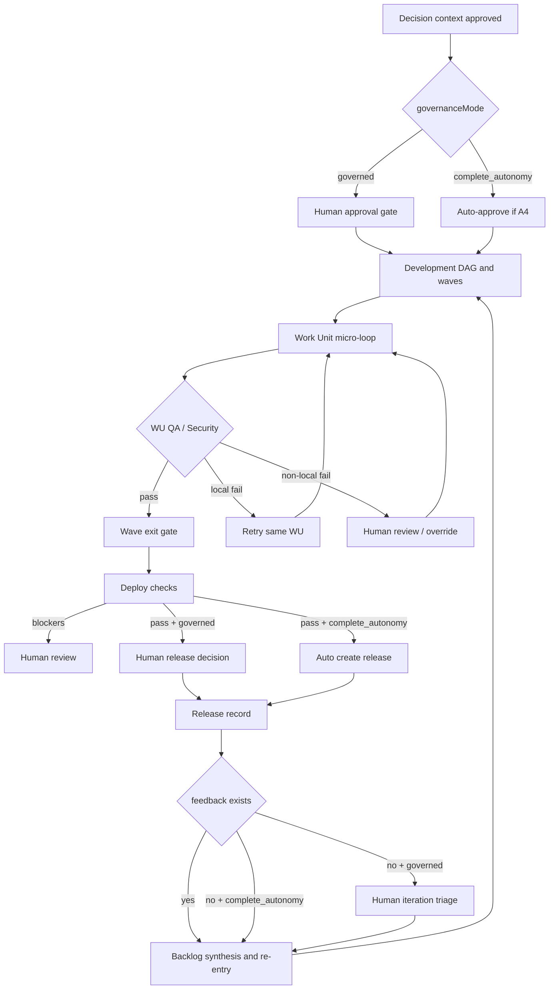

# Lifecycle Governance Modes

Pylon の lifecycle は、`orchestrationMode` と `governanceMode` を分離して扱う。

- `orchestrationMode`: 誰が次の executable step を起動するか
- `governanceMode`: どの判断を human gate として残すか

この分離により、`自律実行の速さ` と `人間の責任ある意思決定` を同時に成立させる。

## Modes

| Mode | Intent | Human gate |
| --- | --- | --- |
| `governed` | 組織の判断責任を保ちつつ自律開発を最大化する | approval, release promotion, iteration triage は人が確定 |
| `complete_autonomy` | 自律 delivery を最大化し、人は override / hold / rework request を随時入れる | 必須 gate は減らし、operator は override 役になる |

## Phase Policy

| Phase | Execution policy | Human role |
| --- | --- | --- |
| research | auto with human override | 問いの切り直し、conditional handoff、停止判断 |
| planning | auto with human override | scope trim、milestone reorder、risk acceptance |
| design | auto with human override | baseline selection、rework request、tradeoff acceptance |
| approval | governed では human required | approve / request changes / reject |
| development | autonomous WU micro-loop | 非局所 block、security block、manual fix の判断 |
| deploy | governed では human required | approve release / hold / request fix |
| iterate | governed では human prioritization | feedback triage、next iteration scope 決定 |

## Continuous Agile Loop

`iterate` は単発の終点ではなく、release 後も backlog synthesis と re-entry を続ける。

- human feedback はいつでも追加できる
- governed mode では backlog の commit を人が確定する
- complete autonomy では backlog synthesis を継続し、人は優先順位を上書きできる
- development は feedback を受けて WU / wave を再構成し、局所 retry から再開する

## Flow

## Operating Principle

- human gate は「自律が弱いから残す」のではなく、「責任境界として残す」
- human review は phase 全体差し戻しではなく、可能な限り wave / work unit に局所化する
- operator はいつでも edit / hold / request changes を行える
- complete autonomy でも human override は常に許可する
