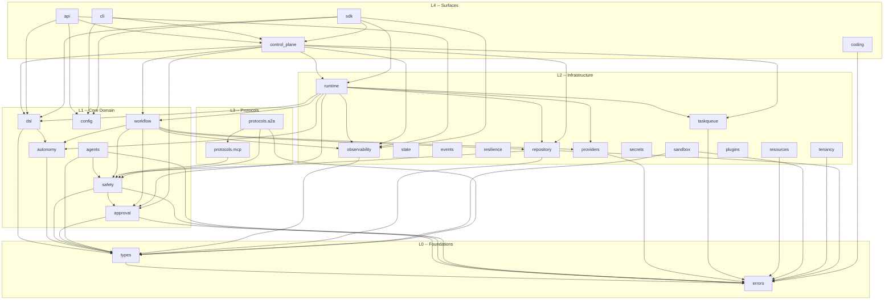

# Module Map

Comprehensive reference for all packages under `src/pylon/`. Each entry documents the package purpose, key exports, internal modules, and dependencies on other Pylon packages.

**Version:** 0.2.0 | **Total packages:** 32 (including sub-packages)

---

## Layer Overview

Pylon is organized into five architectural layers. Lower layers have no upward dependencies.

| Layer | Packages |
|-------|----------|
| **L0 -- Foundations** | `types`, `errors` |
| **L1 -- Core Domain** | `dsl`, `config`, `workflow`, `autonomy`, `safety`, `approval`, `agents` |
| **L2 -- Infrastructure** | `providers`, `runtime`, `repository`, `state`, `events`, `taskqueue`, `resilience`, `resources`, `sandbox`, `secrets`, `tenancy`, `observability`, `plugins` |
| **L3 -- Protocols** | `protocols.mcp`, `protocols.a2a` |
| **L4 -- Surfaces** | `control_plane`, `api`, `cli`, `sdk`, `coding`, `memory` |

---

## L0 -- Foundations

### `pylon.types`

Shared enums, dataclasses, and domain primitives used across the entire codebase.

| Module | Key Exports |
|--------|-------------|
| `types.py` | `RunStatus`, `RunStopReason`, `AutonomyLevel`, `AgentState`, `TrustLevel`, `SandboxTier`, `AgentCapability`, `AgentConfig`, `PolicyConfig`, `SafetyConfig`, `WorkflowConfig`, `WorkflowNode`, `WorkflowNodeType`, `WorkflowJoinPolicy`, `ConditionalEdge`, `KillSwitchEvent`, `EventLogEntry` |

**Dependencies:** `pylon.errors`

---

### `pylon.errors`

Structured error hierarchy with machine-readable codes, HTTP status codes, and process exit codes.

| Module | Key Exports |
|--------|-------------|
| `errors.py` | `PylonError`, `ConfigError`, `PolicyViolationError`, `AgentLifecycleError`, `WorkflowError`, `SandboxError`, `ProviderError`, `PromptInjectionError`, `ApprovalRequiredError`, `ConcurrencyError`, `ExitCode`, `ErrorSpec`, `ERROR_REGISTRY`, `resolve_error`, `resolve_exit_code` |

**Dependencies:** None (leaf package)

---

## L1 -- Core Domain

### `pylon.dsl`

YAML/JSON project definition parser and validator. Turns `pylon.yaml` files into typed project models.

| Module | Key Exports |
|--------|-------------|
| `parser.py` | `PylonProject`, `load_project` |

The `PylonProject` dataclass contains `AgentDef`, `WorkflowDef`, `WorkflowNodeDef`, and policy sections parsed from the DSL file.

**Dependencies:** `pylon.types`, `pylon.autonomy`

---

### `pylon.config`

Configuration loading, validation, and registry. Provides a multi-stage validation pipeline for project definitions.

| Module | Key Exports |
|--------|-------------|
| `pipeline.py` | `ValidationPipeline`, `ValidationContext`, `ValidationIssue`, `PipelineResult`, `build_validation_report`, `validate_project_definition` |
| `loader.py` | Configuration file loading |
| `registry.py` | `ConfigRegistry` |
| `resolver.py` | Environment and reference resolution |
| `validator.py` | Schema validation rules |

**Dependencies:** `pylon.dsl`, `pylon.api`

---

### `pylon.workflow`

Compiled DAG execution engine. Builds, compiles, executes, and replays workflow graphs with deterministic state management.

| Module | Key Exports |
|--------|-------------|
| `graph.py` | `WorkflowGraph`, `END` |
| `compiled.py` | `CompiledWorkflow`, `CompiledNode`, `CompiledEdge` |
| `executor.py` | `GraphExecutor` |
| `conditions.py` | `CompiledCondition`, `compile_condition`, `safe_eval_condition` |
| `commit.py` | `CommitEngine`, `CommitResult` |
| `replay.py` | `ReplayEngine`, `ReplayResult` |
| `result.py` | `NodeResult` |
| `state.py` | `StatePatch`, `compute_state_hash` |

**Dependencies:** `pylon.types`, `pylon.errors`, `pylon.approval`, `pylon.autonomy`, `pylon.providers`, `pylon.repository`, `pylon.safety`, `pylon.observability`

---

### `pylon.autonomy`

Goal-directed execution: critics, verifiers, model routing, and termination conditions for bounded autonomous runs.

| Module | Key Exports |
|--------|-------------|
| `context.py` | `AutonomyContext` |
| `evaluation.py` | `Critic`, `Verifier`, `EvaluationResult`, `EvaluationKind`, `VerificationDecision`, `VerificationDisposition` |
| `goals.py` | `GoalSpec`, `GoalConstraints`, `SuccessCriterion`, `FailurePolicy`, `RefinementPolicy`, `RunCompletionPolicy` |
| `routing.py` | `ModelRouter`, `ModelRouteDecision`, `ModelRouteRequest`, `ModelProfile`, `ModelTier`, `CacheStrategy`, `DEFAULT_MODEL_PROFILES` |
| `termination.py` | `TerminationCondition`, `TerminationDecision`, `TerminationState`, `StuckDetector`, `MaxIterations`, `Timeout`, `TokenBudget`, `CostBudget`, `QualityThreshold`, `ExternalStop`, `AnyTermination`, `AllTermination` |

**Dependencies:** `pylon.types`, `pylon.providers`

---

### `pylon.safety`

Security enforcement: Rule-of-Two+ capability validation, autonomy ladder enforcement, prompt guard, input sanitization, output validation, and kill switch.

| Module | Key Exports |
|--------|-------------|
| `capability.py` | `CapabilityValidator` |
| `autonomy.py` | `AutonomyEnforcer` |
| `kill_switch.py` | `KillSwitch` |
| `context.py` | `SafetyContext` |
| `engine.py` | `SafetyEngine` |
| `tools.py` | `ToolDescriptor` |
| `prompt_guard.py` | Prompt injection detection |
| `input_sanitizer.py` | Input sanitization pipeline |
| `output_validator.py` | Output validation rules |
| `scrubber.py` | Secret scrubbing from outputs |
| `policy.py` | Policy evaluation engine |

**Dependencies:** `pylon.types`, `pylon.errors`, `pylon.approval`

---

### `pylon.approval`

Human-in-the-loop approval workflow for actions at autonomy level A3 and above.

| Module | Key Exports |
|--------|-------------|
| `types.py` | `ApprovalRequest`, `ApprovalDecision`, `ApprovalStatus` |
| `store.py` | `ApprovalStore` |
| `manager.py` | `ApprovalManager` |

**Dependencies:** `pylon.types`, `pylon.errors`, `pylon.repository`

---

### `pylon.agents`

Agent lifecycle management: instantiation, state machine transitions, pooling with auto-scaling, health-check supervision, and registry.

| Module | Key Exports |
|--------|-------------|
| `runtime.py` | `Agent` dataclass with lifecycle FSM |
| `lifecycle.py` | `AgentLifecycleManager` |
| `pool.py` | `AgentPool` |
| `supervisor.py` | `AgentSupervisor` |
| `registry.py` | `AgentRegistry` |

**Dependencies:** `pylon.types`, `pylon.errors`, `pylon.safety`

---

## L2 -- Infrastructure

### `pylon.providers`

LLM provider abstraction layer. Defines the provider protocol and ships an Anthropic Claude implementation.

| Module | Key Exports |
|--------|-------------|
| `base.py` | `Provider` protocol, `ProviderConfig` |
| `anthropic.py` | `AnthropicProvider` |

**Dependencies:** `pylon.errors`

---

### `pylon.runtime`

Compiled workflow execution engine: project compilation, dispatch planning, execution, serialization, and queued execution.

| Module | Key Exports |
|--------|-------------|
| `execution.py` | `ExecutionArtifacts`, `compile_project_graph`, `execute_project_sync`, `execute_single_node_sync`, `resume_project_sync`, `serialize_run`, `deserialize_run`, `normalize_runtime_input` |
| `llm.py` | `LLMRuntime`, `ProviderRegistry`, `ModelPricing` |
| `planning.py` | `WorkflowDispatchPlan`, `WorkflowDispatchTask`, `build_dispatch_plan`, `plan_project_dispatch` |
| `queued_runner.py` | `QueuedWorkflowDispatchRunner`, `QueuedDispatchRun`, `QueuedDispatchStep` |
| `context.py` | `ExecutionContext` |

**Dependencies:** `pylon.types`, `pylon.dsl`, `pylon.workflow`, `pylon.autonomy`, `pylon.approval`, `pylon.providers`, `pylon.repository`, `pylon.observability`, `pylon.taskqueue`, `pylon.control_plane`

---

### `pylon.repository`

Persistence interfaces for workflow definitions, runs, checkpoints, and audit logs. Follows the Repository pattern with read/write separation.

| Module | Key Exports |
|--------|-------------|
| `base.py` | `Repository`, `ReadRepository`, `WriteRepository`, `SearchableRepository` |
| `workflow.py` | `WorkflowDefinitionRepository`, `WorkflowRunRepository` |
| `checkpoint.py` | `CheckpointRepository` |
| `audit.py` | `AuditRepository` |
| `memory.py` | Memory persistence |

**Dependencies:** `pylon.types`, `pylon.errors`, `pylon.safety`

---

### `pylon.state`

Generic state management utilities: state stores, finite state machines, snapshots with rollback, and state diffing.

| Module | Key Exports |
|--------|-------------|
| `store.py` | `StateStore`, `StateOp`, `StateOpType` |
| `machine.py` | `StateMachine`, `StateMachineConfig`, `TransitionRecord`, `InvalidTransitionError`, `StateNotFoundError` |
| `snapshot.py` | `SnapshotManager`, `Snapshot`, `SnapshotMeta` |
| `diff.py` | `compute_diff`, `apply_diff`, `DiffEntry`, `DiffOp` |

**Dependencies:** None (leaf package)

---

### `pylon.events`

In-process event bus and message broker layer for decoupled communication between subsystems.

| Module | Key Exports |
|--------|-------------|
| `types.py` | Event type definitions |
| `bus.py` | `EventBus` |
| `handlers.py` | `EventHandler` base class |
| `store.py` | Event persistence |

**Dependencies:** None (leaf package)

---

### `pylon.taskqueue`

Priority task queue with worker pools, retry policies, dead letter queues, and store-backed persistence.

| Module | Key Exports |
|--------|-------------|
| `queue.py` | `TaskQueue`, `Task`, `TaskStatus`, `TaskQueueError` |
| `worker.py` | `Worker`, `WorkerPool`, `TaskResult`, `WorkerStatus`, `WorkerError` |
| `retry.py` | `RetryPolicy`, `ExponentialBackoff`, `FixedRetry`, `DeadLetterQueue` |
| `store_queue.py` | `StoreBackedTaskQueue`, `TaskQueueStore` |

**Dependencies:** `pylon.errors`

---

### `pylon.resilience`

Fault tolerance primitives: circuit breakers, retry with backoff strategies, fallback chains, and bulkheads for concurrency isolation.

| Module | Key Exports |
|--------|-------------|
| `circuit_breaker.py` | `CircuitBreaker`, `CircuitBreakerConfig`, `CircuitState`, `CircuitMetrics`, `CircuitOpenError` |
| `retry.py` | `RetryPolicy`, `retry`, `with_retry`, `ExponentialBackoff`, `LinearBackoff`, `ConstantBackoff`, `JitteredBackoff`, `RetryExhaustedError` |
| `fallback.py` | `FallbackChain`, `FallbackResult`, `CachedFallback`, `AllFallbacksFailedError` |
| `bulkhead.py` | `Bulkhead`, `AsyncBulkhead`, `BulkheadStats`, `BulkheadFullError` |

**Dependencies:** None (leaf package)

---

### `pylon.resources`

Resource management: rate limiting, quota enforcement, resource pooling, and monitoring with alerting.

| Module | Key Exports |
|--------|-------------|
| `limiter.py` | `RateLimiter` (TokenBucket, SlidingWindow) |
| `quota.py` | `QuotaManager` |
| `pool.py` | `ResourcePool` |
| `monitor.py` | Resource monitoring and alerting |

**Dependencies:** `pylon.errors`

---

### `pylon.sandbox`

Execution isolation layer supporting multiple sandbox tiers (gVisor, Firecracker, Docker, host).

| Module | Key Exports |
|--------|-------------|
| `manager.py` | `SandboxManager` |
| `policy.py` | `SandboxPolicy` |
| `executor.py` | Sandboxed execution runtime |
| `registry.py` | Sandbox backend registry |

**Dependencies:** `pylon.types`, `pylon.errors`

---

### `pylon.secrets`

Secret storage, rotation, and audit logging with pluggable vault backends.

| Module | Key Exports |
|--------|-------------|
| `manager.py` | `SecretStore` |
| `vault.py` | Vault backend integration |
| `rotation.py` | Secret rotation policies |
| `audit.py` | Secret access audit logging |

**Dependencies:** None (leaf package)

---

### `pylon.tenancy`

Multi-tenant isolation: tenant context propagation, resource isolation, lifecycle management, quota enforcement, and configuration per tier.

| Module | Key Exports |
|--------|-------------|
| `context.py` | `TenantContext`, `set_tenant`, `get_tenant`, `require_tenant`, `clear_tenant`, `tenant_scope`, `async_tenant_scope`, `run_in_tenant_context`, `serialize_tenant_context`, `deserialize_tenant_context`, `TenantNotSetError` |
| `config.py` | `TenantConfig`, `TenantLimits`, `TenantTier`, `ConfigStore`, `get_tier_defaults`, `resolve_feature_flags`, `resolve_policies` |
| `isolation.py` | `TenantIsolation`, `IsolationLevel`, `ResourceType`, `ResourceOwnership`, `AuditEntry`, `CrossTenantAccessError` |
| `lifecycle.py` | `TenantLifecycleManager`, `Tenant`, `TenantStatus`, `TenantAlreadyExistsError`, `TenantNotFoundError`, `TenantStatusError` |
| `quota.py` | `QuotaManager`, `TenantQuota`, `TenantUsage`, `QuotaReport`, `QuotaResource`, `QuotaExceededError` |

**Dependencies:** `pylon.errors`

---

### `pylon.observability`

Telemetry subsystem: metrics collection, distributed tracing, structured logging, and exporters (Console, JSONL, Prometheus, in-memory).

| Module | Key Exports |
|--------|-------------|
| `metrics.py` | `MetricsCollector` |
| `tracing.py` | `Tracer`, `Span` |
| `logging.py` | `StructuredLogger`, `LogLevel` |
| `exporters.py` | `ExporterProtocol`, `ConsoleExporter`, `InMemoryExporter`, `JSONLinesExporter`, `PrometheusExporter`, `ExporterLogSink` |
| `run_record.py` | `build_run_record`, `rebuild_run_record` |
| `query_service.py` | `build_run_query_payload`, `build_replay_query_payload` |
| `execution_summary.py` | `build_execution_summary` |

**Dependencies:** `pylon.types`

---

### `pylon.plugins`

Plugin system: manifest-driven discovery, lifecycle management, hook system, and SDK for building provider, policy, sandbox, and tool plugins.

| Module | Key Exports |
|--------|-------------|
| `types.py` | `PluginManifest`, `PluginInfo`, `PluginConfig`, `PluginState`, `PluginType`, `PluginCapability` |
| `loader.py` | `PluginLoader`, `Plugin`, `BasePlugin` |
| `registry.py` | `PluginRegistry` |
| `lifecycle.py` | `PluginLifecycleManager` |
| `hooks.py` | `HookSystem` |
| `sdk.py` | `plugin` decorator, `validate_config`, `LLMProviderPlugin`, `PolicyPlugin`, `SandboxPlugin`, `ToolProviderPlugin` |

**Dependencies:** None (leaf package)

---

## L3 -- Protocols

### `pylon.protocols.mcp`

Model Context Protocol implementation: JSON-RPC 2.0 transport, OAuth 2.1 with PKCE, session management, tool/resource/prompt registration, and method routing.

| Module | Key Exports |
|--------|-------------|
| `types.py` | `JsonRpcRequest`, `JsonRpcResponse`, `JsonRpcError`, `ToolDefinition`, `ResourceDefinition`, `PromptDefinition`, `ServerCapabilities`, `ClientCapabilities`, `InitializeResult`, JSON-RPC error codes |
| `server.py` | `McpServer` |
| `client.py` | `McpClient` |
| `router.py` | `MethodRouter`, `route` decorator |
| `auth.py` | `OAuthProvider`, `OAuthClientConfig`, `OAuthServerConfig`, `PKCEChallenge`, `AuthorizationCode`, `TokenResponse` |
| `session.py` | `McpSession`, `SessionManager` |
| `dto.py` | Data transfer objects |

**Dependencies:** `pylon.safety`

---

### `pylon.protocols.a2a`

Agent-to-Agent protocol: peer delegation, task routing, agent cards, and streaming support.

| Module | Key Exports |
|--------|-------------|
| `types.py` | A2A type definitions |
| `server.py` | A2A task server |
| `client.py` | A2A client |
| `dto.py` | Data transfer objects |
| `card.py` | Agent card definitions |

**Dependencies:** `pylon.types`, `pylon.safety`, `pylon.protocols.mcp`

---

## L4 -- Surfaces

### `pylon.control_plane`

Service layer orchestrating workflow lifecycle: run management, scheduling, persistence backends, and adapter layers for approval and audit.

| Module | Key Exports |
|--------|-------------|
| `workflow_service.py` | `WorkflowRunService`, `WorkflowControlPlaneStore` (protocol) |
| `factory.py` | `build_workflow_control_plane_store`, `ControlPlaneBackend`, `ControlPlaneStoreConfig` |
| `in_memory_store.py` | `InMemoryWorkflowControlPlaneStore` |
| `file_store.py` | `JsonFileWorkflowControlPlaneStore` |
| `sqlite_store.py` | `SQLiteWorkflowControlPlaneStore` |
| `adapters.py` | `StoreBackedApprovalStore`, `StoreBackedAuditRepository` |
| `registry/tools.py` | Tool registration and discovery |
| `registry/skills.py` | Skill composition and dependency resolution |
| `scheduler/` | `WorkflowScheduler` |
| `tenant/` | Tenant management and quota enforcement |

**Dependencies:** `pylon.types`, `pylon.errors`, `pylon.dsl`, `pylon.approval`, `pylon.repository`, `pylon.runtime`, `pylon.workflow`, `pylon.taskqueue`, `pylon.observability`

---

### `pylon.api`

HTTP API server with middleware chain: authentication, rate limiting, request context, tenant resolution, and observability integration.

| Module | Key Exports |
|--------|-------------|
| `server.py` | `APIServer` |
| `http_server.py` | `PylonHTTPServer`, `create_http_server` |
| `factory.py` | `build_api_server`, `build_http_api_server`, `build_middleware_chain`, `APIServerConfig`, `APIMiddlewareConfig`, `APIObservabilityConfig` |
| `routes.py` | Route definitions |
| `schemas.py` | Request/Response schemas |
| `middleware.py` | `JWTTokenVerifier`, `JWKSTokenVerifier`, `RedisRateLimitStore`, `RateLimitBucketScope` |
| `authz.py` | Authorization rules |
| `health.py` | Health check endpoints |
| `observability.py` | API telemetry integration |

**Dependencies:** `pylon.errors`, `pylon.dsl`, `pylon.config`, `pylon.control_plane`, `pylon.observability`

---

### `pylon.cli`

Command-line interface built on Click. Provides commands for project initialization, workflow execution, agent management, approval, replay, inspection, and diagnostics.

| Module | Key Exports |
|--------|-------------|
| `main.py` | CLI entry point (Click group) |
| `state.py` | Persisted local CLI state |
| `output.py` | Output formatting |
| `errors.py` | CLI-specific error handling |
| `commands/run.py` | `pylon run` |
| `commands/init_cmd.py` | `pylon init` |
| `commands/agent.py` | `pylon agent` |
| `commands/approve.py` | `pylon approve` |
| `commands/replay.py` | `pylon replay` |
| `commands/inspect_cmd.py` | `pylon inspect` |
| `commands/logs.py` | `pylon logs` |
| `commands/dev.py` | `pylon dev` |
| `commands/doctor.py` | `pylon doctor` |
| `commands/login.py` | `pylon login` |
| `commands/sandbox.py` | `pylon sandbox` |
| `commands/config_cmd.py` | `pylon config` |

**Dependencies:** `pylon.errors`, `pylon.config`, `pylon.control_plane`

---

### `pylon.sdk`

Developer SDK: HTTP client, programmatic workflow builder, Python decorators for defining agents/tools/workflows, and project materialization.

| Module | Key Exports |
|--------|-------------|
| `client.py` | `PylonClient` (in-process client) |
| `http_client.py` | `PylonHTTPClient` (remote HTTP client) |
| `builder.py` | `WorkflowBuilder` (fluent API) |
| `decorators.py` | `@agent`, `@workflow`, `@tool` decorators, `AgentRegistry`, `ToolRegistry` |
| `config.py` | `SDKConfig` |
| `project.py` | `materialize_workflow_definition`, `workflow_graph_to_project` |

**Dependencies:** `pylon.types`, `pylon.dsl`, `pylon.config`, `pylon.runtime`, `pylon.control_plane`, `pylon.observability`

---

### `pylon.coding`

Autonomous coding loop: task planning, code generation, review with quality gates, and git commit support with secret detection.

| Module | Key Exports |
|--------|-------------|
| `loop.py` | `CodingLoop`, `CodingLoopConfig`, `LoopResult`, `LoopState` |
| `planner.py` | `TaskPlanner`, `Plan`, `PlanStep`, `FileAction`, `CodingComplexity`, `HierarchyPolicy` |
| `reviewer.py` | `CodeReviewer`, `ReviewResult`, `ReviewComment`, `Severity`, `QualityGateConfig` |
| `committer.py` | `GitCommitter`, `CommitPlan`, `SecretPattern` |

**Dependencies:** `pylon.errors`

---

### `pylon.memory`

Memory subsystem for agent knowledge persistence and retrieval. Package directory exists but module contents are defined through the repository layer.

**Dependencies:** See `pylon.repository`

---

## Dependency Graph

---

## Package Index (alphabetical)

| # | Package | Purpose | Layer |
|---|---------|---------|-------|
| 1 | `pylon.agents` | Agent lifecycle, pooling, supervision | L1 |
| 2 | `pylon.api` | HTTP API server and middleware | L4 |
| 3 | `pylon.approval` | Human-in-the-loop approval workflow | L1 |
| 4 | `pylon.autonomy` | Goal-directed execution and model routing | L1 |
| 5 | `pylon.cli` | Command-line interface | L4 |
| 6 | `pylon.coding` | Autonomous coding loop | L4 |
| 7 | `pylon.config` | Configuration validation pipeline | L1 |
| 8 | `pylon.control_plane` | Workflow service and persistence backends | L4 |
| 9 | `pylon.dsl` | YAML/JSON project parser | L1 |
| 10 | `pylon.errors` | Error hierarchy and exit codes | L0 |
| 11 | `pylon.events` | Event bus and message broker | L2 |
| 12 | `pylon.memory` | Agent memory subsystem | L4 |
| 13 | `pylon.observability` | Metrics, tracing, logging, exporters | L2 |
| 14 | `pylon.plugins` | Plugin manifest, lifecycle, hooks, SDK | L2 |
| 15 | `pylon.protocols.a2a` | Agent-to-Agent protocol | L3 |
| 16 | `pylon.protocols.mcp` | Model Context Protocol (JSON-RPC 2.0) | L3 |
| 17 | `pylon.providers` | LLM provider abstraction | L2 |
| 18 | `pylon.repository` | Persistence interfaces (Repository pattern) | L2 |
| 19 | `pylon.resilience` | Circuit breaker, retry, fallback, bulkhead | L2 |
| 20 | `pylon.resources` | Rate limiting, quotas, resource pooling | L2 |
| 21 | `pylon.runtime` | Workflow compilation and execution | L2 |
| 22 | `pylon.safety` | Rule-of-Two+, autonomy enforcement, kill switch | L1 |
| 23 | `pylon.sandbox` | Execution isolation (gVisor, Firecracker, Docker) | L2 |
| 24 | `pylon.sdk` | Developer SDK (client, builder, decorators) | L4 |
| 25 | `pylon.secrets` | Secret storage, rotation, audit | L2 |
| 26 | `pylon.state` | State store, FSM, snapshots, diffing | L2 |
| 27 | `pylon.taskqueue` | Priority queue, workers, retry, DLQ | L2 |
| 28 | `pylon.tenancy` | Multi-tenant context, isolation, quotas | L2 |
| 29 | `pylon.types` | Shared enums and dataclasses | L0 |
| 30 | `pylon.workflow` | Compiled DAG engine | L1 |

---

## Leaf Packages (zero Pylon dependencies)

The following packages depend only on the Python standard library and third-party packages. They can be tested and used in complete isolation.

- `pylon.errors`
- `pylon.state`
- `pylon.events`
- `pylon.resilience`
- `pylon.secrets`
- `pylon.plugins`
