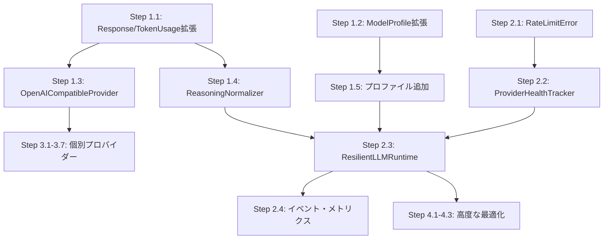

# Pylon マルチモデル自動最適化 — 実装計画書

**作成日**: 2026-03-09
**バージョン**: v1.0
**検証済み**: コードベース全ファイルとの整合性確認完了（不整合0件）

---

## 1. 現状分析

### 1.1 実装済みコンポーネント

| モジュール | ファイル | 状態 |
|-----------|---------|------|
| LLMProvider Protocol | `src/pylon/providers/base.py` | 完成 |
| AnthropicProvider | `src/pylon/providers/anthropic.py` | 完成 |
| OpenAIProvider | `src/pylon/providers/openai.py` | 完成 |
| OllamaProvider | `src/pylon/providers/ollama.py` | 完成 |
| BedrockProvider | `src/pylon/providers/bedrock.py` | 完成 |
| VertexProvider | `src/pylon/providers/vertex.py` | 完成 |
| ModelRouter (3-tier) | `src/pylon/autonomy/routing.py` | 完成 |
| LLMRuntime + ProviderRegistry | `src/pylon/runtime/llm.py` | 完成 |
| ContextManager | `src/pylon/runtime/context.py` | 完成 |
| CircuitBreaker/Retry/Fallback/Bulkhead | `src/pylon/resilience/` | 完成 |
| CostEstimator | `src/pylon/cost/estimator.py` | 完成 |
| CostOptimizer | `src/pylon/cost/optimizer.py` | 完成 |
| CacheManager | `src/pylon/cost/cache_manager.py` | 完成 |
| RateLimitManager | `src/pylon/cost/rate_limiter.py` | 完成 |
| FallbackEngine | `src/pylon/cost/fallback_engine.py` | 完成 |
| CostConfig (YAML) | `src/pylon/cost/config.py` | 完成 |

**テスト**: 1677件全パス（うちcostモジュール45件）

### 1.2 未実装コンポーネント

| コンポーネント | 優先度 | 依存関係 |
|--------------|--------|---------|
| OpenAICompatibleProvider基底クラス | P0 | なし |
| ReasoningNormalizer | P0 | Response拡張 |
| Response/TokenUsage拡張 | P0 | なし |
| ModelProfile拡張 | P0 | なし |
| ResilientLLMRuntime統合 | P1 | P0全完了 |
| ProviderHealthTracker | P1 | RateLimitManager |
| DeepSeek/Groq/Mistral/xAI/Together/Moonshot/Zhipu | P2 | OpenAICompatibleProvider |
| Batch API routing | P3 | CostOptimizer |

---

## 2. 設計決定（ADR）

### ADR-001: LiteLLM依存ではなく自前OpenAI互換基底クラス

**決定**: `openai` Python SDKの`base_url`オーバーライドで12+プロバイダーに対応する薄い基底クラスを構築する。

**根拠**:
- LiteLLMは~150の推移的依存を持ち、Pylonの設計原則（依存の正当化）に反する
- Pylonは~200行で同等機能を実現可能
- ルーティング/キャッシュ/フォールバックの決定権をPylon側に維持する必要がある
- `openai` SDKは既にPylonの依存に含まれている

**トレードオフ**: プロバイダーのエンドポイントURLと認証パターンを手動管理する必要がある。対象は~12社で変更頻度が低いため許容可能。

### ADR-002: ReasoningはResponseのオプションフィールド

**決定**: `Response`に`reasoning: ReasoningOutput | None`を追加。既存プロバイダーは`None`を返し後方互換。

**根拠**:
- LLMProvider Protocolの変更不要
- 消費者はreasoningフィールドを無視可能
- `redacted_for_resend`でプロバイダー固有の不透明データをマルチターンで保持

### ADR-003: CircuitBreakerは(provider, model)ペア単位

**決定**: ProviderHealthTrackerは`(provider_name, model_id)`の粒度で管理。

**根拠**: Haikuが健全でOpusがレート制限中という状況を正しく処理するため。

### ADR-004: フォールバックは429/5xxのみ

**決定**: 400-428はクライアントエラーとして即座にPropagate。429と500-504のみフォールバック発動。

**根拠**: 400系はリクエスト不正であり、別プロバイダーでも同様に失敗する。バジェット浪費の防止。

---

## 3. 実装フェーズ

### Phase 1: 基盤拡張（P0）

**目標**: プロバイダー基底クラス・推論正規化・データモデル拡張

#### Step 1.1: Response/TokenUsage拡張

**ファイル**: `src/pylon/providers/base.py`

```python
# 追加するデータクラス
@dataclass
class ReasoningOutput:
    """正規化された推論/思考出力。"""
    content: str                          # 推論テキスト
    tokens: int = 0                       # 推論トークン数
    redacted_for_resend: Any = None       # マルチターン用の不透明データ

# Response に追加するフィールド
reasoning: ReasoningOutput | None = None
provider_metadata: dict[str, Any] = field(default_factory=dict)

# TokenUsage に追加するフィールド
reasoning_tokens: int = 0
```

**影響範囲**: 既存フィールドにデフォルト値があるため後方互換。全既存プロバイダーのテストは変更不要。

**テスト**: 新規2件（ReasoningOutputの直列化、TokenUsage.total_tokensにreasoning_tokens含まない検証）

#### Step 1.2: ModelProfile拡張

**ファイル**: `src/pylon/autonomy/routing.py`

```python
# 追加するenum
class CacheMode(StrEnum):
    NONE = "none"
    EXPLICIT = "explicit"       # Anthropic: cache_controlブロック
    AUTOMATIC = "automatic"     # OpenAI/DeepSeek: 自動キャッシュ
    PREFIX = "prefix"           # Google: コンテキストキャッシュAPI

class ApiCompatibility(StrEnum):
    NATIVE = "native"
    OPENAI_COMPATIBLE = "openai_compatible"

# ModelProfile に追加するフィールド（全てデフォルト値あり）
context_window: int = 128_000
max_output_tokens: int = 4096
input_price_per_million: float = 0.0
output_price_per_million: float = 0.0
cache_read_price_per_million: float = 0.0
cache_write_price_per_million: float = 0.0
supports_reasoning: bool = False
supports_vision: bool = False
cache_mode: CacheMode = CacheMode.NONE
api_compatibility: ApiCompatibility = ApiCompatibility.NATIVE
```

**影響範囲**: `DEFAULT_MODEL_PROFILES`の既存エントリにデフォルト値が適用。新プロバイダー用エントリを追加。

**テスト**: 新規3件（CacheMode/ApiCompatibility列挙、拡張プロファイルの検証）

#### Step 1.3: OpenAICompatibleProvider基底クラス

**ファイル**: `src/pylon/providers/openai_compat.py`（新規）

```python
class OpenAICompatibleProvider:
    """OpenAI Chat Completions API互換プロバイダーの基底クラス。

    サブクラスはフックメソッドをオーバーライドしてプロバイダー固有の振る舞いを追加：
    - _build_auth_headers(): 認証ヘッダー（デフォルト: Bearer token）
    - _transform_request(): リクエストペイロードの変換
    - _extract_reasoning(): 推論出力の抽出
    - _extract_usage(): トークン使用量の抽出
    """

    def __init__(
        self,
        model: str,
        *,
        api_key: str | None = None,
        base_url: str,
        provider_name: str,
        max_tokens: int = 4096,
        temperature: float = 0.0,
        default_headers: dict[str, str] | None = None,
    ) -> None: ...

    # 既存OpenAIProviderのchat()/stream()ロジックを共有
    async def chat(self, messages: list[Message], **kwargs: Any) -> Response: ...
    async def stream(self, messages: list[Message], **kwargs: Any) -> AsyncIterator[Chunk]: ...

    # オーバーライド可能なフック
    def _build_auth_headers(self) -> dict[str, str]: ...
    def _transform_request(self, create_kwargs: dict[str, Any]) -> dict[str, Any]: ...
    def _extract_reasoning(self, choice: Any, raw: dict[str, Any]) -> ReasoningOutput | None: ...
    def _extract_usage(self, usage: Any) -> TokenUsage: ...
```

**設計原則**:
- 既存`OpenAIProvider`は変更しない（本番稼働中のリグレッション防止）
- `openai.AsyncOpenAI(base_url=...)`で接続先を切替
- フック(メソッドオーバーライド)でプロバイダー固有ロジックを注入（if文分岐ではない）

**テスト**: 新規8件（init、properties、chat happy path、chat error、stream、各フックの動作検証）

#### Step 1.4: ReasoningNormalizer

**ファイル**: `src/pylon/providers/reasoning.py`（新規）

```python
class ReasoningHandler(Protocol):
    """プロバイダー固有の推論抽出プロトコル。"""
    def extract(self, raw_response: dict[str, Any]) -> ReasoningOutput | None: ...
    def prepare_messages(
        self, messages: list[Message], reasoning: list[ReasoningOutput],
    ) -> list[Message]: ...

class ReasoningNormalizer:
    """プロバイダー間の推論出力を統一インターフェースに正規化。"""
    def register(self, provider_name: str, handler: ReasoningHandler) -> None: ...
    def extract(self, provider_name: str, raw: dict[str, Any]) -> ReasoningOutput | None: ...
    def prepare_for_resend(
        self, provider_name: str, messages: list[Message],
        reasoning_history: list[ReasoningOutput],
    ) -> list[Message]: ...
```

**プロバイダー別マルチターン処理ルール**:

| プロバイダー | 推論フィールド | マルチターン処理 |
|------------|--------------|----------------|
| Anthropic | `thinking` content blocks + `signature` | thinking blocksを毎回再送信（必須） |
| OpenAI | `reasoning` items (Responses API) | 再送信不要、`reasoning_effort`で制御 |
| DeepSeek | `reasoning_content` field | **絶対に再送信してはならない**（400エラー） |
| Zhipu/Moonshot | `reasoning_content` field | 再送信不要（DeepSeek同様） |
| Gemini | thought signatures | signatures返送**必須**（欠落で400エラー） |

**テスト**: 新規6件（各ハンドラーのextract/prepare_messages）

#### Step 1.5: DEFAULT_MODEL_PROFILES拡張

**ファイル**: `src/pylon/autonomy/routing.py`

追加するプロファイル:

```python
# DeepSeek
ModelProfile(provider_name="deepseek", model_id="deepseek-chat",
             tier=ModelTier.LIGHTWEIGHT, supports_tools=True,
             input_price_per_million=0.28, output_price_per_million=0.42,
             cache_mode=CacheMode.AUTOMATIC,
             api_compatibility=ApiCompatibility.OPENAI_COMPATIBLE)
ModelProfile(provider_name="deepseek", model_id="deepseek-reasoner",
             tier=ModelTier.STANDARD, supports_tools=True,
             supports_reasoning=True,
             input_price_per_million=0.28, output_price_per_million=0.42,
             cache_mode=CacheMode.AUTOMATIC,
             api_compatibility=ApiCompatibility.OPENAI_COMPATIBLE)

# Groq
ModelProfile(provider_name="groq", model_id="llama-3.3-70b-versatile",
             tier=ModelTier.LIGHTWEIGHT, supports_tools=True,
             api_compatibility=ApiCompatibility.OPENAI_COMPATIBLE)

# Mistral
ModelProfile(provider_name="mistral", model_id="mistral-small-3.2",
             tier=ModelTier.LIGHTWEIGHT, supports_tools=True,
             api_compatibility=ApiCompatibility.OPENAI_COMPATIBLE)
ModelProfile(provider_name="mistral", model_id="mistral-large-3",
             tier=ModelTier.STANDARD, supports_tools=True,
             api_compatibility=ApiCompatibility.OPENAI_COMPATIBLE)

# xAI
ModelProfile(provider_name="xai", model_id="grok-4",
             tier=ModelTier.PREMIUM, supports_tools=True,
             supports_reasoning=True, context_window=256_000,
             api_compatibility=ApiCompatibility.OPENAI_COMPATIBLE)

# Moonshot
ModelProfile(provider_name="moonshot", model_id="kimi-k2.5",
             tier=ModelTier.STANDARD, supports_tools=True,
             supports_reasoning=True, context_window=256_000,
             api_compatibility=ApiCompatibility.OPENAI_COMPATIBLE)

# Zhipu
ModelProfile(provider_name="zhipu", model_id="glm-5",
             tier=ModelTier.STANDARD, supports_tools=True,
             supports_reasoning=True, context_window=200_000,
             api_compatibility=ApiCompatibility.OPENAI_COMPATIBLE)
```

**テスト**: 既存ルーティングテストに新プロファイルの検証を追加（3件）

---

### Phase 2: 統合・耐障害性（P1）

**目標**: 既存cost/resilienceモジュールをLLMRuntimeに統合

#### Step 2.1: RateLimitError追加

**ファイル**: `src/pylon/errors.py`

```python
class RateLimitError(ProviderError):
    """429 Rate Limit Exceeded."""
    def __init__(self, message: str, *, retry_after: float = 0.0, **kwargs):
        super().__init__(message, status_code=429, **kwargs)
        self.retry_after = retry_after
```

**テスト**: 1件

#### Step 2.2: ProviderHealthTracker

**ファイル**: `src/pylon/providers/health.py`（新規）

既存`src/pylon/cost/rate_limiter.py`の`RateLimitManager`が実質的にこの機能を持っているが、
`(provider, model)`ペア粒度のラッパーとして薄い層を追加。

```python
class ProviderHealthTracker:
    """(provider, model)ペア単位のヘルス追跡。"""
    def __init__(self, rate_limiter: RateLimitManager): ...
    def record_success(self, provider: str, model: str, latency_ms: float): ...
    def record_failure(self, provider: str, model: str, error: Exception): ...
    def is_available(self, provider: str, model: str = "") -> bool: ...
    def available_providers(self) -> set[str]: ...
```

**テスト**: 4件

#### Step 2.3: ResilientLLMRuntime

**ファイル**: `src/pylon/runtime/llm.py`（既存ファイルに追加）

既存`LLMRuntime`をラップし、以下のパイプラインを実装：

```
1. CostOptimizer.classify_complexity() → タスク複雑度分析
2. CostOptimizer.recommend() → コスト最適なモデル推薦
3. ModelRouter.route() → ルート選択（推薦結果を考慮）
4. ProviderHealthTracker.is_available() → 可用性確認
5. CacheManager.detect_breakpoints() → キャッシュ戦略
6. FallbackEngine.execute() → 自動フォールバック付き実行
7. ReasoningNormalizer.extract() → 推論出力正規化
8. CostEstimator.estimate_and_record() → 支出記録
```

```python
@dataclass
class ResilientLLMRuntime:
    runtime: LLMRuntime
    health_tracker: ProviderHealthTracker
    fallback_engine: FallbackEngine
    cost_optimizer: CostOptimizer | None = None
    reasoning_normalizer: ReasoningNormalizer | None = None
    cache_manager: CacheManager | None = None

    async def chat(
        self,
        *,
        registry: ProviderRegistry,
        request: ModelRouteRequest,
        messages: list[Message],
        ...
    ) -> RoutedChatResult: ...
```

**テスト**: 8件（パイプライン各段階のモック検証）

#### Step 2.4: イベント・メトリクス拡張

**ファイル**: `src/pylon/events/types.py`, `src/pylon/observability/metrics.py`

```python
# 追加イベントタイプ
PROVIDER_HEALTH_CHANGED = "provider.health_changed"
PROVIDER_FALLBACK_TRIGGERED = "provider.fallback_triggered"
BUDGET_THRESHOLD_REACHED = "budget.threshold_reached"

# 追加メトリクス
"provider_fallback_count"
"provider_circuit_open_count"
"llm_cache_savings_usd"
```

**テスト**: 2件

---

### Phase 3: 個別プロバイダー実装（P2）

**目標**: OpenAICompatibleProvider基底クラスの具体サブクラス7種

各プロバイダーは20-40行の薄いサブクラス。base_url + フックオーバーライドのみ。

#### Step 3.1: DeepSeekProvider

**ファイル**: `src/pylon/providers/deepseek.py`（新規、~35行）

```python
class DeepSeekProvider(OpenAICompatibleProvider):
    def __init__(self, model="deepseek-chat", *, api_key=None, **kwargs):
        super().__init__(
            model=model, api_key=api_key,
            base_url="https://api.deepseek.com/v1",
            provider_name="deepseek", **kwargs,
        )

    def _extract_reasoning(self, choice, raw):
        rc = getattr(choice.message, "reasoning_content", None)
        if rc:
            return ReasoningOutput(content=rc)
        return None

    def _extract_usage(self, usage):
        base = super()._extract_usage(usage)
        cached = getattr(usage, "prompt_cache_hit_tokens", 0)
        return TokenUsage(..., cache_read_tokens=cached)
```

**テスト**: 4件

#### Step 3.2-3.7: 残り6プロバイダー

| Step | プロバイダー | ファイル | 固有処理 | テスト |
|------|------------|---------|---------|--------|
| 3.2 | Groq | `providers/groq.py` | base_urlのみ | 3件 |
| 3.3 | Mistral | `providers/mistral.py` | `tool_choice: "any"`対応 | 3件 |
| 3.4 | xAI | `providers/xai.py` | `reasoning_content`抽出 | 4件 |
| 3.5 | Together | `providers/together.py` | base_urlのみ | 3件 |
| 3.6 | Moonshot | `providers/moonshot.py` | `reasoning_content`抽出、web_search | 4件 |
| 3.7 | Zhipu | `providers/zhipu.py` | `reasoning_content`抽出、web_searchツール型 | 4件 |

---

### Phase 4: 高度な最適化（P3）

#### Step 4.1: pylon.yaml providers設定スキーマ

**ファイル**: `src/pylon/config/validator.py`（既存に追加）

```yaml
# pylon.yaml に追加するセクション
providers:
  deepseek:
    type: openai_compatible
    base_url: https://api.deepseek.com/v1
    api_key: ${DEEPSEEK_API_KEY}
    models:
      - id: deepseek-chat
        tier: lightweight
        context_window: 128000

routing:
  budget:
    max_cost_usd: 5.0
    tier_downgrade_at: 0.75
  fallback:
    allow_tier_downgrade: true
    circuit_breaker:
      failure_threshold: 3
      timeout_seconds: 60
```

#### Step 4.2: ProviderRegistry設定駆動登録

**ファイル**: `src/pylon/runtime/llm.py`（既存に追加）

```python
class ProviderRegistry:
    def register_from_config(self, config: dict[str, Any]) -> None:
        """pylon.yaml の providers セクションからプロバイダーを動的登録。"""
```

#### Step 4.3: Batch API routing

低遅延要件のないワークロードをBatch APIにルーティングし50%割引を活用。

---

## 4. ファイル変更一覧

### 変更するファイル（既存）

| ファイル | 変更内容 | Phase |
|---------|---------|-------|
| `src/pylon/providers/base.py` | ReasoningOutput追加、Response拡張、TokenUsage拡張 | 1 |
| `src/pylon/autonomy/routing.py` | CacheMode/ApiCompatibility追加、ModelProfile拡張、プロファイル追加 | 1 |
| `src/pylon/runtime/llm.py` | ResilientLLMRuntime追加、ProviderRegistry拡張 | 2 |
| `src/pylon/errors.py` | RateLimitError追加 | 2 |
| `src/pylon/events/types.py` | 3イベントタイプ追加 | 2 |
| `src/pylon/observability/metrics.py` | 3メトリクス追加 | 2 |
| `src/pylon/providers/__init__.py` | 新プロバイダーのエクスポート追加 | 3 |
| `src/pylon/config/validator.py` | providers/routingスキーマ追加 | 4 |

### 新規作成するファイル

| ファイル | 行数見積 | Phase |
|---------|---------|-------|
| `src/pylon/providers/openai_compat.py` | ~200行 | 1 |
| `src/pylon/providers/reasoning.py` | ~150行 | 1 |
| `src/pylon/providers/health.py` | ~80行 | 2 |
| `src/pylon/providers/deepseek.py` | ~35行 | 3 |
| `src/pylon/providers/groq.py` | ~25行 | 3 |
| `src/pylon/providers/mistral.py` | ~30行 | 3 |
| `src/pylon/providers/xai.py` | ~30行 | 3 |
| `src/pylon/providers/together.py` | ~25行 | 3 |
| `src/pylon/providers/moonshot.py` | ~35行 | 3 |
| `src/pylon/providers/zhipu.py` | ~35行 | 3 |

### 新規テストファイル

| ファイル | テスト数 | Phase |
|---------|---------|-------|
| `tests/unit/test_openai_compat.py` | 8件 | 1 |
| `tests/unit/test_reasoning_normalizer.py` | 6件 | 1 |
| `tests/unit/test_provider_health.py` | 4件 | 2 |
| `tests/unit/test_resilient_runtime.py` | 8件 | 2 |
| `tests/unit/test_deepseek_provider.py` | 4件 | 3 |
| `tests/unit/test_groq_provider.py` | 3件 | 3 |
| `tests/unit/test_mistral_provider.py` | 3件 | 3 |
| `tests/unit/test_xai_provider.py` | 4件 | 3 |
| `tests/unit/test_together_provider.py` | 3件 | 3 |
| `tests/unit/test_moonshot_provider.py` | 4件 | 3 |
| `tests/unit/test_zhipu_provider.py` | 4件 | 3 |

---

## 5. テスト戦略

### 5.1 単体テスト方針

- SDKモジュールは`monkeypatch.setattr`でモック（実際のパッケージ不要）
- 既存プロバイダーテスト（`tests/unit/test_providers.py`、35件）のパターンを踏襲
- 各プロバイダー最低3件: import error handling、chat happy path、プロバイダー固有機能

### 5.2 統合テスト方針

- `ResilientLLMRuntime`はパイプライン全体をモックプロバイダーで検証
- フォールバックチェーンは実際のエラー注入でE2E検証
- キャッシュ戦略は`CacheManager`+`ContextManager`の連携を検証

### 5.3 品質ゲート

- 全テスト(1677+新規~55件)パス
- `ruff check`エラー0件
- 既存テストのリグレッション0件

---

## 6. リスクと緩和策

| リスク | 影響 | 緩和策 |
|-------|------|--------|
| 既存OpenAIProviderとOpenAICompatibleProviderの責務重複 | メンテナンスコスト | 既存OpenAIProviderは変更しない。将来的にリファクタ可能 |
| プロバイダーAPI仕様変更 | テスト失敗 | 各プロバイダーはSDKモックで単体テスト。統合テストは別途 |
| reasoning_content形式の変更（DeepSeek V3.2→V4等） | 推論抽出失敗 | ReasoningHandlerが個別差し替え可能。Protocolベース |
| コスト見積もりの不正確さ（価格改定） | バジェット超過 | YAMLで価格オーバーライド可能。CostEstimatorは動的更新対応 |

---

## 7. 実行順序と依存関係



**クリティカルパス**: Step 1.1 → Step 1.3 → Step 2.3 → Phase 3

---

## 8. 成功基準

| 基準 | 目標値 |
|------|--------|
| テスト総数 | 1732+件（1677 + ~55新規） |
| テストパス率 | 100% |
| 対応プロバイダー数 | 12社（現5 + 新7） |
| フォールバック自動切替 | 429/5xxで3段階チェーン |
| コスト最適化 | バジェット75%消費でティアダウングレード |
| レートリミット事前検知 | RPM/TPMスライディングウィンドウ |
| サーキットブレーカー | 5連続失敗でOPEN、30秒後HALF_OPEN |
| 推論出力正規化 | 5形式を`ReasoningOutput`に統一 |
