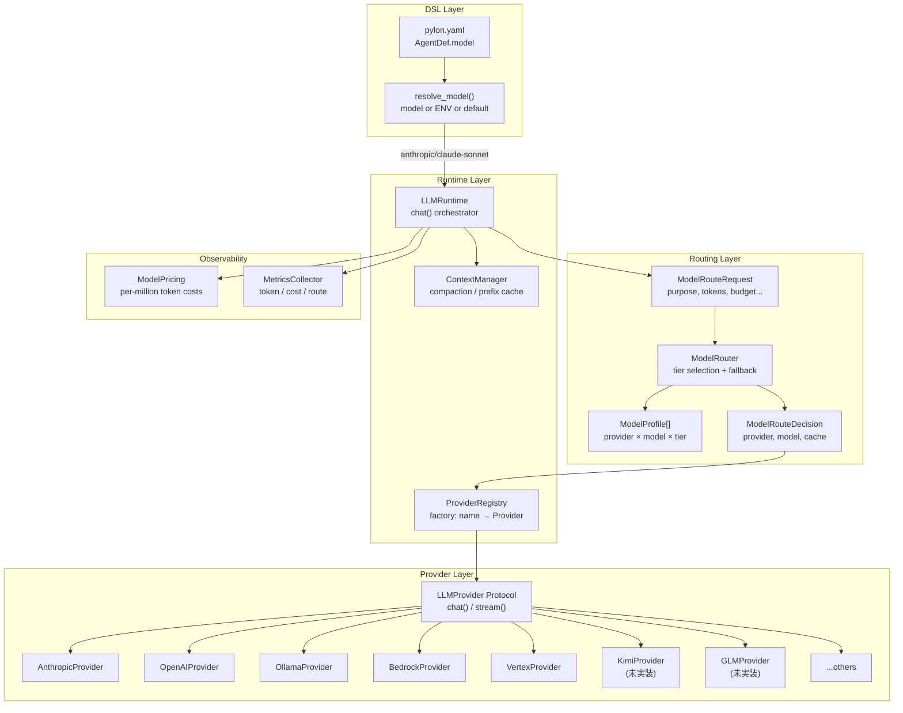
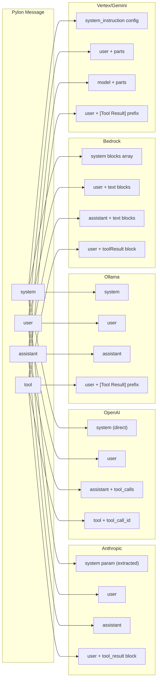
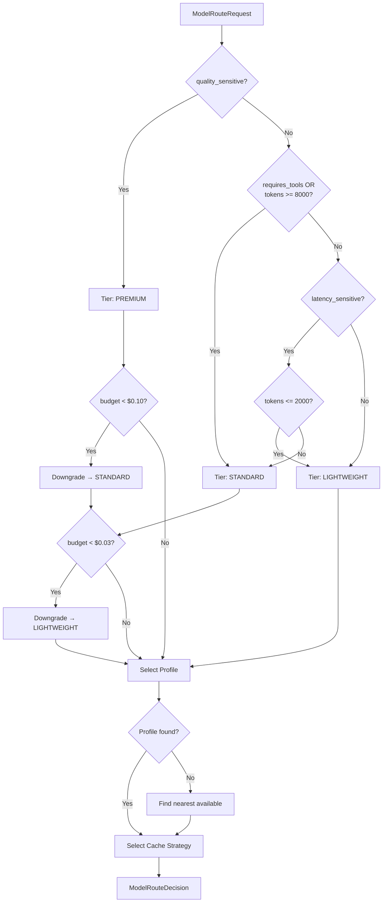
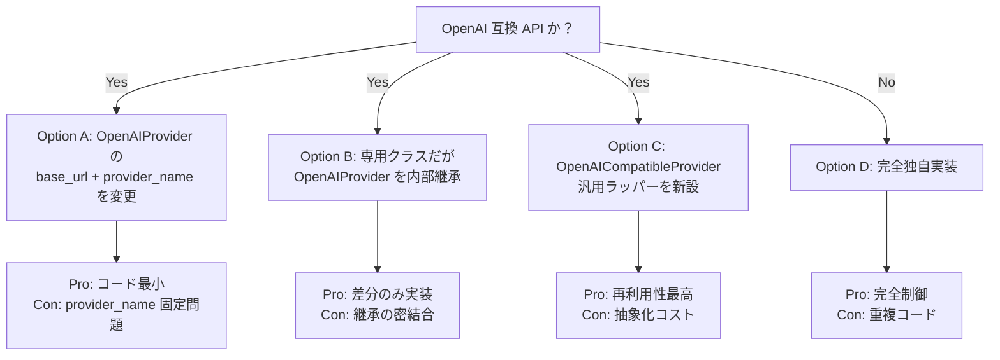
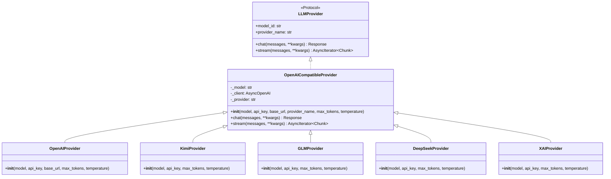
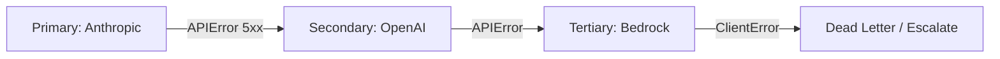

# Multi-Model Provider Architecture — Deep Research Spec

> **Purpose**: Pylon のマルチモデルプロバイダ基盤の現状分析・拡張設計・新規プロバイダ追加（Kimi 2.5, GLM-5 等）のためのディープリサーチ資料。
>
> **Version**: 0.2.0 / 2026-03-09

---

## 1. 現状アーキテクチャ全体像



---

## 2. プロバイダ共通インターフェース

### 2.1 LLMProvider Protocol

```python
@runtime_checkable
class LLMProvider(Protocol):
    async def chat(self, messages: list[Message], **kwargs: Any) -> Response: ...
    async def stream(self, messages: list[Message], **kwargs: Any) -> AsyncIterator[Chunk]: ...

    @property
    def model_id(self) -> str: ...
    @property
    def provider_name(self) -> str: ...
```

### 2.2 共通データ型

| 型 | フィールド | 備考 |
|---|---|---|
| `Message` | `role`, `content`, `tool_calls`, `tool_call_id` | role: system/user/assistant/tool |
| `Response` | `content`, `model`, `usage`, `tool_calls`, `finish_reason` | |
| `Chunk` | `content`, `tool_calls`, `finish_reason`, `usage` | ストリーミング単位 |
| `TokenUsage` | `input_tokens`, `output_tokens`, `cache_read_tokens`, `cache_write_tokens` | `total_tokens` = input + output |

### 2.3 内部 kwargs（全プロバイダで pop 必須）

```python
_INTERNAL_KWARGS = frozenset({
    "cache_strategy",
    "batch_eligible",
    "context_compacted",
    "original_input_tokens",
    "prepared_input_tokens",
})
```

---

## 3. 実装済みプロバイダ詳細比較

### 3.1 一覧

| Provider | Class | SDK | Default Model | Tools | Cache | Batch | Async Method |
|----------|-------|-----|---------------|-------|-------|-------|-------------|
| Anthropic | `AnthropicProvider` | `anthropic` (AsyncAnthropic) | claude-sonnet-4-20250514 | Full | Read/Write | Yes | Native async |
| OpenAI | `OpenAIProvider` | `openai` (AsyncOpenAI) | gpt-4o | Full | No | Yes | Native async |
| Ollama | `OllamaProvider` | `httpx` (AsyncClient) | llama3.1 | No | No | No | Native async |
| Bedrock | `BedrockProvider` | `boto3` (bedrock-runtime) | anthropic.claude-sonnet-4-20250514-v1:0 | Full | No | No | `run_in_executor` |
| Vertex | `VertexProvider` | `google-genai` (Client.aio) | gemini-2.0-flash | Full | Read | No | Native async |

### 3.2 メッセージ変換マッピング



### 3.3 コンストラクタパラメータ比較

| Parameter | Anthropic | OpenAI | Ollama | Bedrock | Vertex |
|-----------|-----------|--------|--------|---------|--------|
| `model` | claude-sonnet-4-20250514 | gpt-4o | llama3.1 | anthropic.claude-... | gemini-2.0-flash |
| `api_key` | Optional | Optional | — | — | Optional |
| `base_url` | — | Optional | localhost:11434 | — | — |
| `max_tokens` | 4096 | 4096 | 4096 | 4096 | 4096 |
| `temperature` | 0.0 | 0.0 | 0.0 | 0.0 | 0.0 |
| `region_name` | — | — | — | us-east-1 | — |
| `profile_name` | — | — | — | Optional | — |
| `project` | — | — | — | — | Optional |
| `location` | — | — | — | — | us-central1 |

### 3.4 エラーハンドリング

| Provider | Caught Exception | ProviderError Details | Retryable |
|----------|-----------------|----------------------|-----------|
| Anthropic | `anthropic.APIError` | `status_code` | Yes (default) |
| OpenAI | `openai.APIError` | `status_code` | Yes (default) |
| Ollama | `httpx.HTTPError` | `status_code` (if available) | Yes (default) |
| Bedrock | `botocore.exceptions.ClientError` | `error_code` | Yes (default) |
| Vertex | Generic `Exception` | `error_type` (class name) | Yes (default) |

### 3.5 ストリーミング実装パターン

| Provider | Stream API | Text Event | Tool Event | Usage Event | Done Signal |
|----------|-----------|------------|------------|-------------|-------------|
| Anthropic | `messages.stream()` | `content_block_delta` | `content_block_start/stop` + `input_json_delta` | `message_delta` | `message_stop` |
| OpenAI | `create(stream=True)` | `choices[0].delta.content` | `delta.tool_calls` | Final chunk (no choices) | `finish_reason` |
| Ollama | NDJSON lines | `message.content` | — | Final line (`done: true`) | `done: true` |
| Bedrock | `converse_stream()` | `contentBlockDelta` | — | `metadata` | `messageStop` |
| Vertex | `generate_content_stream()` | `chunk.text` | — | `usage_metadata` | Iteration end |

---

## 4. ルーティングシステム

### 4.1 ModelRouter の決定フロー



### 4.2 現在の DEFAULT_MODEL_PROFILES

| Provider | Model ID | Tier | Tools | Cache | Batch |
|----------|----------|------|-------|-------|-------|
| anthropic | claude-haiku | LIGHTWEIGHT | Yes | Yes | Yes |
| anthropic | claude-sonnet | STANDARD | Yes | Yes | Yes |
| anthropic | claude-opus | PREMIUM | Yes | Yes | Yes |
| openai | gpt-4o-mini | LIGHTWEIGHT | Yes | No | Yes |
| openai | gpt-4o | STANDARD | Yes | No | Yes |
| openai | o3 | PREMIUM | Yes | No | Yes |
| google | gemini-2.0-flash | LIGHTWEIGHT | Yes | Yes | No |
| google | gemini-2.5-pro | STANDARD | Yes | Yes | No |
| bedrock | anthropic.claude-sonnet-4-20250514-v1:0 | STANDARD | Yes | No | No |
| ollama | llama3.1 | LIGHTWEIGHT | No | No | No |

### 4.3 キャッシュ戦略選択

| 条件 | 結果 |
|-----|------|
| batch_eligible AND profile.batch_api AND NOT latency_sensitive | BATCH |
| NOT cacheable_prefix OR NOT profile.prompt_caching | NONE |
| provider in {openai, google} | PREFIX |
| それ以外 | EXPLICIT |

---

## 5. 新規プロバイダ追加要件

### 5.1 追加対象候補

| Provider | 提供元 | 主要モデル | API 方式 | SDK | Tool Support | 特記事項 |
|----------|--------|-----------|---------|-----|-------------|---------|
| **Kimi (Moonshot)** | Moonshot AI | kimi-2.5, kimi-k2 | OpenAI 互換 REST | `openai` SDK 流用可 | Yes | `base_url` 変更で対応可能な可能性 |
| **GLM (Zhipu AI)** | 智譜 AI | glm-5, glm-4-plus | 独自 REST / OpenAI 互換 | `zhipuai` or `openai` | Yes | Tool calling 対応済 |
| **DeepSeek** | DeepSeek | deepseek-v3, deepseek-r1 | OpenAI 互換 REST | `openai` SDK 流用可 | Yes | Reasoning model (think blocks) |
| **Mistral** | Mistral AI | mistral-large, codestral | REST | `mistralai` | Yes | EU hosted option |
| **Cohere** | Cohere | command-r-plus | REST | `cohere` | Yes | RAG 特化 API |
| **xAI** | xAI | grok-3, grok-3-mini | OpenAI 互換 REST | `openai` SDK 流用可 | Yes | Reasoning model |
| **Together AI** | Together | Llama, Qwen 等 hosted | OpenAI 互換 REST | `openai` SDK 流用可 | Partial | Multi-model aggregator |
| **Groq** | Groq | Llama, Mixtral hosted | OpenAI 互換 REST | `groq` or `openai` | Yes | Ultra-low latency |

### 5.2 OpenAI 互換プロバイダの設計判断

多くの新興プロバイダが OpenAI 互換 API を提供している。設計上の選択肢:



**推奨: Option C** — `OpenAICompatibleProvider` 基底クラスを導入し、`base_url` と `provider_name` をパラメータ化。Kimi, DeepSeek, xAI, Together, Groq は全てこれで対応可能。

### 5.3 新規プロバイダ実装チェックリスト

```markdown
- [ ] `src/pylon/providers/{name}.py` 作成
  - [ ] SDK import guard (try/except ImportError)
  - [ ] `_{provider}_messages()` メッセージ変換関数
  - [ ] Constructor: model, api_key, max_tokens, temperature + 固有パラメータ
  - [ ] `provider_name` property
  - [ ] `model_id` property
  - [ ] `chat()` 実装 (内部 kwargs の pop 必須)
  - [ ] `stream()` 実装
  - [ ] Error handling → `ProviderError`
  - [ ] TokenUsage マッピング
- [ ] `src/pylon/autonomy/routing.py` に ModelProfile 追加
- [ ] `tests/unit/test_providers.py` にテスト追加
  - [ ] Import error test
  - [ ] Properties test
  - [ ] Message conversion test
  - [ ] chat() happy path test
  - [ ] chat() error handling test
- [ ] `pyproject.toml` に optional dependency 追加
- [ ] `docs/` ドキュメント更新
```

---

## 6. Kimi 2.5 (Moonshot AI) 設計メモ

### 6.1 API 仕様

- **Endpoint**: `https://api.moonshot.cn/v1`
- **認証**: `Authorization: Bearer {api_key}`
- **互換性**: OpenAI Chat Completions API 互換
- **モデル**: `moonshot-v1-8k`, `moonshot-v1-32k`, `moonshot-v1-128k`, `kimi-2.5`
- **Context Window**: 8K / 32K / 128K / 1M tokens
- **Tool Calling**: Yes (OpenAI 形式)
- **Streaming**: Yes (SSE, OpenAI 互換)

### 6.2 実装方針

```python
class KimiProvider(OpenAICompatibleProvider):
    """Moonshot AI Kimi provider."""

    def __init__(
        self,
        model: str = "kimi-2.5",
        *,
        api_key: str | None = None,
        max_tokens: int = 4096,
        temperature: float = 0.0,
    ) -> None:
        super().__init__(
            model=model,
            api_key=api_key,
            max_tokens=max_tokens,
            temperature=temperature,
            base_url="https://api.moonshot.cn/v1",
            provider_name="kimi",
        )
```

### 6.3 ModelProfile 案

```python
ModelProfile(provider_name="kimi", model_id="kimi-2.5", tier=ModelTier.STANDARD,
             supports_tools=True, prompt_caching=False, batch_api=False),
```

### 6.4 特殊考慮事項

- コンテキストウィンドウが 1M tokens まで対応 → `ContextManager` の `max_input_tokens` を動的に設定可能にする必要
- 中国リージョンからのアクセスが前提 → プロキシ設定 (`base_url` カスタマイズ) 対応
- Pricing: 入力 60 元/百万トークン、出力 60 元/百万トークン (通常) → `ModelPricing` に通貨対応を検討

---

## 7. GLM-5 (Zhipu AI / 智譜 AI) 設計メモ

### 7.1 API 仕様

- **Endpoint**: `https://open.bigmodel.cn/api/paas/v4`
- **認証**: JWT (API Key → HS256 署名) or `Authorization: Bearer {api_key}` (v4 では Bearer 対応)
- **互換性**: OpenAI Chat Completions API 部分互換
- **モデル**: `glm-4`, `glm-4-plus`, `glm-4-flash`, `glm-5`, `glm-5-plus`
- **Tool Calling**: Yes (OpenAI 互換形式)
- **Streaming**: Yes (SSE)
- **Web Search**: 独自拡張 (`web_search` tool)
- **画像理解**: `glm-4v` 系 (multimodal)

### 7.2 実装方針

```python
class GLMProvider(OpenAICompatibleProvider):
    """Zhipu AI GLM provider."""

    def __init__(
        self,
        model: str = "glm-5",
        *,
        api_key: str | None = None,
        max_tokens: int = 4096,
        temperature: float = 0.0,
    ) -> None:
        super().__init__(
            model=model,
            api_key=api_key,
            max_tokens=max_tokens,
            temperature=temperature,
            base_url="https://open.bigmodel.cn/api/paas/v4",
            provider_name="glm",
        )
```

### 7.3 ModelProfile 案

```python
ModelProfile(provider_name="glm", model_id="glm-5", tier=ModelTier.STANDARD,
             supports_tools=True, prompt_caching=False, batch_api=False),
ModelProfile(provider_name="glm", model_id="glm-4-flash", tier=ModelTier.LIGHTWEIGHT,
             supports_tools=True, prompt_caching=False, batch_api=False),
```

### 7.4 特殊考慮事項

- 認証: v4 API は Bearer トークン対応だが、旧 JWT 署名方式も残存 → `api_key` ベースで統一
- `web_search` ツール: Zhipu 独自拡張。Pylon の tool 体系への統合方法を検討
- レスポンス差異: `usage.completion_tokens` が OpenAI と同じだが、一部フィールド欠損の可能性
- Rate Limit: ヘッダー `X-RateLimit-Remaining` 等の独自フォーマット

---

## 8. 設計上の未解決課題

### 8.1 OpenAI 互換プロバイダ基底クラス

**現状の問題**: Kimi, GLM, DeepSeek, xAI, Together, Groq は全て OpenAI 互換 API だが、個別にフルクラスを書くと重複コードが大量発生する。

**提案: `OpenAICompatibleProvider` の導入**



**設計上の判断ポイント**:

1. 既存の `OpenAIProvider` を `OpenAICompatibleProvider` のサブクラスにリファクタするか？
2. `_to_openai_messages()` はそのまま共有できるか、プロバイダ固有の差異があるか？
3. ストリーミングの差異（DeepSeek の thinking blocks 等）をどうフックするか？

### 8.2 Reasoning Model 対応

DeepSeek-R1, OpenAI o3 等の reasoning model は `<think>` ブロックを出力する。

**検討事項**:

- `Response` に `reasoning_content: str | None` フィールドを追加するか？
- `Chunk` に reasoning delta を含めるか？
- ルーティングで `reasoning_required: bool` を `ModelRouteRequest` に追加するか？

```python
# 案: Response 拡張
@dataclass
class Response:
    content: str
    model: str
    usage: TokenUsage | None = None
    tool_calls: list[dict[str, Any]] = field(default_factory=list)
    finish_reason: str = "stop"
    reasoning_content: str | None = None  # NEW: thinking/reasoning output
```

### 8.3 Multimodal 対応

現在の `Message.content` は `str` 型のみ。画像/音声/動画入力への拡張:

```python
# 現状
@dataclass
class Message:
    role: str
    content: str  # テキストのみ

# 拡張案
@dataclass
class ContentPart:
    type: str  # "text", "image_url", "image_base64", "audio"
    text: str | None = None
    url: str | None = None
    data: bytes | None = None
    media_type: str | None = None

@dataclass
class Message:
    role: str
    content: str | list[ContentPart]  # 後方互換
    tool_calls: list[dict[str, Any]] = field(default_factory=list)
    tool_call_id: str | None = None
```

**影響範囲**:
- 全プロバイダの `_to_*_messages()` 変換関数
- `ContextManager` のトークン推定
- ストリーミングのチャンク処理

### 8.4 コンテキストウィンドウの動的管理

各モデルのコンテキストウィンドウサイズが大きく異なる:

| Model | Context Window |
|-------|---------------|
| claude-haiku | 200K |
| claude-sonnet/opus | 200K |
| gpt-4o | 128K |
| gpt-4o-mini | 128K |
| gemini-2.0-flash | 1M |
| gemini-2.5-pro | 1M |
| kimi-2.5 | 1M |
| glm-5 | 128K |
| deepseek-v3 | 128K |
| llama3.1 | 128K |

**提案**: `ModelProfile` に `max_context_tokens: int` を追加し、`ContextManager` がルーティング結果に応じて動的に調整。

```python
@dataclass(frozen=True)
class ModelProfile:
    provider_name: str
    model_id: str
    tier: ModelTier
    supports_tools: bool = True
    prompt_caching: bool = False
    batch_api: bool = False
    max_context_tokens: int = 128_000  # NEW
    supports_reasoning: bool = False    # NEW
    supports_vision: bool = False       # NEW
```

### 8.5 Pricing の通貨・リージョン対応

- Anthropic/OpenAI: USD
- Kimi (Moonshot): CNY (元)
- GLM (Zhipu): CNY (元)
- Bedrock: USD (AWS リージョン別)

```python
# 案: ModelPricing に通貨を追加
@dataclass(frozen=True)
class ModelPricing:
    input_per_million: float
    output_per_million: float
    cache_read_per_million: float = 0.0
    cache_write_per_million: float = 0.0
    currency: str = "USD"  # NEW: "USD", "CNY", "EUR"

    def to_usd(self, exchange_rate: float = 1.0) -> ModelPricing:
        """Convert to USD for unified cost tracking."""
        ...
```

### 8.6 ProviderRegistry のファクトリパターン改善

現在の `ProviderRegistry` は手動登録のみ。自動検出や設定ベースの登録が必要:

```python
# 現状: 手動登録
registry = ProviderRegistry()
registry.register("anthropic", lambda model_id: AnthropicProvider(model=model_id))

# 案: 設定ベース自動登録
# pylon.yaml
providers:
  anthropic:
    api_key_env: ANTHROPIC_API_KEY
    max_tokens: 4096
  openai:
    api_key_env: OPENAI_API_KEY
  kimi:
    api_key_env: MOONSHOT_API_KEY
  glm:
    api_key_env: GLM_API_KEY
  ollama:
    base_url: http://localhost:11434
```

### 8.7 フォールバックチェーン

プロバイダ障害時のフォールバック戦略:



**検討事項**:
- `LLMRuntime` にフォールバックロジックを追加するか、上位レイヤー（resilience module）に委譲するか
- レスポンス品質の差異をどう扱うか（PREMIUM → STANDARD へのフォールバックでゴール達成に影響）
- フォールバック発生のメトリクス記録

---

## 9. 実装優先度マトリクス

| 優先度 | 項目 | 理由 | 工数見積 |
|--------|------|------|---------|
| **P0** | `OpenAICompatibleProvider` 基底クラス | 後続の全互換プロバイダの前提 | S |
| **P0** | DeepSeek プロバイダ | Reasoning model 対応の先行実装 | S |
| **P1** | Kimi プロバイダ | ユーザー要望、大コンテキスト | S (互換基底あれば) |
| **P1** | GLM プロバイダ | ユーザー要望、中国市場 | S (互換基底あれば) |
| **P1** | `ModelProfile.max_context_tokens` | コンテキスト管理の正確性 | S |
| **P2** | Reasoning model 対応 (`reasoning_content`) | o3, DeepSeek-R1 の thinking 出力 | M |
| **P2** | DSL `providers` セクション | 設定ベースのプロバイダ登録 | M |
| **P2** | xAI (Grok) プロバイダ | 需要増加中 | S |
| **P2** | Groq プロバイダ | 低レイテンシユースケース | S |
| **P3** | Multimodal 対応 | 画像入力の `Message.content` 拡張 | L |
| **P3** | フォールバックチェーン | 本番運用の耐障害性 | M |
| **P3** | Pricing 通貨対応 | CNY/EUR のコスト追跡 | S |
| **P3** | Mistral プロバイダ | EU 市場、コード特化 | S |
| **P3** | Cohere プロバイダ | RAG 特化 | S |

**工数**: S = 半日以下, M = 1-2日, L = 3日以上

---

## 10. テスト戦略

### 10.1 ユニットテスト（SDK モック）

現在のパターンを踏襲:
- `monkeypatch.setattr(module, "sdk_name", fake_module)` で SDK をモック
- 各テストクラスで import error, properties, message conversion, chat happy path, chat error を網羅

### 10.2 統合テスト（実 API）

```python
@pytest.mark.integration
@pytest.mark.skipif(not os.environ.get("ANTHROPIC_API_KEY"), reason="No API key")
async def test_anthropic_real_chat():
    provider = AnthropicProvider(model="claude-haiku-3-5-20241022")
    resp = await provider.chat([Message(role="user", content="Say hello in 3 words")])
    assert len(resp.content) > 0
    assert resp.usage.total_tokens > 0
```

### 10.3 互換性テスト

OpenAI 互換プロバイダの共通テストスイートを用意:

```python
class OpenAICompatibleTestSuite:
    """Shared test cases for all OpenAI-compatible providers."""
    provider_class: type
    module: ModuleType
    provider_name: str
    default_model: str

    def test_import_error(self, monkeypatch): ...
    def test_properties(self, monkeypatch): ...
    async def test_chat_happy_path(self, monkeypatch): ...
    async def test_chat_api_error(self, monkeypatch): ...
```

---

## 11. 参考リンク

| リソース | URL |
|---------|-----|
| Moonshot API Docs | https://platform.moonshot.cn/docs |
| Zhipu AI API Docs | https://open.bigmodel.cn/dev/api |
| DeepSeek API Docs | https://api-docs.deepseek.com |
| Mistral API Docs | https://docs.mistral.ai |
| xAI API Docs | https://docs.x.ai |
| Groq API Docs | https://console.groq.com/docs |
| Together AI API Docs | https://docs.together.ai |
| Cohere API Docs | https://docs.cohere.com |
| OpenAI Compatibility Guide | https://platform.openai.com/docs/api-reference |
