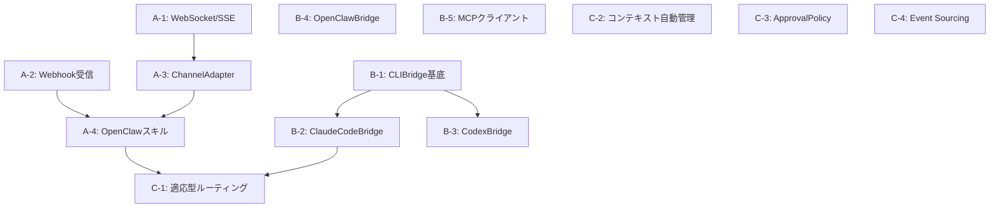

# Pylon 進化実装計画書

**作成日**: 2026-03-09
**対象**: Pylon v0.2.0 → v0.3.0
**現状**: 215ファイル / 36,154行 / 1,722テスト / 12プロバイダー対応

---

## 1. 現状の全体像

### 1.1 完成済みの資産

```
src/pylon/ (215ファイル)
├── providers/       12プロバイダー, LLMProvider Protocol, ReasoningNormalizer
├── autonomy/        3-tier ModelRouter, GoalSpec, TerminationCondition, Critic/Verifier
├── runtime/         LLMRuntime, ResilientLLMRuntime, ContextManager, ExecutionPlanning
├── cost/            CostEstimator, CostOptimizer, CacheManager, RateLimitManager, FallbackEngine
├── workflow/        GraphExecutor, DAG検証, 条件分岐, ループ, Join Policy
├── control_plane/   WorkflowScheduler, WorkflowService, ControlPlaneStore
├── api/             HTTPサーバー(stdlib), 30エンドポイント, ミドルウェアチェーン
├── protocols/mcp/   MCP Server (JSON-RPC, 4プリミティブ, OAuth 2.1)
├── protocols/a2a/   A2A Server (タスク送受信, ピア認証)
├── resilience/      CircuitBreaker, FallbackChain, RetryPolicy, AsyncBulkhead
├── events/          EventBus (pub/sub, フィルタ, デッドレター)
├── agents/          ライフサイクル管理, Supervisor, Registry
├── plugins/         LLMProvider/Tool/Sandbox/Policy プラグイン
├── sdk/             ローカルクライアント, HTTPクライアント, デコレーターAPI
├── config/          YAML/JSON/ENV ローダー, Resolver, Validator
├── tenancy/         マルチテナント分離, コンテキスト, Quota
├── secrets/         Vault統合, ローテーション, 監査
├── resources/       QuotaManager, RateLimiter, ResourcePool
├── repository/      Checkpoint, Audit, WorkflowStore
├── taskqueue/       Queue, Worker, Scheduler, RetryPolicy
├── observability/   Metrics, Tracing, RunRecord
├── security/        RBAC, SafetyContext, AgentCapability
└── types.py         AutonomyLevel A0-A4, AgentState, SandboxTier
```

### 1.2 欠落している機能

| カテゴリ | ギャップ | 影響 |
|---------|---------|------|
| **WebSocket** | リアルタイムストリーミング不可 | フロントエンド統合困難 |
| **Webhook受信** | 外部イベント受信不可 | OpenClaw/Slack等からの連携不可 |
| **チャネルアダプター** | メッセージング統合なし | チャットUI連携不可 |
| **コードエージェントブリッジ** | Claude Code/Codex連携なし | コーディングタスク委譲不可 |
| **SSE/ストリーミングAPI** | LLMストリーミング公開不可 | レスポンス待ち時間が長い |
| **ASGI対応** | stdlib HTTPサーバーのみ | 本番デプロイ困難 |
| **Event Sourcing** | チェックポイントはあるが巻き戻し限定的 | 監査証跡不完全 |

---

## 2. 進化の方向性

### 2.1 3つの柱

```
┌─────────────────────────────────────────────────────────────────┐
│  柱1: Gateway Layer          Pylon を外部ゲートウェイの           │
│  (外からPylonへ)             バックエンドとして利用可能にする      │
├─────────────────────────────────────────────────────────────────┤
│  柱2: Agent Bridge Layer     Claude Code/Codex/OpenClaw等の      │
│  (Pylonから外へ)             エージェントツールをラップ            │
├─────────────────────────────────────────────────────────────────┤
│  柱3: Intelligence Layer     ルーティング・コスト最適化を          │
│  (Pylon内部進化)             適応型学習で自動改善                  │
└─────────────────────────────────────────────────────────────────┘
```

### 2.2 統合アーキテクチャ

```
外部チャネル                        フロントエンド
(Slack/Discord/LINE/Teams)         (t3code/WebUI/CLI)
         │                              │
         ▼                              ▼
┌──────────────────────────────────────────────────────┐
│               Gateway Layer (柱1)                     │
│  WebhookReceiver │ WebSocketServer │ SSE Endpoints    │
│  ChannelAdapter  │ ASGI Wrapper    │ AuthGateway      │
└────────────────────────┬─────────────────────────────┘
                         │
┌────────────────────────▼─────────────────────────────┐
│               Pylon Core (既存 + 進化)                │
│  ResilientLLMRuntime → 12プロバイダー自動ルーティング   │
│  CostOptimizer → タスク複雑度ベースの最安選択          │
│  FallbackEngine → 429/5xx自動切替                     │
│  WorkflowEngine → DAG実行, ループ, 並列               │
│  EventBus → イベント駆動                              │
│  MCP Server → ツール公開                              │
│  A2A Server → エージェント間通信                      │
└────────────────────────┬─────────────────────────────┘
                         │
┌────────────────────────▼─────────────────────────────┐
│             Agent Bridge Layer (柱2)                  │
│  ClaudeCodeBridge │ CodexBridge │ OpenClawBridge      │
│  GenericCLIBridge │ MCPClientBridge                   │
└──────────────────────────────────────────────────────┘
```

---

## 3. 実装フェーズ

### Phase A: Gateway Layer — 外からPylonへ（P0）

#### A-1: WebSocket & SSEサポート

**目的**: LLMストリーミングレスポンスをリアルタイムでクライアントに配信

**新規ファイル**: `src/pylon/gateway/streaming.py`

```python
class StreamingHandler:
    """WebSocket/SSEでLLMストリーミングレスポンスを配信。"""

    async def handle_websocket(self, ws, path: str) -> None:
        """WebSocket接続でchat/streamリクエストを処理。

        プロトコル (t3code JSON-RPC互換):
        → {"jsonrpc":"2.0","method":"chat","params":{...},"id":"1"}
        ← {"jsonrpc":"2.0","result":{"type":"chunk","content":"..."}}
        ← {"jsonrpc":"2.0","result":{"type":"done","usage":{...},"cost":0.003}}
        """

    async def handle_sse(self, request) -> Response:
        """SSEエンドポイントでストリーミングレスポンスを配信。

        GET /api/v1/stream?session_id=xxx
        data: {"type":"chunk","content":"Hello"}
        data: {"type":"done","usage":{...}}
        """
```

**テスト**: 6件
**依存**: なし（既存APIサーバーに追加）

#### A-2: Webhook受信フレームワーク

**目的**: OpenClawや外部サービスからのイベントを受信・検証・ルーティング

**新規ファイル**: `src/pylon/gateway/webhook.py`

```python
class WebhookReceiver:
    """外部サービスからのWebhookを受信してワークフロー実行に変換。

    - HMAC-SHA256署名検証
    - リプレイ攻撃防止（タイムスタンプ検証）
    - イベントタイプ別ルーティング
    - リトライ対応（べき等性保証）
    """

    async def handle(self, request: WebhookRequest) -> WebhookResponse: ...

    def register_handler(
        self, event_type: str, handler: WebhookHandler,
    ) -> None: ...

class WebhookVerifier:
    """Webhook署名検証。"""
    def verify_hmac(self, payload: bytes, signature: str, secret: str) -> bool: ...
    def verify_timestamp(self, timestamp: int, tolerance_seconds: int = 300) -> bool: ...
```

**エンドポイント追加**:
```
POST /api/v1/webhooks/{source}          # Webhook受信
POST /api/v1/webhooks/{source}/verify   # 署名検証テスト
GET  /api/v1/webhooks/subscriptions     # 登録済みWebhook一覧
```

**テスト**: 5件
**依存**: なし

#### A-3: チャネルアダプター抽象層

**目的**: OpenClaw互換のチャネルアダプター設計をPython側に定義

**新規ファイル**: `src/pylon/gateway/channels.py`

```python
class ChannelAdapter(Protocol):
    """メッセージングチャネルの抽象インターフェース。
    OpenClawのChannelPlugin設計をPythonに移植。
    """

    @property
    def channel_name(self) -> str: ...

    async def receive(self) -> ChannelMessage: ...
    async def send(self, message: ChannelMessage) -> None: ...
    async def health_check(self) -> bool: ...

@dataclass
class ChannelMessage:
    """チャネル間共通メッセージフォーマット。"""
    channel: str              # "slack", "discord", "webhook"
    sender_id: str            # チャネル内のユーザーID
    content: str              # テキスト内容
    thread_id: str | None     # スレッドID（あれば）
    attachments: list = field(default_factory=list)
    metadata: dict = field(default_factory=dict)

class ChannelRouter:
    """受信メッセージをワークフロー/エージェントにルーティング。"""

    def register_adapter(self, adapter: ChannelAdapter) -> None: ...

    async def route(self, message: ChannelMessage) -> Response:
        """メッセージ → ModelRouteRequest → ResilientLLMRuntime → Response"""
```

**テスト**: 4件
**依存**: A-1（ストリーミング）

#### A-4: OpenClawスキル連携エンドポイント

**目的**: OpenClawからPylonを「スキル」として呼び出すための専用API

**新規ファイル**: `src/pylon/gateway/openclaw.py`

```python
class OpenClawGateway:
    """OpenClawスキルとしてPylonを公開するアダプター。

    OpenClawスキルフォーマット:
    - 入力: { message: str, context: dict, session_id: str }
    - 出力: { reply: str, usage: dict, cost: float, model: str }
    """

    async def handle_skill_request(self, request: dict) -> dict:
        """OpenClawスキルリクエストをPylonのchat APIに変換。

        1. メッセージからタスク複雑度を推定
        2. CostOptimizerで最適モデル選択
        3. ResilientLLMRuntimeで実行（フォールバック付き）
        4. OpenClawフォーマットでレスポンス
        """
```

**エンドポイント**:
```
POST /api/v1/openclaw/chat       # OpenClawスキル互換
POST /api/v1/openclaw/workflow   # ワークフロー実行
GET  /api/v1/openclaw/models     # 利用可能モデル一覧
GET  /api/v1/openclaw/health     # ヘルスチェック
```

**テスト**: 4件
**依存**: A-2

---

### Phase B: Agent Bridge Layer — Pylonから外へ（P1）

#### B-1: GenericCLIBridge（基底クラス）

**目的**: 外部CLIツール（Claude Code, Codex等）をサブプロセスとしてラップする基底クラス

**新規ファイル**: `src/pylon/bridges/cli_bridge.py`

```python
class CLIBridge:
    """外部CLIツールのサブプロセスラッパー基底クラス。

    t3codeのcodexAppServerManager設計を参考にPythonで実装:
    - サブプロセスの起動・監視・終了管理
    - stdin/stdout経由のJSON-RPC通信
    - タイムアウト管理
    - ヘルスチェック
    """

    def __init__(
        self,
        command: list[str],        # ["claude", "--print", "--output-format", "json"]
        *,
        working_dir: str = ".",
        timeout: float = 300.0,
        env: dict[str, str] | None = None,
    ) -> None: ...

    async def start(self) -> None: ...
    async def stop(self) -> None: ...
    async def send(self, message: str) -> str: ...
    async def stream(self, message: str) -> AsyncIterator[str]: ...

    @property
    def is_running(self) -> bool: ...

class CLIBridgeProvider(LLMProvider):
    """CLIBridgeをLLMProvider Protocolに適合させるアダプター。

    外部CLIツールをPylonのプロバイダーとして登録可能にする。
    ModelRouterから他のLLMプロバイダーと同様にルーティングされる。
    """

    async def chat(self, messages: list[Message], **kwargs) -> Response: ...
    async def stream(self, messages: list[Message], **kwargs) -> AsyncIterator[Chunk]: ...
```

**テスト**: 6件
**依存**: なし

#### B-2: ClaudeCodeBridge

**目的**: Claude Code CLIをPylonのプロバイダーとしてラップ

**新規ファイル**: `src/pylon/bridges/claude_code.py`

```python
class ClaudeCodeBridge(CLIBridge):
    """Claude Code CLIのサブプロセスラッパー。

    使用コマンド:
    - claude --print --output-format json -p "prompt"
    - claude --print --output-format stream-json -p "prompt"  # ストリーミング

    機能:
    - コードの読み書き、テスト実行、git操作
    - MCPサーバーツールの利用
    - 長時間タスクの非同期実行
    """

    def __init__(
        self,
        *,
        model: str = "claude-sonnet-4-6",
        working_dir: str = ".",
        allowed_tools: list[str] | None = None,
        max_turns: int = 10,
    ) -> None: ...

class ClaudeCodeProvider(CLIBridgeProvider):
    """Claude CodeをLLMProviderとしてPylonに登録。

    ModelProfile:
      provider_name="claude-code"
      tier=ModelTier.PREMIUM
      supports_tools=True
      supports_reasoning=True
    """

    @property
    def provider_name(self) -> str:
        return "claude-code"
```

**テスト**: 5件
**依存**: B-1

#### B-3: CodexBridge

**目的**: OpenAI Codex CLIをPylonのプロバイダーとしてラップ

**新規ファイル**: `src/pylon/bridges/codex.py`

```python
class CodexBridge(CLIBridge):
    """Codex app-serverのJSON-RPCラッパー。
    t3codeのcodexAppServerManager.tsを参考にPythonで実装。

    プロトコル:
    - codex app-server をstdio JSON-RPCで起動
    - provider/session/create → セッション作成
    - provider/turn/send → ターン送信
    - provider/turn/interrupt → 中断
    - item/*/requestApproval → 承認リクエスト
    """

    def __init__(
        self,
        *,
        model: str = "codex-mini",
        approval_policy: str = "on-failure",
        sandbox_mode: str = "workspace-write",
    ) -> None: ...

    async def start_session(self, workspace: str) -> str: ...
    async def send_turn(self, message: str) -> AsyncIterator[dict]: ...
    async def approve(self, request_id: str, decision: str) -> None: ...
    async def interrupt(self) -> None: ...

class CodexProvider(CLIBridgeProvider):
    """CodexをLLMProviderとしてPylonに登録。"""

    @property
    def provider_name(self) -> str:
        return "codex"
```

**テスト**: 5件
**依存**: B-1

#### B-4: OpenClawBridge

**目的**: OpenClaw GatewayをPylonのプロバイダーとしてラップ

**新規ファイル**: `src/pylon/bridges/openclaw.py`

```python
class OpenClawBridge:
    """OpenClaw Gateway APIのHTTPクライアント。

    OpenClawの25+チャネルを経由してメッセージを送受信:
    - POST /api/v1/agent → エージェント実行
    - POST /api/v1/chat → セッション内チャット
    - GET  /api/v1/channels → チャネル一覧

    主な用途:
    - PylonワークフローからOpenClaw経由でSlack/Discord等に通知
    - OpenClawのスキル（ブラウザ自動化、メディア処理等）をPylonから呼び出し
    """

    def __init__(
        self,
        base_url: str = "http://localhost:18789",
        token: str = "",
    ) -> None: ...

    async def send_message(
        self, channel: str, message: str, thread_id: str = "",
    ) -> dict: ...

    async def execute_skill(
        self, skill_name: str, params: dict,
    ) -> dict: ...
```

**テスト**: 4件
**依存**: なし

#### B-5: MCPクライアントブリッジ

**目的**: 外部MCPサーバーのツールをPylonのワークフローノードとして利用

**新規ファイル**: `src/pylon/bridges/mcp_client.py`

```python
class MCPClientBridge:
    """外部MCPサーバーに接続してツールを呼び出すクライアント。

    Pylonは既にMCPサーバー（src/pylon/protocols/mcp/）を持っているが、
    MCPクライアントとして外部サーバーに接続する機能がない。

    用途:
    - Claude CodeのMCPサーバーからツールを取得
    - filesystemやgithub等のMCPサーバーと連携
    - ワークフローノードとしてMCPツールを実行
    """

    async def connect(self, server_command: list[str]) -> None: ...
    async def list_tools(self) -> list[dict]: ...
    async def call_tool(self, name: str, arguments: dict) -> dict: ...
    async def disconnect(self) -> None: ...
```

**テスト**: 5件
**依存**: なし

---

### Phase C: Intelligence Layer — Pylon内部進化（P2）

#### C-1: 適応型ルーティング

**目的**: ルーティング結果と品質評価を蓄積し、ルーティング精度を自動改善

**新規ファイル**: `src/pylon/intelligence/adaptive_router.py`

```python
class AdaptiveRouter:
    """過去のルーティング結果から学習する適応型ルーター。

    ModelRouterの上位層として動作:
    1. 過去の(purpose, complexity, provider, quality_score)を蓄積
    2. 同じpurposeパターンに対して最も高品質だったプロバイダーを優先
    3. コスト効率（quality/cost比）でランキング
    4. 新しいプロバイダーの探索（ε-greedy）
    """

    def route(self, request: ModelRouteRequest) -> ModelRouteDecision:
        """通常のModelRouter.route()を呼びつつ、過去データで調整。"""

    def record_outcome(
        self, route: ModelRouteDecision, quality_score: float, cost: float,
    ) -> None:
        """ルーティング結果を記録して学習データに追加。"""
```

**テスト**: 4件

#### C-2: コンテキストウィンドウ自動管理

**目的**: プロバイダーのcontext_windowに応じた自動コンパクション

**ファイル**: `src/pylon/runtime/context.py`（既存拡張）

```python
# ContextManagerに追加
def prepare_for_provider(
    self,
    messages: list[Message],
    provider_name: str,
    model_id: str,
    model_profiles: tuple[ModelProfile, ...],
) -> PreparedContext:
    """プロバイダーのcontext_windowに応じた自動コンパクション。

    例:
    - GPT-5.4 (1.05M tokens) → ほぼコンパクション不要
    - Claude Sonnet (200K) → 大規模コンテキストは要約
    - Llama 3.1 8B (128K) → 積極的コンパクション
    """
```

**テスト**: 3件

#### C-3: ApprovalPolicy統合

**目的**: t3codeの4段階承認ポリシーをPylonのAutonomyLevelに統合

**新規ファイル**: `src/pylon/autonomy/approval.py`

```python
class ApprovalPolicy(StrEnum):
    """t3code互換の承認ポリシー。AutonomyLevelとマッピング。"""
    UNTRUSTED = "untrusted"         # A1: 全操作に承認要求
    ON_FAILURE = "on_failure"       # A2: 失敗時のみ承認要求
    ON_REQUEST = "on_request"       # A3: エージェント要求時のみ
    AUTO_APPROVE = "auto_approve"   # A4: 全自動

    @classmethod
    def from_autonomy_level(cls, level: AutonomyLevel) -> ApprovalPolicy:
        return {
            AutonomyLevel.A0: cls.UNTRUSTED,
            AutonomyLevel.A1: cls.UNTRUSTED,
            AutonomyLevel.A2: cls.ON_FAILURE,
            AutonomyLevel.A3: cls.ON_REQUEST,
            AutonomyLevel.A4: cls.AUTO_APPROVE,
        }[level]

class SandboxMode(StrEnum):
    """t3code互換のサンドボックスモード。"""
    READ_ONLY = "read_only"
    WORKSPACE_WRITE = "workspace_write"
    FULL_ACCESS = "full_access"
```

**テスト**: 3件

#### C-4: Event Sourcing 監査ログ

**目的**: t3codeのEvent Sourcing設計を参考に、全操作のイミュータブルな監査証跡を構築

**新規ファイル**: `src/pylon/intelligence/event_store.py`

```python
class EventStore:
    """イミュータブルなイベントストア。

    t3codeのorchestration_eventsテーブル設計を参考に:
    - 全コマンド→イベント変換を記録
    - シーケンス番号による順序保証
    - イベント再生（replay）による状態復元
    - コマンドべき等性（command_receipts）
    """

    async def append(self, event: DomainEvent) -> int: ...
    async def read_stream(self, stream_id: str, after_sequence: int = 0) -> list[DomainEvent]: ...
    async def replay(self, stream_id: str) -> dict: ...

@dataclass(frozen=True)
class DomainEvent:
    """ドメインイベント。"""
    event_id: str
    event_type: str              # "workflow.started", "model.routed", "cost.recorded"
    stream_id: str               # workflow_id or agent_id
    payload: dict
    occurred_at: float
    correlation_id: str = ""     # リクエスト追跡用
```

**テスト**: 5件

---

## 4. pylon.yaml スキーマ拡張

```yaml
version: "1"
name: my-project

# === 既存セクション ===
agents: { ... }
workflow: { ... }
policy: { ... }
goal: { ... }

# === Phase A: Gateway設定 ===
gateway:
  # WebSocket/SSE
  streaming:
    websocket:
      enabled: true
      path: /ws
    sse:
      enabled: true
      path: /api/v1/stream

  # Webhook受信
  webhooks:
    openclaw:
      secret: ${OPENCLAW_WEBHOOK_SECRET}
      events: ["message.received", "skill.invoked"]
    github:
      secret: ${GITHUB_WEBHOOK_SECRET}
      events: ["push", "pull_request"]

  # チャネル
  channels:
    slack:
      adapter: webhook  # or socket_mode
      token: ${SLACK_BOT_TOKEN}
      signing_secret: ${SLACK_SIGNING_SECRET}

# === Phase B: Bridge設定 ===
bridges:
  claude_code:
    enabled: true
    model: claude-sonnet-4-6
    working_dir: .
    max_turns: 10
    tier: premium      # ModelRouterでの扱い

  codex:
    enabled: false
    model: codex-mini
    approval_policy: on_failure
    sandbox_mode: workspace_write
    tier: premium

  openclaw:
    enabled: true
    base_url: http://localhost:18789
    token: ${OPENCLAW_GATEWAY_TOKEN}

  mcp_servers:
    - name: filesystem
      command: ["npx", "-y", "@modelcontextprotocol/server-filesystem", "/workspace"]
    - name: github
      command: ["npx", "-y", "@modelcontextprotocol/server-github"]
      env:
        GITHUB_TOKEN: ${GITHUB_TOKEN}

# === Phase C: Intelligence設定 ===
intelligence:
  adaptive_routing:
    enabled: true
    exploration_rate: 0.1    # ε-greedy探索率
    min_samples: 5           # 学習開始に必要な最低サンプル数

  event_store:
    backend: sqlite          # or memory
    path: ${PYLON_STATE_DIR}/events.db
```

---

## 5. ファイル変更一覧

### 新規ディレクトリ

```
src/pylon/
├── gateway/                    # Phase A
│   ├── __init__.py
│   ├── streaming.py            # WebSocket/SSE (A-1)
│   ├── webhook.py              # Webhook受信 (A-2)
│   ├── channels.py             # チャネルアダプター (A-3)
│   └── openclaw.py             # OpenClawスキル連携 (A-4)
├── bridges/                    # Phase B
│   ├── __init__.py
│   ├── cli_bridge.py           # 基底CLIブリッジ (B-1)
│   ├── claude_code.py          # Claude Code (B-2)
│   ├── codex.py                # Codex (B-3)
│   ├── openclaw.py             # OpenClaw (B-4)
│   └── mcp_client.py           # MCPクライアント (B-5)
├── intelligence/               # Phase C
│   ├── __init__.py
│   ├── adaptive_router.py      # 適応型ルーティング (C-1)
│   └── event_store.py          # Event Sourcing (C-4)
└── autonomy/
    └── approval.py             # ApprovalPolicy (C-3, 新規)
```

### 変更する既存ファイル

| ファイル | 変更内容 | Phase |
|---------|---------|-------|
| `src/pylon/api/routes.py` | Webhook/OpenClaw/ストリーミングエンドポイント追加 | A |
| `src/pylon/runtime/context.py` | プロバイダー別context_window対応 | C |
| `src/pylon/autonomy/routing.py` | AdaptiveRouterとの統合ポイント | C |
| `src/pylon/config/validator.py` | gateway/bridges/intelligenceスキーマ追加 | A,B,C |
| `src/pylon/providers/__init__.py` | Bridge系プロバイダーのエクスポート | B |

### 新規テストファイル

| ファイル | テスト数 | Phase |
|---------|---------|-------|
| `tests/unit/test_streaming.py` | 6 | A |
| `tests/unit/test_webhook.py` | 5 | A |
| `tests/unit/test_channels.py` | 4 | A |
| `tests/unit/test_openclaw_gateway.py` | 4 | A |
| `tests/unit/test_cli_bridge.py` | 6 | B |
| `tests/unit/test_claude_code_bridge.py` | 5 | B |
| `tests/unit/test_codex_bridge.py` | 5 | B |
| `tests/unit/test_openclaw_bridge.py` | 4 | B |
| `tests/unit/test_mcp_client.py` | 5 | B |
| `tests/unit/test_adaptive_router.py` | 4 | C |
| `tests/unit/test_approval_policy.py` | 3 | C |
| `tests/unit/test_event_store.py` | 5 | C |

---

## 6. 依存関係と実行順序



**クリティカルパス**: A-1 → A-3 → A-4 → C-1

**並行実行可能**:
- Phase A (A-1, A-2) と Phase B (B-1, B-4, B-5) は並行実装可能
- Phase C の C-2, C-3, C-4 は他と独立して実装可能

---

## 7. 成功基準

| 基準 | 目標値 |
|------|--------|
| テスト総数 | 1,783+件（1,722 + ~61新規） |
| テストパス率 | 100% |
| Gateway: WebSocket接続 | LLMストリーミングのリアルタイム配信 |
| Gateway: Webhook受信 | HMAC検証付き、リプレイ攻撃防止 |
| Bridge: Claude Code | サブプロセス起動→プロンプト送信→結果取得 |
| Bridge: Codex | JSON-RPC over stdio通信確立 |
| Bridge: OpenClaw | HTTP API経由でスキル呼び出し成功 |
| Intelligence: 適応型ルーティング | 過去データからの品質予測精度 > 80% |
| OpenClawスキル統合 | Slack→OpenClaw→Pylon→12プロバイダー の一気通貫 |

---

## 8. v0.3.0 リリース時の全体像

```
┌─────────────────────────────────────────────────────┐
│  Pylon v0.3.0 — Autonomous AI Agent Orchestration   │
│                                                      │
│  プロバイダー: 12社 + Claude Code + Codex + OpenClaw  │
│  ゲートウェイ: HTTP + WebSocket + SSE + Webhook       │
│  プロトコル: REST + MCP + A2A + JSON-RPC              │
│  最適化: 適応型ルーティング + コスト圧縮 + フォールバック│
│  安全性: A0-A4自律レベル + ApprovalPolicy + Sandbox    │
│  監査: Event Sourcing + Checkpoint + Audit Log        │
│  連携: OpenClaw(25+チャネル) + t3code(コードUI)        │
│  テスト: 1,783+ 件                                    │
└─────────────────────────────────────────────────────┘
```
