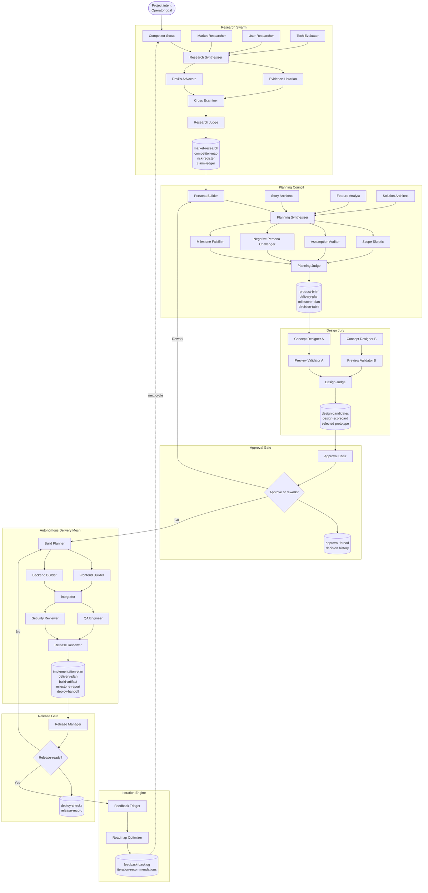
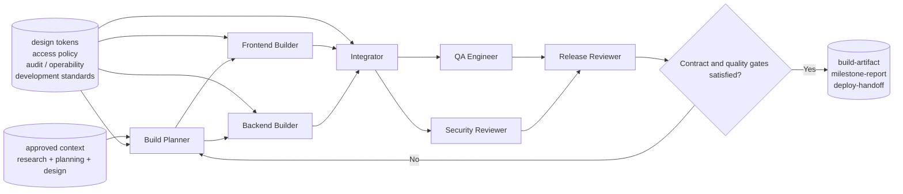

# Pylon Product Lifecycle Multi-Agent Flow

This document visualizes the current Pylon product cycle as a multi-agent operating model.
It is aligned with `PHASE_ORDER`, `build_lifecycle_phase_blueprints(...)`, and the lifecycle quality contracts in:

- `src/pylon/lifecycle/orchestrator.py`
- `src/pylon/lifecycle/contracts.py`

## 1. Lifecycle Overview

## 2. Development Contract-Conformance Flow

## 3. Operating Rules

- `research`, `planning`, `design`, and `development` are executable multi-agent phases with explicit team blueprints and artifact contracts.
- `approval`, `deploy`, and `iterate` are not decorative UI steps; they are governance, release, and feedback loops that must preserve auditability.
- Development should not start from a blank prompt. It should start from approved upstream context plus formal contracts such as `design tokens`, `access policy`, `audit / operability`, and `development standards`.
- Prototype implementation should re-enter the planner or reviewer loop when contract conformance, security posture, milestone readiness, or deploy handoff is incomplete.
- Human decision points remain visible at the approval and release gates even when most execution is autonomous.
