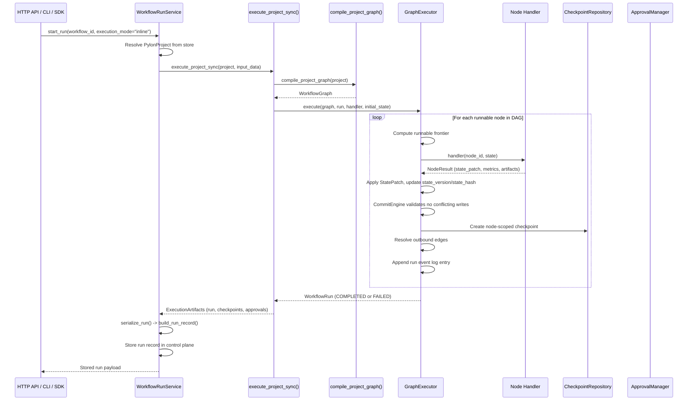
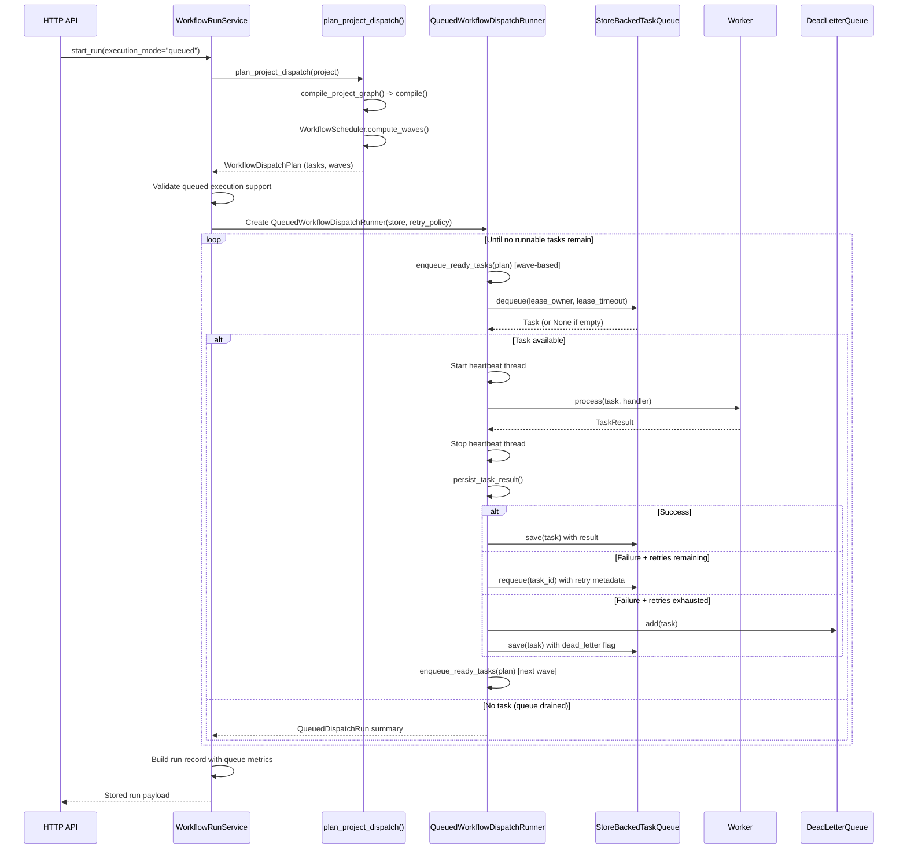
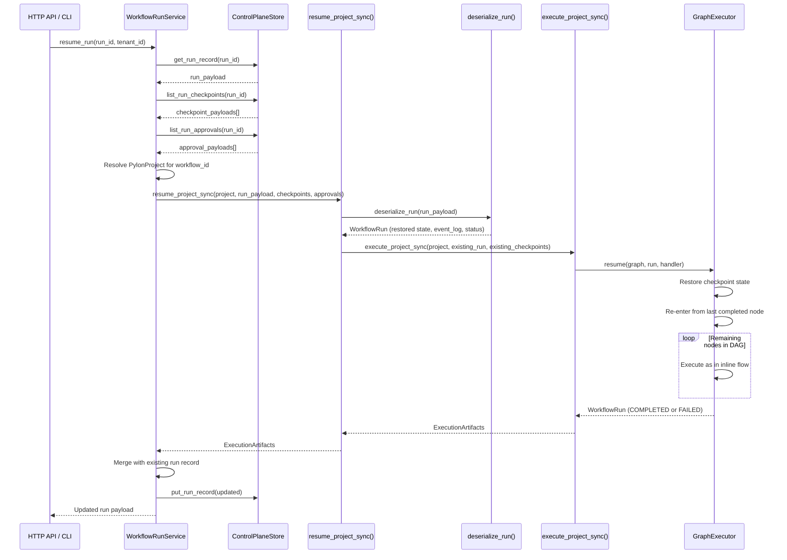
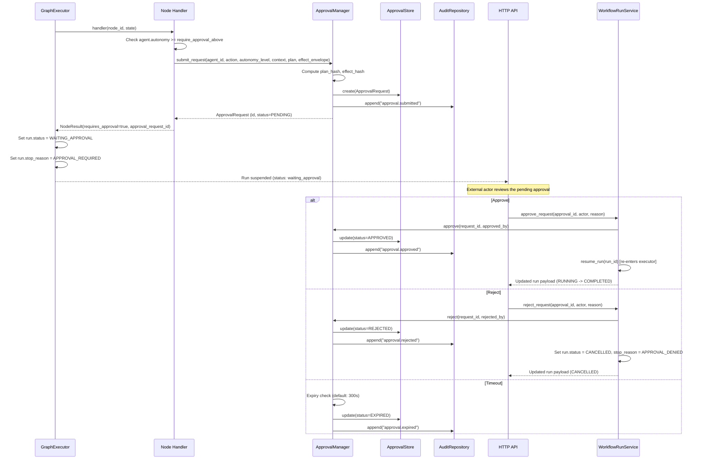
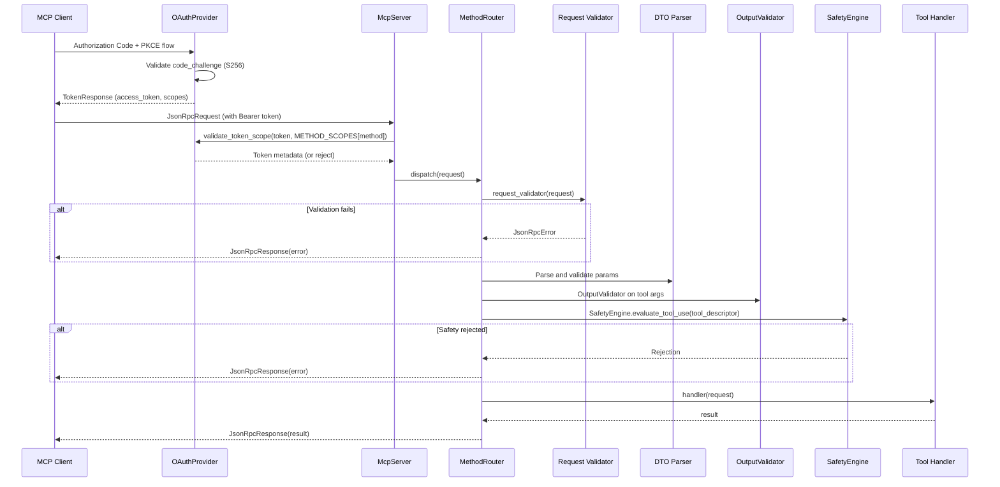
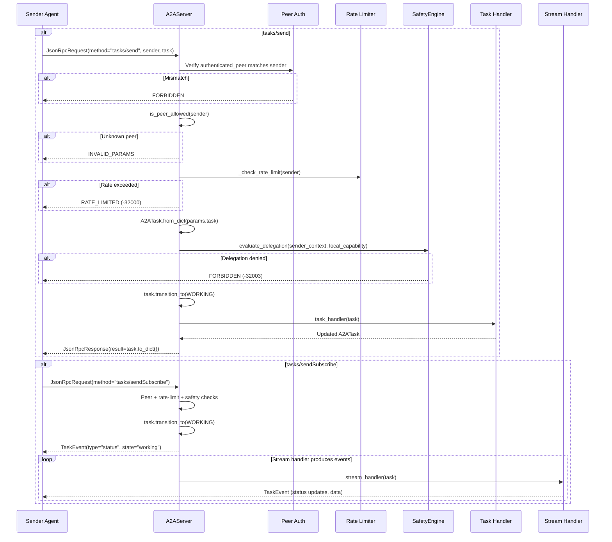
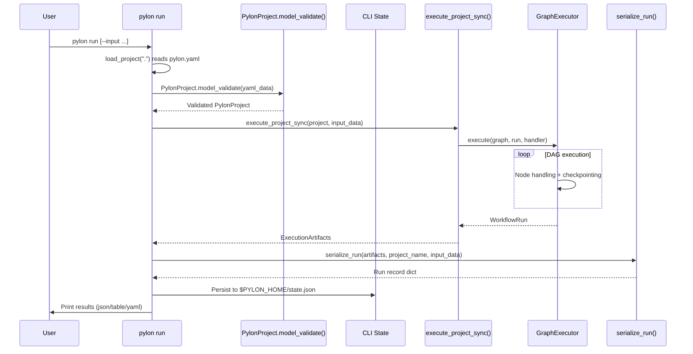
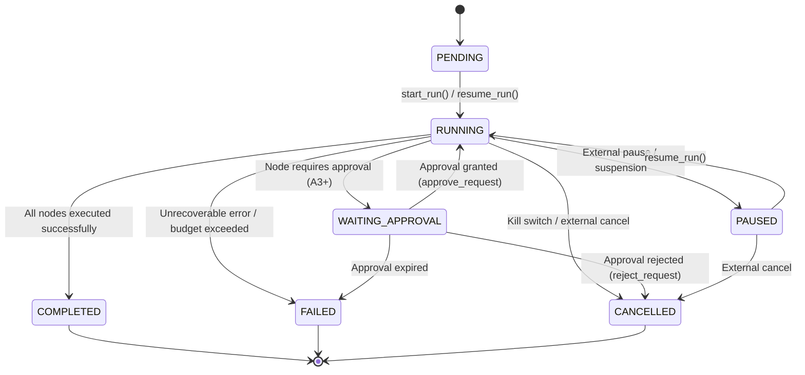

# Runtime Flows

This document describes the runtime execution paths in the Pylon platform. Each section covers a distinct flow with its sequence diagram, key components, step-by-step description, and error handling behavior.

---

## 1. Inline Execution Flow

The default and most mature execution path. A workflow is compiled from a `PylonProject` definition and executed synchronously through the `GraphExecutor` DAG scheduler.

### Sequence Diagram

### Step-by-Step

1. **Entry**: `WorkflowRunService.start_run()` resolves the registered `PylonProject` for the given `workflow_id` and `tenant_id`.
2. **Compilation**: `compile_project_graph()` walks `project.workflow.nodes` and builds a `WorkflowGraph` with typed nodes, conditional edges, loop metadata, and join policies.
3. **Graph Validation**: `WorkflowGraph.validate()` checks for DAG acyclicity and structural correctness. `compile()` produces a `CompiledWorkflow` with edge resolution and entry-node detection.
4. **Executor Loop**: `GraphExecutor.execute()` enters the main scheduling loop:
   - Computes the runnable frontier (nodes whose inbound dependencies are satisfied).
   - Invokes the node handler with `(node_id, state)`.
   - Normalizes the return value into a `NodeResult`.
   - Applies `StatePatch` objects via `CommitEngine`, which rejects conflicting parallel writes.
   - Updates `state_version` and `state_hash` for deterministic replay.
   - Creates a node-scoped `Checkpoint` via `CheckpointRepository`.
   - Resolves outbound edges (including conditional evaluation from a restricted AST subset).
   - Appends a structured event to the run event log.
5. **Completion**: The run transitions to `COMPLETED` when no more runnable nodes exist, or `FAILED` on unrecoverable error.
6. **Serialization**: `serialize_run()` produces the canonical stored run record with state, event log, checkpoint IDs, and approval references.

### Error Handling

- **Conflicting parallel writes**: `CommitEngine` detects overlapping state keys written by concurrent nodes in the same wave. The run fails with `RunStopReason.STATE_CONFLICT`.
- **Max steps exceeded**: `GraphExecutor` enforces a `max_steps` limit (default: `node_count * 10`). Exceeding it fails the run with `RunStopReason.LIMIT_EXCEEDED`.
- **Handler exceptions**: Unhandled exceptions from node handlers are caught by the executor and result in a `FAILED` run with the error recorded in the event log.
- **Goal-driven termination**: When a `GoalSpec` is present, the executor evaluates termination conditions (cost budget, token budget, quality criteria) after each node.

### Key Components

| Component | Module |
|---|---|
| `WorkflowRunService` | `pylon.control_plane.workflow_service` |
| `execute_project_sync()` | `pylon.runtime.execution` |
| `compile_project_graph()` | `pylon.runtime.execution` |
| `GraphExecutor` | `pylon.workflow.executor` |
| `CommitEngine` | `pylon.workflow.commit` |
| `CheckpointRepository` | `pylon.repository.checkpoint` |
| `WorkflowRun` | `pylon.repository.workflow` |
| `NodeResult` | `pylon.workflow.result` |

---

## 2. Queued Execution Flow

An alternative execution mode that projects the workflow DAG into a wave-based dispatch plan and executes it through a durable task queue with lease-based ownership, heartbeats, retry policies, and dead-letter handling.

### Sequence Diagram

### Step-by-Step

1. **Plan Generation**: `plan_project_dispatch()` compiles the project graph and uses `WorkflowScheduler.compute_waves()` to partition nodes into dependency-ordered waves.
2. **Validation**: `_validate_queued_execution_support()` rejects workflows with goals, approval-gated agents, conditional edges, non-default join policies, or non-agent node types.
3. **Runner Initialization**: `QueuedWorkflowDispatchRunner` is created with the configured `RetryPolicy` (fixed or exponential backoff), lease timeout, and heartbeat interval.
4. **Wave Dispatch Loop**:
   - `enqueue_ready_tasks()` scans the dispatch plan and enqueues tasks whose dependencies are all `COMPLETED`.
   - `dequeue()` acquires a lease on the next pending task.
   - A background heartbeat thread periodically extends the lease to prevent expiry during long-running handlers.
   - `Worker.process()` invokes the handler and produces a `TaskResult`.
   - On success, the result is persisted and downstream tasks become eligible.
   - On failure, `_apply_retry_policy()` either requeues with backoff or dead-letters the task.
5. **Drain**: The loop continues until `dequeue()` returns `None` (no runnable tasks).
6. **Summary**: A `QueuedDispatchRun` captures completed, failed, blocked, and dead-lettered task IDs.

### Error Handling

- **Lease expiry**: If a worker dies without heartbeating, `recover_expired_leases()` re-enqueues orphaned tasks on the next runner initialization.
- **Retry with backoff**: `FixedRetry` or `ExponentialBackoff` policies control max retries and delay. Retry metadata is stored in the task payload.
- **Dead-letter queue**: Tasks that exhaust all retries are moved to the `DeadLetterQueue` and flagged in the run record.
- **Conflicting state writes**: Parallel nodes in the same wave that write overlapping state keys cause the run to fail with `RunStopReason.STATE_CONFLICT`.
- **Blocked tasks**: Tasks whose dependencies failed or were cancelled are reported as `blocked_task_ids`.

### Key Components

| Component | Module |
|---|---|
| `plan_project_dispatch()` | `pylon.runtime.planning` |
| `WorkflowScheduler` | `pylon.control_plane.scheduler` |
| `QueuedWorkflowDispatchRunner` | `pylon.runtime.queued_runner` |
| `StoreBackedTaskQueue` | `pylon.taskqueue.store_queue` |
| `Worker` | `pylon.taskqueue.worker` |
| `RetryPolicy` / `ExponentialBackoff` | `pylon.taskqueue.retry` |
| `DeadLetterQueue` | `pylon.taskqueue` |

---

## 3. Resume Flow

Resumes a previously suspended or paused workflow run from its last checkpoint. The existing run record, checkpoints, and approvals are deserialized and fed back into the executor.

### Sequence Diagram

### Step-by-Step

1. **Load State**: `WorkflowRunService.resume_run()` loads the existing run record, all associated checkpoints, and approval records from the control-plane store.
2. **Validation**: The service verifies the run is in a resumable status (`PAUSED`, `WAITING_APPROVAL` after approval, or `FAILED` for retry). The input data is validated against the original run input if `expected_resume_input` is set.
3. **Deserialization**: `deserialize_run()` reconstructs a `WorkflowRun` object from the serialized payload, restoring `status`, `state`, `state_version`, `state_hash`, `event_log`, and `approval_request_id`.
4. **Checkpoint Restoration**: Existing checkpoints are loaded into a fresh `CheckpointRepository`. Existing approvals are loaded into the `ApprovalStore`.
5. **Re-entry**: `GraphExecutor.resume()` picks up from the last successfully checkpointed node and continues execution through the remaining DAG.
6. **Completion**: The resumed run follows the same execution semantics as the inline flow from the re-entry point onward.

### Error Handling

- **Non-resumable status**: Attempting to resume a `COMPLETED` or `CANCELLED` run raises `ValueError`.
- **Input mismatch**: If `expected_resume_input` does not match the provided `input_data`, a `ValueError` is raised.
- **State hash verification**: `ReplayEngine` can verify `state_hash` consistency during re-entry to detect state corruption.

### Key Components

| Component | Module |
|---|---|
| `WorkflowRunService.resume_run()` | `pylon.control_plane.workflow_service` |
| `resume_project_sync()` | `pylon.runtime.execution` |
| `deserialize_run()` | `pylon.runtime.execution` |
| `GraphExecutor.resume()` | `pylon.workflow.executor` |
| `ReplayEngine` | `pylon.workflow.replay` |

---

## 4. Approval Flow

When a node's agent has autonomy level A3 or above (as determined by `require_approval_above` policy), execution is suspended until an external actor approves or rejects the pending request.

### Sequence Diagram

### Step-by-Step

1. **Trigger**: During node execution, the handler checks whether the agent's autonomy level meets or exceeds the project policy `require_approval_above` (default: A3).
2. **Submission**: `ApprovalManager.submit_request()` creates an `ApprovalRequest` with `plan_hash` and `effect_hash` computed from the node's execution plan and effect envelope. This ensures approval is bound to a specific scope.
3. **Suspension**: The handler returns `NodeResult(requires_approval=True, approval_request_id=...)`. The executor transitions the run to `WAITING_APPROVAL` with `RunStopReason.APPROVAL_REQUIRED`.
4. **External Decision**: An operator uses the API endpoints:
   - `POST /api/v1/approvals/{approval_id}/approve` to approve.
   - `POST /api/v1/approvals/{approval_id}/reject` to reject.
5. **Resume on Approval**: `WorkflowRunService.approve_request()` marks the approval as `APPROVED` and calls `resume_run()` to re-enter the executor from the suspended checkpoint.
6. **Cancel on Rejection**: `WorkflowRunService.reject_request()` marks the approval as `REJECTED` and transitions the run to `CANCELLED` with `RunStopReason.APPROVAL_DENIED`.
7. **Expiry**: Pending approvals that exceed `timeout_seconds` (default: 300) are automatically expired during subsequent `get_pending()` or `get_request()` calls.

### Binding Validation

Before resuming after approval, `ApprovalManager.validate_binding()` re-checks that the `plan_hash` and `effect_hash` still match the original request. If the plan or effect envelope has drifted (e.g., the workflow definition changed), an `ApprovalBindingMismatchError` is raised, preventing stale approvals from authorizing modified actions.

### Key Components

| Component | Module |
|---|---|
| `ApprovalManager` | `pylon.approval.manager` |
| `ApprovalStore` | `pylon.approval.store` |
| `ApprovalRequest` / `ApprovalDecision` | `pylon.approval.types` |
| `AuditRepository` | `pylon.repository.audit` |
| `AutonomyLevel` | `pylon.types` |

---

## 5. MCP Protocol Flow

The Model Context Protocol server handles JSON-RPC 2.0 requests with OAuth 2.1 + PKCE authentication and scope-based access control.

### Sequence Diagram

### Step-by-Step

1. **Authentication**: The client obtains an access token through the OAuth 2.1 Authorization Code flow with PKCE (S256 challenge method). The `OAuthProvider` validates the `code_verifier` against the stored `code_challenge`.
2. **Token Validation**: Each incoming JSON-RPC request includes a Bearer token. The server validates the token and checks that its scopes cover the required scope for the requested method (as defined in `METHOD_SCOPES`).
3. **Request Routing**: `MethodRouter.dispatch()` looks up the registered handler for the JSON-RPC method name.
4. **Request Validation**: An optional request validator (set via `set_request_validator()`) performs pre-dispatch checks.
5. **DTO Parsing**: Request params are parsed into typed DTOs. `DtoValidationError` results in an `INVALID_PARAMS` JSON-RPC error.
6. **Safety Checks**: `OutputValidator` validates tool arguments. `SafetyEngine.evaluate_tool_use()` checks the tool descriptor against safety policies. Unsafe arguments or tools requiring approval are rejected before handler invocation.
7. **Handler Dispatch**: The validated request is dispatched to the registered handler.
8. **Response**: The handler result is wrapped in a `JsonRpcResponse`. Notifications (requests with `id=None`) receive no response.

### Error Handling

- **Unknown method**: Returns `METHOD_NOT_FOUND` (-32601).
- **Invalid params**: Returns `INVALID_PARAMS` (-32602) on DTO validation failure.
- **Unhandled handler exception**: Returns `INTERNAL_ERROR` (-32603) with a generic message (no stack trace leakage).
- **Token expired/invalid**: Rejected at the OAuth validation layer before reaching the router.
- **Insufficient scope**: Rejected when the token's scopes do not cover the method's required scope.

### Supported MCP Methods and Required Scopes

| Method | Required Scope |
|---|---|
| `tools/list` | `tools:read` |
| `tools/call` | `tools:call` |
| `resources/list` | `resources:read` |
| `resources/read` | `resources:read` |
| `resources/subscribe` | `resources:subscribe` |
| `prompts/list` | `prompts:read` |
| `prompts/get` | `prompts:execute` |
| `sampling/createMessage` | `sampling:create` |

### Key Components

| Component | Module |
|---|---|
| `McpServer` | `pylon.protocols.mcp.server` |
| `MethodRouter` | `pylon.protocols.mcp.router` |
| `OAuthProvider` | `pylon.protocols.mcp.auth` |
| `PKCEChallenge` | `pylon.protocols.mcp.auth` |
| `OutputValidator` | `pylon.safety.output_validator` |
| `SafetyEngine` | `pylon.safety.engine` |
| `ToolDescriptor` | `pylon.safety.tools` |

---

## 6. A2A Protocol Flow

Agent-to-agent communication via the A2A JSON-RPC 2.0 server. Supports task delegation with peer authentication, rate limiting, and safety evaluation.

### Sequence Diagram

### Step-by-Step

1. **Peer Authentication**: If `authenticated_peer` is provided (e.g., via mTLS), the server verifies that the `sender` field in the request matches the authenticated identity.
2. **Peer Authorization**: The sender is checked against the `allowed_peers` set. Unknown peers are rejected.
3. **Rate Limiting**: A sliding-window rate limiter tracks requests per peer within `rate_window` seconds. Exceeding `rate_limit` returns a `RATE_LIMITED` error.
4. **Task Construction**: `A2ATask.from_dict()` deserializes the task payload.
5. **Safety Evaluation**: A `SafetyContext` is built for the sender (from peer policies or task metadata). `SafetyEngine.evaluate_delegation()` checks whether the sender's capabilities are compatible with the local receiver's capability policy.
6. **Task Execution**: For `tasks/send`, the registered `task_handler` processes the task synchronously. For `tasks/sendSubscribe`, the `stream_handler` yields `TaskEvent` objects asynchronously.
7. **Task Lifecycle**: Tasks transition through states: `SUBMITTED` -> `WORKING` -> `COMPLETED` | `FAILED` | `CANCELED`.

### Additional Methods

| Method | Description |
|---|---|
| `tasks/get` | Retrieve a task by ID |
| `tasks/cancel` | Cancel a task (if state transition is valid) |
| `tasks/pushNotification/set` | Configure push notification endpoint for a task |
| `tasks/pushNotification/get` | Retrieve push notification configuration |

### Error Handling

- **Peer identity mismatch**: Returns `FORBIDDEN` (-32003).
- **Unknown peer**: Returns `INVALID_PARAMS` (-32602).
- **Rate limit exceeded**: Returns `RATE_LIMITED` (-32000).
- **Safety evaluation failure**: Returns `FORBIDDEN` (-32003) with the denial reason.
- **Duplicate task ID**: Returns `INVALID_PARAMS` (-32602) to prevent task overwrite.
- **Invalid state transition**: `tasks/cancel` rejects transitions from terminal states.

### Key Components

| Component | Module |
|---|---|
| `A2AServer` | `pylon.protocols.a2a.server` |
| `A2ATask` / `TaskEvent` | `pylon.protocols.a2a.types` |
| `SafetyEngine` | `pylon.safety.engine` |
| `SafetyContext` | `pylon.safety.context` |
| `AgentCapability` | `pylon.types` |

---

## 7. CLI Execution Flow

The `pylon run` command provides local workflow execution from a `pylon.yaml` project definition.

### Sequence Diagram

### Step-by-Step

1. **Project Loading**: `load_project(".")` reads `pylon.yaml` from the current directory.
2. **Validation**: `PylonProject.model_validate()` (Pydantic) validates the project definition, including agents, workflow nodes, policy, and goal configuration.
3. **Execution**: `execute_project_sync()` compiles and executes the project graph through the same `GraphExecutor` runtime used by the API and SDK.
4. **Serialization**: `serialize_run()` produces the canonical run record.
5. **State Persistence**: The run record, checkpoints, approvals, and sandbox metadata are persisted to `$PYLON_HOME/state.json` for local state management.
6. **Output**: Results are formatted according to the `--output` flag (`json`, `table`, or `yaml`; default: `table` for TTY, `json` for pipe).

### Error Handling

- **Invalid pylon.yaml**: Pydantic validation errors are surfaced with field-level detail.
- **Runtime errors**: Execution failures are captured in the run record and printed with the run status.
- **File not found**: Missing `pylon.yaml` results in a clear error message.

### Key Components

| Component | Module |
|---|---|
| `cli` / `run` command | `pylon.cli.main` / `pylon.cli.commands.run` |
| `PylonProject` | `pylon.dsl.parser` |
| `OutputFormatter` | `pylon.cli.output` |
| CLI state management | `pylon.cli.state` |

---

## 8. State Transitions

The `WorkflowRun` status follows a deterministic state machine. The diagram below captures all valid transitions.

### State Diagram

### Status Definitions

| Status | Description |
|---|---|
| `PENDING` | Run created but not yet started. |
| `RUNNING` | Actively executing nodes in the DAG. |
| `WAITING_APPROVAL` | Suspended at a node that requires human approval (A3+ autonomy). |
| `PAUSED` | Suspended by external request or system-initiated suspension. |
| `COMPLETED` | All nodes executed successfully and the run reached a terminal state. |
| `FAILED` | Execution encountered an unrecoverable error, budget exceeded, or approval expired. |
| `CANCELLED` | Run was explicitly cancelled by an operator, kill switch, or approval rejection. |

### Stop Reasons

When a run leaves the `RUNNING` state, a machine-readable `RunStopReason` is recorded:

| Reason | Trigger |
|---|---|
| `NONE` | Normal completion. |
| `LIMIT_EXCEEDED` | Max steps exceeded. |
| `TIMEOUT_EXCEEDED` | Execution timeout. |
| `TOKEN_BUDGET_EXCEEDED` | Token budget exhausted. |
| `COST_BUDGET_EXCEEDED` | Cost budget exhausted. |
| `APPROVAL_REQUIRED` | Node requires approval (run paused). |
| `APPROVAL_DENIED` | Approval request rejected. |
| `EXTERNAL_STOP` | Operator-initiated stop or kill switch. |
| `ESCALATION_REQUIRED` | Agent escalated beyond its autonomy level. |
| `STUCK_DETECTED` | No progress detected across iterations. |
| `LOOP_EXHAUSTED` | Loop node reached max iterations without convergence. |
| `QUALITY_REACHED` | Quality threshold met (goal-driven). |
| `QUALITY_FAILED` | Quality threshold not met after exhausting attempts. |
| `STATE_CONFLICT` | Conflicting parallel state writes detected. |
| `WORKFLOW_ERROR` | Unhandled workflow-level error. |

---

## How To Read The Repository

For the most representative implementation path, read the source in this order:

1. `pylon.types` -- Core enums, autonomy levels, run status, capabilities
2. `pylon.workflow` -- Graph, compiled workflow, executor, commit engine, replay
3. `pylon.runtime.execution` -- compile, execute, resume, serialize
4. `pylon.runtime.planning` -- Dispatch plan generation for queued mode
5. `pylon.runtime.queued_runner` -- Queue-backed dispatch runner
6. `pylon.repository.workflow` / `pylon.repository.checkpoint` -- Persistence
7. `pylon.approval` -- Approval manager, store, types
8. `pylon.safety` -- Safety engine, autonomy enforcer, output validator
9. `pylon.protocols.mcp` -- MCP server, router, auth
10. `pylon.protocols.a2a` -- A2A server, task lifecycle
11. `pylon.control_plane.workflow_service` -- Shared control-plane service
12. `pylon.cli` / `pylon.api` / `pylon.sdk` -- Entry points
