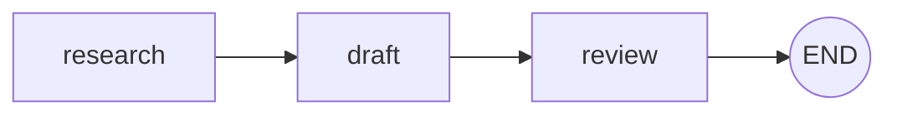
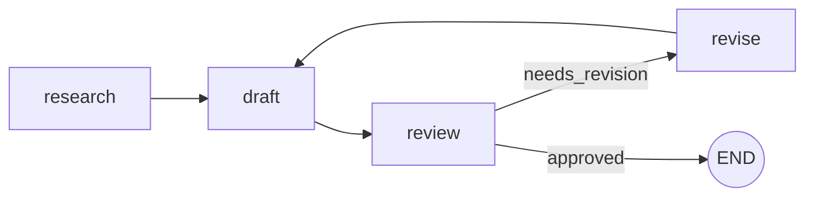

# Getting Started with Pylon

This guide walks you through installing Pylon, creating your first multi-agent workflow, and running it via the CLI, HTTP API, and Python SDK.

## 1. Prerequisites

- **Python 3.12** or later
- **pip** or **uv** package manager

Verify your Python version:

```bash
python --version   # Should print 3.12.x or later
```

## 2. Installation

Install the published package:

```bash
pip install pylon-ai
```

Or, for development (includes test and lint dependencies):

```bash
git clone https://github.com/noriyuki-nakano-opsdata/pylon.git
cd pylon
pip install -e ".[dev]"
```

After installation, confirm the CLI is available:

```bash
pylon --version   # pylon, version 0.2.0
```

## 3. Project Structure

Scaffold a new project with `pylon init`:

```bash
mkdir my-project && cd my-project
pylon init --name my-project
```

This creates a single file in the current directory:

```text
my-project/
  pylon.yaml           # Workflow definition
```

With `--quickstart`, you also get a Docker Compose file for sandbox execution:

```bash
pylon init --name my-project --quickstart
```

```text
my-project/
  pylon.yaml
  docker-compose.yaml
```

Runtime state (workflow runs, checkpoints, approvals) is stored separately under
`$PYLON_HOME` (defaults to `~/.pylon`), not in the project directory.

## 4. Your First Workflow

Open `pylon.yaml` and define a three-agent workflow. This example researches a
topic, drafts a summary, and reviews the result:

```yaml
version: "1"
name: research-pipeline
description: Research a topic, draft a summary, and review it

agents:
  researcher:
    model: anthropic/claude-sonnet-4-20250514
    role: >
      Research the given topic thoroughly.
      Gather key facts, recent developments, and expert opinions.
    autonomy: A2
    tools: [web-search, file-read]
    sandbox: docker
    input_trust: untrusted

  drafter:
    model: anthropic/claude-sonnet-4-20250514
    role: >
      Write a clear, well-structured summary based on the research.
      Target 500 words with an executive summary and key takeaways.
    autonomy: A2
    tools: [file-read, file-write]
    sandbox: docker

  reviewer:
    model: anthropic/claude-sonnet-4-20250514
    role: >
      Review the draft for accuracy, clarity, and completeness.
      Approve or request specific revisions.
    autonomy: A3
    tools: [file-read]

workflow:
  type: graph
  nodes:
    research:
      agent: researcher
      next: draft
    draft:
      agent: drafter
      next: review
    review:
      agent: reviewer
      next: END

goal:
  objective: "Produce an accurate, well-sourced summary of the given topic"
  success_criteria:
    - "All claims are supported by cited sources"
    - "Summary is between 400 and 600 words"

policy:
  max_cost_usd: 5.0
  max_duration: 30m
  require_approval_above: A3
  safety:
    blocked_actions: [git-push]
    max_file_changes: 20
  compliance:
    audit_log: required
```

Key points about the configuration:

- **agents** defines the AI participants, their models, roles, allowed tools, and autonomy levels.
- **workflow.nodes** defines the execution graph. Each node references an agent and declares its successors. Use `END` to mark terminal nodes.
- **policy** sets guardrails: cost limits, duration caps, approval requirements, and blocked actions.
- **goal** (optional) declares what the workflow should accomplish and how to measure success.

## 5. Running the Workflow

Execute the workflow from the project directory:

```bash
pylon run --input '{"topic": "AI safety"}'
```

Pylon compiles the YAML into a DAG, validates all references, and executes each
node in topological order. Because the `reviewer` agent has autonomy level A3
and the policy sets `require_approval_above: A3`, the run will pause before
the review step and wait for human approval.

### Inspecting a run

```bash
# View the full run payload (execution summary, approvals, metrics)
pylon inspect <run_id>

# Stream the event log
pylon logs <run_id>
```

### Approving or denying

When a run pauses for approval:

```bash
# Approve and resume
pylon approve <approval_id>

# Deny with a reason
pylon approve <approval_id> --deny --reason "Missing source citations"
```

### Replaying from a checkpoint

Every completed node creates a checkpoint. You can replay the workflow state at
any checkpoint:

```bash
pylon replay <checkpoint_id>
```

The replay engine reconstructs state from the event log and verifies state
hashes to ensure consistency.

## 6. Using the HTTP API

Pylon includes a built-in HTTP API server for programmatic access. Start it with
the `dev` command:

```bash
pylon dev --port 8080
```

### Register a workflow

```bash
curl -X POST http://localhost:8080/workflows \
  -H "Content-Type: application/json" \
  -H "X-Tenant-ID: default" \
  -d '{
    "id": "research-pipeline",
    "project": {
      "version": "1",
      "name": "research-pipeline",
      "agents": {
        "researcher": {"model": "anthropic/claude-sonnet-4-20250514", "role": "Research topics", "autonomy": "A2"},
        "drafter":    {"model": "anthropic/claude-sonnet-4-20250514", "role": "Draft summaries", "autonomy": "A2"},
        "reviewer":   {"model": "anthropic/claude-sonnet-4-20250514", "role": "Review drafts", "autonomy": "A3"}
      },
      "workflow": {
        "nodes": {
          "research": {"agent": "researcher", "next": "draft"},
          "draft":    {"agent": "drafter",    "next": "review"},
          "review":   {"agent": "reviewer",   "next": "END"}
        }
      }
    }
  }'
```

### Start a run

```bash
curl -X POST http://localhost:8080/workflows/research-pipeline/run \
  -H "Content-Type: application/json" \
  -H "X-Tenant-ID: default" \
  -d '{"input": {"topic": "AI safety"}}'
```

Response (`202 Accepted`):

```json
{
  "id": "r1a2b3c4d5e6",
  "workflow_id": "research-pipeline",
  "status": "completed",
  "execution_summary": {
    "total_events": 3,
    "last_node": "review",
    "pending_approval": false
  }
}
```

### Check run status

```bash
curl http://localhost:8080/api/v1/workflow-runs/<run_id> \
  -H "X-Tenant-ID: default"
```

### Approve a pending request

```bash
curl -X POST http://localhost:8080/api/v1/approvals/<approval_id>/approve \
  -H "Content-Type: application/json" \
  -H "X-Tenant-ID: default" \
  -d '{"reason": "Looks good"}'
```

See the [API Reference](api-reference.md) for the complete route contract.

## 7. Using the Python SDK

Pylon provides two SDK clients: `PylonClient` for in-process execution and
`PylonHTTPClient` for remote API access.

### In-process execution with PylonClient

```python
from pylon.dsl.parser import PylonProject
from pylon.sdk import PylonClient

client = PylonClient()

# Register a project from a dict (or load from a YAML file)
project = PylonProject.model_validate({
    "version": "1",
    "name": "research-pipeline",
    "agents": {
        "researcher": {"role": "Research topics"},
        "drafter": {"role": "Draft summaries"},
        "reviewer": {"role": "Review drafts"},
    },
    "workflow": {
        "nodes": {
            "research": {"agent": "researcher", "next": "draft"},
            "draft": {"agent": "drafter", "next": "review"},
            "review": {"agent": "reviewer", "next": "END"},
        }
    },
})

client.register_project("research-pipeline", project)

# Execute the workflow
result = client.run_workflow("research-pipeline", input_data={"topic": "AI safety"})
print(f"Run ID: {result.run_id}")
print(f"Status: {result.status}")
print(f"Output: {result.output}")

# Retrieve the full run details
run = client.get_run(result.run_id)
```

### Decorator-based workflow authoring

```python
from pylon.sdk import PylonClient, agent, workflow

client = PylonClient()

@agent(name="researcher", role="Research topics and gather facts")
def researcher(state):
    return {"findings": f"Research on: {state['topic']}"}

@agent(name="drafter", role="Draft a summary from research")
def drafter(state):
    return {"draft": f"Summary based on: {state['findings']}"}

@agent(name="reviewer", role="Review the draft")
def reviewer(state):
    return {"verdict": "approved", "draft": state["draft"]}

@workflow(name="research-pipeline")
def define(builder):
    builder.add_node("research", agent="researcher")
    builder.add_node("draft", agent="drafter")
    builder.add_node("review", agent="reviewer")
    builder.add_edge("research", "draft")
    builder.add_edge("draft", "review")
    builder.set_entry("research")

client.register_workflow("research-pipeline", define)
result = client.run_workflow("research-pipeline", input_data={"topic": "AI safety"})
run = client.get_run(result.run_id)
```

### Remote execution with PylonHTTPClient

```python
from pylon.sdk import PylonHTTPClient

client = PylonHTTPClient(
    base_url="http://localhost:8080",
    tenant_id="default",
)

# Start a run against a previously registered workflow
result = client.run_workflow("research-pipeline", input_data={"topic": "AI safety"})
print(f"Run ID: {result.run_id}, Status: {result.status}")

# Poll run status
run = client.get_run(result.run_id)

# List pending approvals
approvals = client.list_approvals(run_id=result.run_id)
if approvals:
    client.approve_request(approvals[0]["id"], reason="Approved")

# Replay a checkpoint
checkpoints = client.list_checkpoints(run_id=result.run_id)
if checkpoints:
    replay = client.replay_checkpoint(checkpoints[0]["id"])
```

## 8. Workflow Concepts

### DAG Execution Model

Pylon compiles your `workflow.nodes` into a directed acyclic graph (DAG) and
executes nodes in topological order. Nodes with no unresolved dependencies run
concurrently when possible.



Conditional edges allow branching based on workflow state:

```yaml
nodes:
  review:
    agent: reviewer
    next:
      - target: revise
        condition: "state.verdict == 'needs_revision'"
      - target: END
        condition: "state.verdict == 'approved'"
```



### Autonomy Levels

Pylon uses a five-level autonomy ladder to control how much independence each
agent has:

| Level | Name | Behavior |
|-------|------|----------|
| **A0** | Manual | All actions require human execution |
| **A1** | Supervised | Each step needs explicit human approval |
| **A2** | Bounded | Autonomous within policy bounds, no per-step approval |
| **A3** | Plan-Approved | Agent proposes a plan; human approves; then autonomous execution |
| **A4** | Fully Autonomous | Operates independently within the safety envelope |

The `policy.require_approval_above` setting determines the threshold. When set
to `A3`, agents at A3 or above trigger an approval gate before execution.

### Join Policies

When a node has multiple inbound edges (fan-in), a join policy determines when
it becomes eligible to run:

- **all_resolved** (default) -- wait for every predecessor to complete
- **any_resolved** -- start as soon as one predecessor completes
- **majority_resolved** -- start when more than half have completed

### Checkpoints and Replay

After each node completes, Pylon records a checkpoint containing the current
workflow state, event log, and a state hash. This enables:

- **Replay**: Reconstruct the exact workflow state at any checkpoint. The replay
  engine verifies state hashes to detect tampering or drift.
- **Resume**: Restart a paused or failed workflow from the last good checkpoint
  instead of re-running from scratch.
- **Audit**: The complete event log provides a verifiable trace of every
  decision, approval, and state transition.

## 9. Environment Variables

| Variable | Description | Default |
|----------|-------------|---------|
| `PYLON_DEFAULT_MODEL` | Default model when not specified in agent config | `anthropic/claude-sonnet-4-20250514` |
| `PYLON_HOME` | CLI state and config directory | `~/.pylon` |
| `PYLON_VAULT_ADDR` | Vault address for secrets integration | `http://127.0.0.1:8200` |
| `PYLON_VAULT_TOKEN` | Vault authentication token | (unset) |

## 10. Next Steps

You now have a working Pylon installation and an understanding of the core
workflow model. To go deeper:

- [Architecture Overview](architecture.md) -- understand the layered design and
  module responsibilities
- [API Reference](api-reference.md) -- complete HTTP route contract with request
  and response schemas
- [Specification](SPECIFICATION.md) -- the full implemented specification
  including safety, protocols, and multi-tenancy
