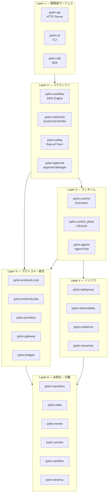
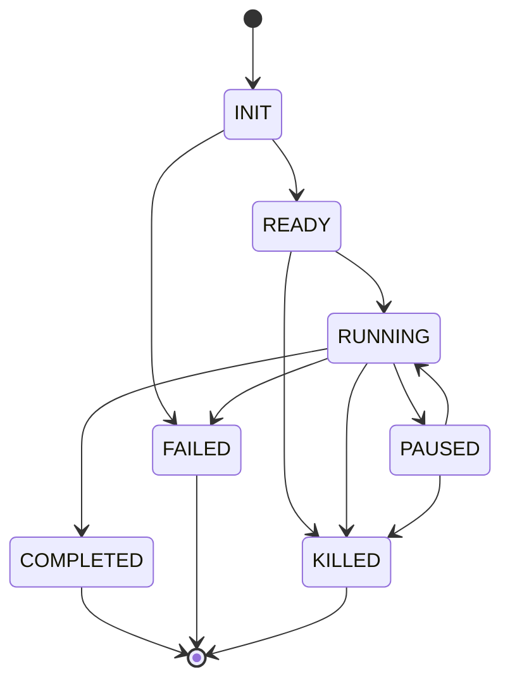
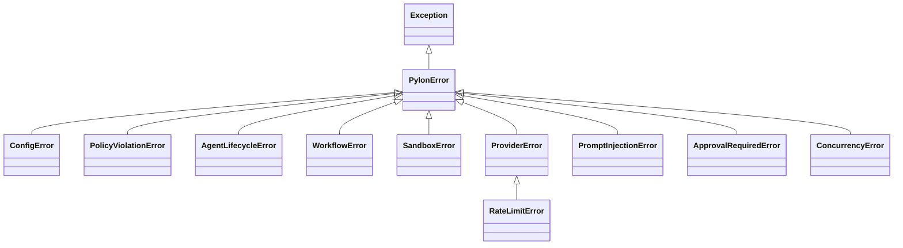
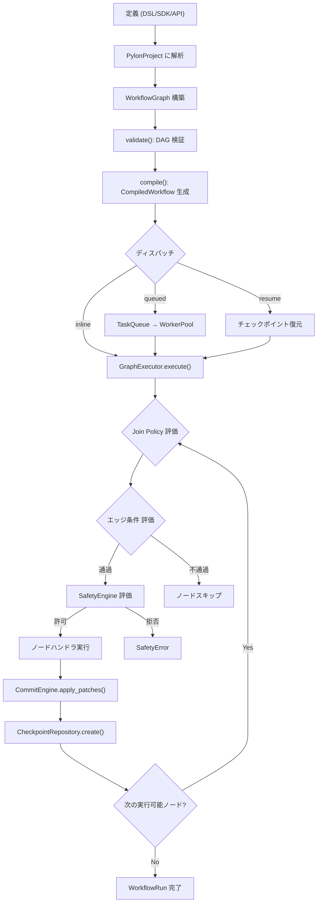
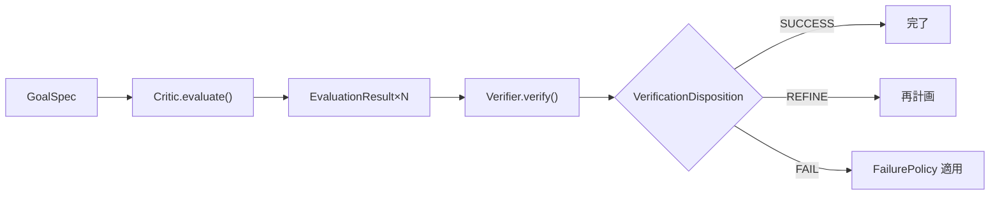

# Pylon システム仕様書 v2.0

| 項目 | 内容 |
|-----|------|
| 文書番号 | PYLON-SPEC-JP-002 |
| バージョン | 2.0 |
| 作成日 | 2026-03-11 |
| 対象バージョン | Pylon v0.2.0 |
| 対象読者 | 開発者・技術ステークホルダー |
| ソースオブトゥルース | `src/pylon/` 以下の実装コード |

## 改訂履歴

| 版 | 日付 | 改訂内容 |
|---|------|---------|
| 1.0 | 2026-03-11 | 初版作成 |
| 2.0 | 2026-03-11 | 実コード照合による全面改訂。型定義・エラー体系・autonomy・gateway・bridges・cost モジュールを追加。ダイアグラム・状態遷移テーブルを導入 |

---

## 用語定義

| 用語 | 定義 |
|-----|------|
| DAG | Directed Acyclic Graph（有向非巡回グラフ）。ワークフローの実行順序を定義 |
| Rule-of-Two+ | 単一実行フレームで危険なケイパビリティの組み合わせを禁止する安全性原則 |
| Join Policy | 複数のインバウンドエッジを持つノードの実行開始条件 |
| StatePatch | ワークフロー状態への差分更新 |
| Superstep | 1回の実行ステップ（実行可能な全ノードを処理） |
| GoalSpec | 自律実行の目標定義。成功基準・制約・失敗ポリシーを含む |
| Critic | GoalSpec の成功基準に対して実行結果を評価するコンポーネント |
| Verifier | Critic の評価結果を統合して SUCCESS/REFINE/FAIL を判定 |
| ModelRouter | 目的・予算・品質要件に基づいて LLM プロバイダー/モデルを選択 |
| MCP | Model Context Protocol。JSON-RPC 2.0 ベースのツール統合プロトコル |
| A2A | Agent-to-Agent。エージェント間タスク委任プロトコル |
| HITL | Human-in-the-Loop。A3+ 自律レベルでの人間承認 |

---

## 1. 概要

### 1.1 Pylon とは

Pylon は **Python ファーストの自律型 AI エージェントオーケストレーションプラットフォーム**である。エージェントパイプラインを決定論的 DAG にコンパイルし、安全性エンフォースメント (Rule-of-Two+)、承認ゲート、自律レベル制御を組み込んで実行する。

### 1.2 技術スタック（実装済み）

| レイヤー | 技術 | バージョン |
|---------|------|----------|
| バックエンド | Python, asyncio, Pydantic, Click, PyYAML | 3.12+, 2+, 8+, 6+ |
| フロントエンド | React, TypeScript, Tailwind CSS, Vite, React Query | 19, 5.7+, 4, 6, 5 |
| ビルド | Hatchling (Python), Vite (UI) | — |
| テスト | pytest, pytest-asyncio, Vitest | 8+, 0.23+, 4+ |
| 品質 | ruff, mypy | 0.4+, 1.10+ |

---

## 2. システムアーキテクチャ

### 2.1 レイヤー構成



### 2.2 パッケージ一覧（全 37 パッケージ）

| パッケージ | 主要責務 | ソース |
|-----------|---------|--------|
| `pylon.workflow` | DAG コンパイル・実行・コミット・リプレイ | `src/pylon/workflow/` |
| `pylon.safety` | Rule-of-Two+ 静的/動的エンフォースメント | `src/pylon/safety/` |
| `pylon.autonomy` | GoalSpec, Critic, Verifier, ModelRouter, 終了条件 | `src/pylon/autonomy/` |
| `pylon.approval` | 承認ライフサイクル, plan/effect バインディング | `src/pylon/approval/` |
| `pylon.agents` | エージェントライフサイクル, プール, スーパーバイザ | `src/pylon/agents/` |
| `pylon.runtime` | 実行オーケストレーション, LLM ランタイム | `src/pylon/runtime/` |
| `pylon.control_plane` | ワークフローサービス, スケジューラ, ストア | `src/pylon/control_plane/` |
| `pylon.api` | HTTP API サーバー, ミドルウェア | `src/pylon/api/` |
| `pylon.cli` | Click CLI, ローカル実行 | `src/pylon/cli/` |
| `pylon.sdk` | デコレーター, ビルダー, HTTPクライアント | `src/pylon/sdk/` |
| `pylon.protocols.mcp` | MCP JSON-RPC サーバー, OAuth 2.1 | `src/pylon/protocols/mcp/` |
| `pylon.protocols.a2a` | A2A タスクルーティング, ピア委任 | `src/pylon/protocols/a2a/` |
| `pylon.providers` | LLM プロバイダー抽象化 | `src/pylon/providers/` |
| `pylon.gateway` | WebSocket/SSE ストリーミング, Webhook, Channel | `src/pylon/gateway/` |
| `pylon.bridges` | 外部 CLI/サービスブリッジ (6ツール) | `src/pylon/bridges/` |
| `pylon.cost` | コスト推定, 最適化, キャッシュ, フォールバック | `src/pylon/cost/` |
| `pylon.lifecycle` | プロダクトライフサイクルオーケストレーション | `src/pylon/lifecycle/` |
| `pylon.intelligence` | アダプティブルーター, イベントストア | `src/pylon/intelligence/` |
| `pylon.repository` | ワークフロー/チェックポイント/監査永続化 | `src/pylon/repository/` |
| `pylon.state` | 状態ストア, ステートマシン, スナップショット | `src/pylon/state/` |
| `pylon.events` | イベントバス, ハンドラ, デッドレター | `src/pylon/events/` |
| `pylon.secrets` | バージョン付きシークレット, Vault 抽象化 | `src/pylon/secrets/` |
| `pylon.sandbox` | サンドボックスポリシー, ライフサイクル | `src/pylon/sandbox/` |
| `pylon.tenancy` | マルチテナント分離, クォータ | `src/pylon/tenancy/` |
| `pylon.taskqueue` | 耐久キュー, ワーカープール, DLQ | `src/pylon/taskqueue/` |
| `pylon.observability` | メトリクス, トレーシング, Prometheus | `src/pylon/observability/` |
| `pylon.resilience` | サーキットブレーカー, リトライ, バルクヘッド | `src/pylon/resilience/` |
| `pylon.resources` | レート制限, リソースプール, クォータ | `src/pylon/resources/` |
| `pylon.dsl` | YAML/JSON プロジェクトパーサー | `src/pylon/dsl/` |
| `pylon.config` | 設定ロード, `${ENV_VAR}` / `${secret:key}` 解決 | `src/pylon/config/` |
| `pylon.plugins` | プラグイン検出, マニフェスト, フック | `src/pylon/plugins/` |
| `pylon.coding` | コーディングループ, 計画, レビュー | `src/pylon/coding/` |

---

## 3. コア型定義

> ソース: [`src/pylon/types.py`](../src/pylon/types.py)

### 3.1 自律レベル (`AutonomyLevel`)

```python
class AutonomyLevel(IntEnum):
    A0 = 0  # Manual: エージェントが提案、人間が実行
    A1 = 1  # Supervised: 各ステップで人間が承認
    A2 = 2  # Semi-autonomous: ポリシー範囲内で自律実行
    A3 = 3  # Autonomous-guarded: 計画を人間が承認後、実行
    A4 = 4  # Fully autonomous: 安全エンベロープ内で完全自律
```

A3+ では `PolicyConfig.require_approval_above` に基づき人間承認が必須。

### 3.2 エージェント状態遷移 (`AgentState`)



`AgentState.can_transition_to(target)` メソッドで遷移の妥当性を検証。

### 3.3 エージェントケイパビリティ (`AgentCapability`)

| フィールド | 型 | 説明 |
|-----------|---|------|
| `can_read_untrusted` | `bool` | 信頼されない外部入力の処理 |
| `can_access_secrets` | `bool` | 秘密情報・認証情報へのアクセス |
| `can_write_external` | `bool` | 外部システムへの書き込み |

**Rule-of-Two+ ハードルール:**
- 3つ全ての同時保持 → `PolicyViolationError`
- `can_read_untrusted` + `can_access_secrets` → `PolicyViolationError`

`AgentCapability.can_grant(additional)` で追加付与の安全性を事前検証。

### 3.4 ワークフローノード型 (`WorkflowNodeType`)

| 値 | 説明 |
|---|------|
| `AGENT` | エージェント実行ノード |
| `SUBGRAPH` | サブグラフノード |
| `ROUTER` | ルーターノード |
| `LOOP` | **反復改善ループノード** (`loop_max_iterations`, `loop_criterion`, `loop_threshold`) |

### 3.5 Join ポリシー (`WorkflowJoinPolicy`)

| 値 | 動作 |
|---|------|
| `ALL_RESOLVED` | 全インバウンドエッジ解決まで待機。いずれか取られれば実行、なければスキップ |
| `ANY` | いずれか1つ取られた時点で実行。残りをブロック |
| `FIRST` | 最小エッジキーを決定論的に選択。残りをブロック |

`ANY`/`FIRST` はルーターノードかつインバウンドエッジ2本以上でのみ有効。

### 3.6 実行状態 (`RunStatus`)

| 値 | 説明 |
|---|------|
| `PENDING` | 実行待ち |
| `RUNNING` | 実行中 |
| `WAITING_APPROVAL` | 承認待ち |
| `PAUSED` | 一時停止 |
| `COMPLETED` | 完了 |
| `FAILED` | 失敗 |
| `CANCELLED` | キャンセル |

### 3.7 停止理由 (`RunStopReason`)

| 値 | 説明 |
|---|------|
| `NONE` | 停止なし |
| `LIMIT_EXCEEDED` | イテレーション上限超過 |
| `TIMEOUT_EXCEEDED` | タイムアウト超過 |
| `TOKEN_BUDGET_EXCEEDED` | トークン予算超過 |
| `COST_BUDGET_EXCEEDED` | コスト予算超過 |
| `APPROVAL_REQUIRED` | 承認が必要 |
| `APPROVAL_DENIED` | 承認拒否 |
| `EXTERNAL_STOP` | 外部からの停止要求 |
| `ESCALATION_REQUIRED` | エスカレーション必要 |
| `STUCK_DETECTED` | スタック検出 |
| `LOOP_EXHAUSTED` | ループ回数上限 |
| `QUALITY_REACHED` | 品質閾値到達 |
| `QUALITY_FAILED` | 品質基準未達 |
| `STATE_CONFLICT` | 状態コンフリクト |
| `WORKFLOW_ERROR` | ワークフローエラー |

### 3.8 信頼レベル (`TrustLevel`)

| 値 | スコープ | 例 |
|---|--------|---|
| `TRUSTED` | ローカル設定 | `pylon.yaml` |
| `INTERNAL` | 内部入力 | CLI 入力、メモリ呼び出し |
| `UNTRUSTED` | 外部入力 | MCP レスポンス、A2A 入力、LLM 出力 |

### 3.9 サンドボックスティア (`SandboxTier`)

| 値 | 起動時間 | プラットフォーム | 備考 |
|---|---------|--------------|------|
| `GVISOR` | <500ms | Linux only | 標準ティア |
| `FIRECRACKER` | <2s | Linux KVM | 高分離 |
| `DOCKER` | <1s | 全プラットフォーム | 開発用 |
| `NONE` | 即時 | — | SuperAdmin 必須 |

### 3.10 ポリシー設定 (`PolicyConfig`)

| フィールド | 型 | デフォルト | 説明 |
|-----------|---|----------|------|
| `max_cost_usd` | `float` | `10.0` | コスト上限 (USD) |
| `max_duration_seconds` | `int` | `3600` | 最大実行時間 (秒) |
| `require_approval_above` | `AutonomyLevel` | `A3` | 承認要求閾値 |
| `blocked_actions` | `list[str]` | `[]` | 禁止アクション |
| `max_file_changes` | `int` | `50` | 最大ファイル変更数 |
| `audit_log` | `str` | `"required"` | 監査ログ要件 |
| `allow_host_sandbox` | `bool` | `False` | ホストプロセス実行許可 |

### 3.11 緊急停止 (`KillSwitchEvent`)

| フィールド | 型 | 説明 |
|-----------|---|------|
| `scope` | `str` | `"global"`, `"tenant:{id}"`, `"workflow:{id}"`, `"agent:{id}"` |
| `reason` | `str` | 停止理由 |
| `issued_by` | `str` | 発行者 |
| `parent_scope` | `str` | 親スコープ |
| `require_dual_approval` | `bool` | デュアル承認要件 |

---

## 4. エラー体系

> ソース: [`src/pylon/errors.py`](../src/pylon/errors.py)

### 4.1 エラー階層



### 4.2 エラーカタログ

| エラークラス | コード | HTTP | 終了コード | リトライ | カテゴリ |
|------------|------|------|----------|---------|---------|
| `ConfigError` | `CONFIG_INVALID` | 400 | 78 | ✗ | validation |
| `PolicyViolationError` | `POLICY_VIOLATION` | 403 | 75 | ✗ | safety |
| `AgentLifecycleError` | `AGENT_LIFECYCLE_ERROR` | 409 | 72 | ✗ | lifecycle |
| `WorkflowError` | `WORKFLOW_ERROR` | 500 | 73 | ✗ | lifecycle |
| `SandboxError` | `SANDBOX_ERROR` | 500 | 71 | ✗ | safety |
| `ProviderError` | `PROVIDER_ERROR` | 502 | 74 | **✓** | infrastructure |
| `RateLimitError` | `RATE_LIMIT_EXCEEDED` | 429 | 74 | **✓** | infrastructure |
| `PromptInjectionError` | `PROMPT_INJECTION_DETECTED` | 403 | 76 | ✗ | safety |
| `ApprovalRequiredError` | `APPROVAL_REQUIRED` | 202 | 77 | ✗ | lifecycle |
| `ConcurrencyError` | `CONCURRENCY_CONFLICT` | 409 | 73 | **✓** | infrastructure |

### 4.3 構造化プロセス終了コード (`ExitCode`)

| 値 | 名称 |
|---|------|
| 0 | `SUCCESS` |
| 70 | `INTERNAL_ERROR` |
| 71 | `SANDBOX_ERROR` |
| 72 | `AGENT_LIFECYCLE_ERROR` |
| 73 | `WORKFLOW_ERROR` |
| 74 | `PROVIDER_ERROR` |
| 75 | `POLICY_VIOLATION` |
| 76 | `PROMPT_INJECTION` |
| 77 | `APPROVAL_REQUIRED` |
| 78 | `CONFIG_INVALID` |
| 79 | `TASK_QUEUE_ERROR` |
| 80 | `SCHEDULER_ERROR` |
| 81 | `WORKER_ERROR` |

全エラーは `ERROR_REGISTRY` で自動収集され、`resolve_error(code)` で検索可能。

---

## 5. ワークフローエンジン

### 5.1 実行フロー



### 5.2 条件言語

制限された Python AST サブセットからコンパイル。サポート: 定数、`state.<field>` アクセス、比較演算子 (`==`, `!=`, `<`, `<=`, `>`, `>=`, `is`, `is not`, `in`, `not in`)、論理演算子 (`and`, `or`, `not`)、単項マイナス。

**非サポート**: 任意の関数呼び出し、任意の名前、`state.<field>` 以外の属性チェーン。不正な構文や欠損フィールドは `WorkflowError` で失敗。

### 5.3 状態コミット (`CommitEngine`)

- 同一スーパーステップで複数ノードが同じキーを更新 → 競合拒否
- 非競合パッチをマージ → `state_version` インクリメント → `state_hash` 再計算

### 5.4 一時停止・再開・承認待ち

| 条件 | RunStatus | 追加処理 |
|-----|----------|---------|
| `max_steps` 到達 | `PAUSED` | `state["pause_reason"] = "max_steps_exceeded"` |
| 承認が必要 | `WAITING_APPROVAL` | `approval_request_id` 設定, `suspension_reason = "approval_required"` |
| 再開時 | `RUNNING` | コントロールフロースナップショット復元, `plan_hash`/`effect_hash` 検証 |
| 例外発生 | `FAILED` | `state["error"]` 設定 |

---

## 6. 安全性モデル (Rule-of-Two+)

### 6.1 原則

単一の実行フレームにおいて禁止される組み合わせ:
- `can_read_untrusted` + `can_access_secrets` + `can_write_external` (3つ全て)
- `can_read_untrusted` + `can_access_secrets` (ペア)

### 6.2 SafetyContext

| フィールド | 型 | 目的 |
|-----------|---|------|
| `agent_name` | `str` | エージェント識別 |
| `run_id` | `str` | 実行 ID |
| `held_capability` | `AgentCapability` | 保持中のケイパビリティ |
| `data_taint` | `set[str]` | データ汚染追跡 |
| `effect_scopes` | `set[str]` | 外部効果制約 |
| `secret_scopes` | `set[str]` | 秘密情報制約 |
| `call_chain` | `list[str]` | 委任チェーン |
| `approval_token` | `str | None` | 承認トークン |

### 6.3 エンフォースメントポイント

1. **エージェント作成** — `CapabilityValidator` (静的)
2. **動的ツール付与** — `AgentCapability.can_grant()` (静的)
3. **MCP `tools/call`** — DTO 検証 → `OutputValidator` → `SafetyEngine.evaluate_tool_use()` (動的)
4. **A2A `tasks/send`** — ピア認証 → `SafetyEngine.evaluate_delegation()` (動的)
5. **ルーター pre-dispatch** — バリデーションフック (動的)

### 6.4 入力サニタイズとプロンプトガード

| 信頼レベル | `PromptGuard` | `InputSanitizer` |
|-----------|-------------|-----------------|
| `TRUSTED` | バイパス | 変更なし |
| `INTERNAL` | 正規表現マッチング | 制御文字除去 |
| `UNTRUSTED` | 正規表現 + ヒューリスティック分類 | スクリプト/HTMLタグ/制御文字除去, 最大長制限 |

`OutputValidator` はシェルインジェクション、パストラバーサル、ブロック済みツールを拒否。

---

## 7. 自律制御 (`pylon.autonomy`)

> ソース: [`src/pylon/autonomy/`](../src/pylon/autonomy/)

### 7.1 GoalSpec

```python
@dataclass(frozen=True)
class GoalSpec:
    objective: str                            # 目標テキスト
    success_criteria: tuple[SuccessCriterion, ...]  # 成功基準
    constraints: GoalConstraints              # リソース制約
    failure_policy: FailurePolicy             # FAIL / ESCALATE / REQUEST_APPROVAL
    completion_policy: RunCompletionPolicy    # REQUIRE_WORKFLOW_END / COMPLETE_ON_GOAL
    refinement_policy: RefinementPolicy       # max_replans, exhaustion_policy
    allowed_effect_scopes: frozenset[str]     # 許可外部効果
    allowed_secret_scopes: frozenset[str]     # 許可秘密スコープ
```

**GoalConstraints**: `max_iterations`, `max_tokens`, `max_cost_usd`, `timeout_seconds`, `max_replans` を `TerminationCondition` に変換。

### 7.2 品質保証パイプライン



**EvaluationKind** (5種):
- `RESPONSE_QUALITY` — 応答品質スコア
- `TOOL_TRAJECTORY` — ツール呼び出し順序 (`exact` / `in_order` / `any_order`)
- `HALLUCINATION` — ハルシネーションスコア
- `SAFETY` — 安全性スコア
- `STATE_VALUE` — 状態値チェック

### 7.3 終了条件 (`TerminationCondition`)

コンポジション可能な7種の条件。`|` (Any) と `&` (All) で合成。

| 条件 | 説明 | 停止理由 |
|-----|------|---------|
| `MaxIterations` | イテレーション上限 | `LIMIT_EXCEEDED` |
| `Timeout` | 経過時間上限 | `TIMEOUT_EXCEEDED` |
| `TokenBudget` | トークン予算 (total/prompt/completion) | `TOKEN_BUDGET_EXCEEDED` |
| `CostBudget` | コスト予算 (USD) | `COST_BUDGET_EXCEEDED` |
| `ExternalStop` | 外部停止要求 | `EXTERNAL_STOP` |
| `QualityThreshold` | 品質スコア達成 | `QUALITY_REACHED` → `COMPLETED` |
| `StuckDetector` | 同一ステップ署名の繰り返し検出 | `STUCK_DETECTED` → `PAUSED` |

### 7.4 ModelRouter

コスト認識型モデル選択。10プロバイダー・19モデルプロファイルを内蔵。

**ルーティングロジック:**
1. `quality_sensitive` → PREMIUM
2. `requires_tools` or `input_tokens >= 8000` → STANDARD
3. `latency_sensitive` and `tokens <= 2000` → LIGHTWEIGHT
4. その他 → LIGHTWEIGHT
5. 残予算が $0.10 未満 → PREMIUM→STANDARD ダウングレード
6. 残予算が $0.03 未満 → LIGHTWEIGHT にフォールバック

**内蔵プロバイダー**: Anthropic (Haiku/Sonnet/Opus), OpenAI (gpt-4o-mini/gpt-4o/o3), Google (Gemini Flash/Pro), AWS Bedrock, Ollama, DeepSeek, Groq, Mistral, xAI (Grok), Moonshot (Kimi), Zhipu (GLM), Together

**キャッシュ戦略**: `NONE` / `PREFIX` / `EXPLICIT` / `BATCH`

---

## 8. プロトコル・外部統合

### 8.1 MCP

JSON-RPC 2.0 サーバー。サポートバージョン: `2025-11-25`, `2024-11-05`。OAuth 2.1 + PKCE、セッション管理、ツール/リソース/プロンプト/サンプリングハンドラ。

### 8.2 A2A

`A2ATask`, `TaskEvent`, `AgentCard`, `AgentCapabilities`。send/get/cancel/push-notification フロー。`tasks/sendSubscribe` ストリーミング。許可ピアチェック、送信者レート制限。

### 8.3 Gateway (`pylon.gateway`)

| コンポーネント | 説明 |
|-------------|------|
| `StreamingHandler` / `StreamConfig` | WebSocket/SSE ストリーミング |
| `WebhookHandler` / `WebhookReceiver` / `WebhookVerifier` | Webhook 受信・検証 |
| `ChannelAdapter` / `ChannelRouter` / `ChannelMessage` | チャネルルーティング |
| `OpenClawGateway` | OpenClaw 統合 |

### 8.4 Bridges (`pylon.bridges`)

外部 CLI ツール・サービスを `LLMProvider` インターフェースにラップ:

| ブリッジ | ターゲット |
|---------|-----------|
| `ClaudeCodeBridge` / `ClaudeCodeProvider` | Claude Code CLI |
| `CodexBridge` / `CodexProvider` | OpenAI Codex CLI |
| `GeminiCLIBridge` / `GeminiCLIProvider` | Gemini CLI |
| `KimiCodeBridge` / `KimiCodeProvider` | Kimi Code CLI |
| `MCPClientBridge` | MCP クライアント |
| `OpenClawBridge` | OpenClaw サービス |

共通基底: `CLIBridge` / `CLIBridgeProvider`

### 8.5 コスト管理 (`pylon.cost`)

| コンポーネント | 説明 |
|-------------|------|
| `CostEstimator` / `ModelPricingTable` / `ProviderPricing` | モデル別コスト見積 |
| `CostOptimizer` / `CostCeiling` / `QualityFloor` / `TaskComplexity` | コスト最適化戦略 |
| `CacheManager` / `CacheHitStats` / `CacheBreakpoint` | プロンプトキャッシュ管理 |
| `RateLimitManager` / `ProviderQuota` / `QuotaWindow` | プロバイダー別レート制限 |
| `FallbackEngine` / `FallbackChainConfig` / `FallbackEvent` | フォールバックチェーン |

---

## 9. API 仕様

### 9.1 ミドルウェアスタック

| #  | ミドルウェア | 機能 |
|----|-----------|------|
| 1 | `SecurityHeadersMiddleware` | セキュリティヘッダー |
| 2 | `RequestContextMiddleware` | request_id / correlation_id 注入 |
| 3 | `RequestTelemetryMiddleware` | JSONL テレメトリ |
| 4 | `AuthMiddleware` | JWT 検証 (HS256, RS256-512, JWKS, OIDC) |
| 5 | `TenantMiddleware` | テナントコンテキスト |
| 6 | `RateLimitMiddleware` | トークンバケット (memory / sqlite / redis) |

### 9.2 全エンドポイント一覧

**運用:**
`GET /health`, `GET /ready`, `GET /metrics`, `POST /kill-switch`

**エージェント:**
`POST/GET /api/v1/agents`, `GET/PATCH/DELETE /api/v1/agents/{id}`, `GET /api/v1/agents/activity`, `GET /api/v1/agents/{id}/activity`, `GET/PATCH /api/v1/agents/{id}/skills`

**ワークフロー:**
`POST/GET /api/v1/workflows`, `GET/DELETE /api/v1/workflows/{id}`, `GET /api/v1/workflows/{id}/plan`, `POST/GET /api/v1/workflows/{id}/runs`

**実行:**
`GET /api/v1/runs`, `GET /api/v1/runs/{run_id}`, `GET /api/v1/workflows/{id}/runs/{run_id}`, `POST /api/v1/runs/{run_id}/resume`, `GET /api/v1/runs/{run_id}/approvals`, `GET /api/v1/runs/{run_id}/checkpoints`

**承認:**
`GET /api/v1/approvals`, `POST /api/v1/approvals/{id}/approve`, `POST /api/v1/approvals/{id}/reject`

**チェックポイント:**
`GET /api/v1/checkpoints`, `GET /api/v1/checkpoints/{id}/replay`

**タスク/メモリ/イベント/コンテンツ/チーム:**
各 `POST/GET/PATCH/DELETE` CRUD

**スキル:**
`GET /api/v1/skills`, `GET /api/v1/skills/categories`, `POST /api/v1/skills/scan`, `GET /api/v1/skills/{id}`, `POST /api/v1/skills/{id}/execute`

**モデル:**
`GET /api/v1/models`, `GET /api/v1/models/health`, `POST /api/v1/models/refresh`, `POST /api/v1/models/policy`

**広告:**
`POST /api/v1/ads/audit`, `GET /api/v1/ads/audit/{run_id}`, `GET /api/v1/ads/reports`, `GET /api/v1/ads/reports/{id}`, `POST /api/v1/ads/plan`, `POST /api/v1/ads/budget/optimize`, `GET /api/v1/ads/benchmarks/{platform}`, `GET /api/v1/ads/templates`

**コスト/契約/機能:**
`GET /api/v1/costs/summary`, `GET /api/v1/contract`, `GET /api/v1/features`

**互換エイリアス** (`/agents`, `/workflows` 等) は `/api/v1` の正規パスにリダイレクト。`Deprecation`, `Sunset: 2026-09-30`, `X-Pylon-Canonical-Path` ヘッダーを発行。

### 9.3 認可スコープ

`agents:read/write`, `workflows:read/write`, `runs:read/write`, `approvals:read/write`, `checkpoints:read`, `observability:read`, `kill-switch:write`。ワイルドカード (`workflows:*`, `*`) サポート。

---

## 10. CLI 仕様

| コマンド | 説明 |
|---------|------|
| `pylon init` | 新規プロジェクトスキャフォールド |
| `pylon validate` | プロジェクト定義の検証 |
| `pylon run [path] [--workflow-id]` | ワークフロー実行 |
| `pylon inspect` | 実行状態の検査（正規化実行ペイロード） |
| `pylon logs` | 実行ログ表示 |
| `pylon replay` | チェックポイントからのリプレイ (`view_kind="replay"`) |
| `pylon approve` | 承認操作（resume 経由） |
| `pylon sandbox list` / `clean` | サンドボックス管理 |
| `pylon agent list` / `status` / `kill` | エージェント管理 |
| `pylon config get` / `set` / `list` | 設定管理 |
| `pylon login` | 認証 |
| `pylon doctor` | 環境診断 |
| `pylon dev` | 開発モード |

ローカル状態: `$PYLON_HOME/control-plane.json`, `$PYLON_HOME/state.json`

---

## 11. SDK 仕様

**クライアント**: `PylonClient` (インプロセス), `PylonHTTPClient` (リモート)

**ワークフロー定義**: `@workflow` デコレーター, `WorkflowBuilder` (フルーエントビルダー)。すべて `materialize_workflow_definition()` で `PylonProject` に正規化。

入力: `PylonProject`, `dict`, `str|Path`, `WorkflowBuilder`, `WorkflowGraph`, `WorkflowInfo`, `@workflow` ファクトリ

**制限**: `WorkflowBuilder` の callable エッジ条件は正規化不可 → `WorkflowBuilderError`

---

## 12. プロダクトライフサイクル

> ソース: [`src/pylon/lifecycle/`](../src/pylon/lifecycle/) — `orchestrator.py` (178KB), `contracts.py`, `coordinator.py`, `state.py`, `operator_console.py`

### 12.1 7 フェーズ

```
Research → Planning → Design → Approval → Development → Deploy → Iterate
```

### 12.2 フェーズ間コントラクトと品質ゲート

各フェーズは `build_phase_contract()` で品質ゲートを定義し、次フェーズへの準備完了を検証:

| フェーズ | 契約型 | 品質ゲート | ハンドオフ先 |
|---------|-------|-----------|------------|
| Research | `ResearchArtifact` | 競合/市場カバレッジ, ユーザーシグナル, 技術実現性 | Planning |
| Planning | `PlanningArtifact` | ペルソナ/ジャーニー, スコープ/ユースケース, マイルストーン/見積, デザイントークン | Design, Approval |
| Design | `DesignArtifact` | 2案以上のバリアント, ベースライン選択 | Approval, Development |
| Approval | `ApprovalPacket` | 承認決定 = `approved` | Development |
| Development | `BuildArtifact` | HTML ビルド成果物, 全マイルストーン satisfied | Deploy |
| Deploy | `ReleaseArtifact` | リリースチェック合格, リリースレコード存在 | Iterate |
| Iterate | `IterationBacklog` | フィードバック or 改善提案が存在 | — |

### 12.3 ライフサイクル状態管理

- `rebuild_lifecycle_phase_statuses()` — フェーズステータスの再構築
- `build_lifecycle_invalidation_patch()` — 依存フェーズの無効化
- `prune_lifecycle_records_from_phase()` — フェーズ以降の記録削除
- `resolve_lifecycle_orchestration_mode()` — 自律レベルに基づく実行モード決定

---

## 13. 永続化・リプレイ

### 13.1 コントロールプレーンストア

| バックエンド | 用途 |
|------------|------|
| `InMemoryStore` | テスト・組み込み |
| `JsonFileWorkflowControlPlaneStore` | ローカル開発 (CLI) |
| `SQLiteWorkflowControlPlaneStore` | スキーマバージョニング, CAS, 冪等キー |

`build_workflow_control_plane_store()` ファクトリで `memory`/`json_file`/`sqlite` を選択。

### 13.2 チェックポイントとリプレイ

チェックポイントはスナップショットではなくイベントログ。`ReplayEngine` はイベントログを先頭から再生し、各ステップで `state_hash` を再計算。ハッシュ不一致は整合性違反。秘密情報は永続化前にスクラブ。

---

## 14. フロントエンド (UI)

### 14.1 ルーティング構造

**管理者スコープ** (`/`):
`/dashboard`, `/workflows`, `/agents`, `/agents/new`, `/agents/:id`, `/costs`, `/providers`, `/models`, `/skills`, `/projects/new`, `/settings`

**プロジェクトスコープ** (`/p/:projectSlug/`):
`studio`, `tasks`, `team`, `memory`, `calendar`, `content`, `issues`, `issues/:issueNumber`, `pulls`, `pulls/:prNumber`, `runs`, `approvals`

**広告** (`/p/:projectSlug/ads/`):
`dashboard`, `audit`, `reports`, `reports/:reportId`, `plan`, `budget`

**ライフサイクル** (`/p/:projectSlug/lifecycle/`):
`research`, `planning`, `design`, `approval`, `development`, `deploy`, `iterate`

### 14.2 フィーチャーフラグ

全画面は `useFeatureFlags().isEnabled(scope, feature)` で制御。バックエンドの `GET /api/v1/features` から取得。無効な画面は `FeatureUnavailable` コンポーネントでフォールバック。

---

## 15. DSL 仕様

`pylon.yaml` / `pylon.yml` / `pylon.json` を使用。

```yaml
version: "1"
name: my-project

agents:
  coder:
    model: anthropic/claude-sonnet-4-20250514  # デフォルト
    role: "Write clean, tested code"
    autonomy: A2
    tools: [file-read, file-write]
    sandbox: gvisor
    input_trust: untrusted

workflow:
  type: graph
  nodes:
    plan:
      agent: coder
      next: [review]
    review:
      agent: reviewer
      next:
        - target: plan
          condition: "state.needs_revision == True"
        - target: END

goal:   # GoalSpec DSL
  objective: "目標テキスト"
  success_criteria:
    - type: state_value
      threshold: 1.0
      rubric: "説明"
      metadata: { key: "field", expected: true }
  constraints:
    max_iterations: 20
    max_cost_usd: 10.0
    timeout: 60m
    max_replans: 3
  failure_policy: escalate

policy:
  max_cost_usd: 10.0
  max_duration: 60m
  require_approval_above: A3
  safety:
    blocked_actions: []
    max_file_changes: 50
  compliance:
    audit_log: true
```

---

## 16. 非機能要件

### 16.1 セキュリティ

Rule-of-Two+, OAuth 2.1 + PKCE, JWT (HS256/RS256–512), JWKS/OIDC ディスカバリ, シークレットスクラビング, サンドボックス分離, セキュリティヘッダー

### 16.2 レジリエンス

サーキットブレーカー, リトライ (固定/指数バックオフ), フォールバック, バルクヘッド, デッドレターキュー, リースオーナーシップ + ハートビート

### 16.3 可観測性

構造化メトリクス (Prometheus: `api_request_count`, `api_request_duration_seconds`, `api_request_error_count`, `api_requests_in_flight`), 分散トレーシング, JSON 構造化ログ, JSONL テレメトリ, request_id / correlation_id / trace_id 伝播

### 16.4 テスト

- **バックエンド**: 1,597 テスト (pytest) — `tests/unit/`, `tests/integration/`, `tests/e2e/`
- **フロントエンド**: Vitest — `ui/src/test/`
- 非同期: `pytest-asyncio` (auto モード)

---

## 17. 既知の制限事項

| 領域 | 状態 |
|-----|------|
| インフラモジュール | 多くがインメモリ参照実装。プロダクション向け PostgreSQL/Redis バックエンドは計画段階 |
| サンドボックス | gVisor/Firecracker バックエンドは未接続 (ポリシーモデルのみ) |
| リプレイ | 状態再構築は動作するが、分散耐久実行基盤としてはまだ不完全 |
| Queued 実行 | 直列エージェント DAG のみ対応。ゴール、承認ゲート、ループ、ルーター、条件付きエッジは未対応 |
| `WorkflowBuilder` | callable エッジ条件の正規化は不可 (`WorkflowBuilderError`) |
| Bridges | CLI ブリッジは外部ツールのインストールに依存 |

---

## 関連ドキュメント

| ドキュメント | パス |
|------------|------|
| 技術仕様書 (英語) | [SPECIFICATION.md](SPECIFICATION.md) |
| アーキテクチャ概要 | [architecture.md](architecture.md) |
| ランタイムフロー | [architecture/runtime-flows.md](architecture/runtime-flows.md) |
| モジュールマップ | [architecture/module-map.md](architecture/module-map.md) |
| API リファレンス | [api-reference.md](api-reference.md) |
| Getting Started | [getting-started.md](getting-started.md) |
| 企画概要書 | [pylon-concept.md](pylon-concept.md) |
| ADR 001–010 | [adr/](adr/) |
| 競合分析 (7件) | [architecture/functional-specifications/](architecture/functional-specifications/) |
| vNext アーキテクチャ | [architecture/pylon-vnext-target-architecture.md](architecture/pylon-vnext-target-architecture.md) |
