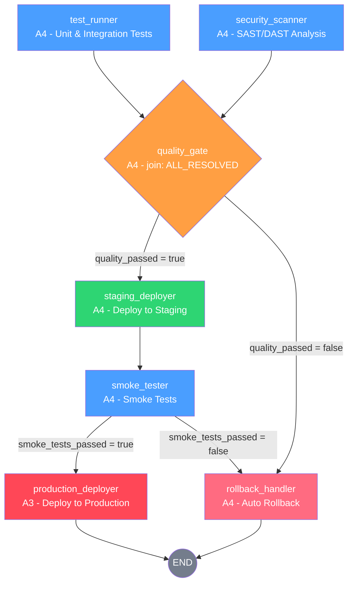

# Autonomous CI/CD Pipeline

A fully autonomous CI/CD pipeline agent that handles testing, security scanning, and deployment decisions with automatic rollback on failure.

## Overview

This pipeline orchestrates 7 agents across a directed graph workflow with parallel execution and conditional branching. It runs tests and security scans in parallel, evaluates quality gates, deploys through staging to production, and automatically rolls back on failure.

## Agents

| Agent | Autonomy | Purpose |
|-------|----------|---------|
| `test_runner` | A4 (full) | Runs unit and integration tests |
| `security_scanner` | A4 (full) | SAST/DAST security analysis |
| `quality_gate` | A4 (full) | Evaluates test + security results |
| `staging_deployer` | A4 (full) | Deploys to staging environment |
| `smoke_tester` | A4 (full) | Runs smoke tests on staging |
| `production_deployer` | A3 (approval) | Deploys to production (requires human approval) |
| `rollback_handler` | A4 (full) | Auto-rollback on any failure |

## Workflow



### Key Design Points

- **Parallel execution**: `test_runner` and `security_scanner` run simultaneously
- **Fan-in synchronization**: `quality_gate` uses `join_policy: ALL_RESOLVED` to wait for both parallel branches
- **Conditional branching**: Quality gate and smoke tests branch to rollback on failure
- **Human-in-the-loop**: Only `production_deployer` (A3) requires human approval; all other agents are fully autonomous (A4)
- **Automatic rollback**: `rollback_handler` is reachable from two failure points (quality gate failure, smoke test failure)

## Policy Guardrails

| Guardrail | Value |
|-----------|-------|
| Max cost | $2.00 USD |
| Max duration | 45 minutes |
| Approval threshold | A3+ |
| Audit log | Required |

### Blocked Actions

Dangerous commands are blocked at the policy level:
- `kubectl delete namespace production`
- `kubectl delete namespace staging`
- `helm uninstall --no-hooks`
- `git push --force`
- `rm -rf /`
- `docker system prune -af`

## Usage

```bash
pylon run examples/autonomous-cicd-pipeline/pylon.yaml
```

## Goal

> Safely deploy the application to production with zero-downtime, ensuring all tests pass and no security vulnerabilities are present.

### Success Criteria

1. All unit and integration tests pass with >= 95% pass rate
2. Code coverage >= 80%
3. No critical or high severity security vulnerabilities
4. Staging smoke tests pass within acceptable latency thresholds
5. Production deployment completes with zero-downtime
