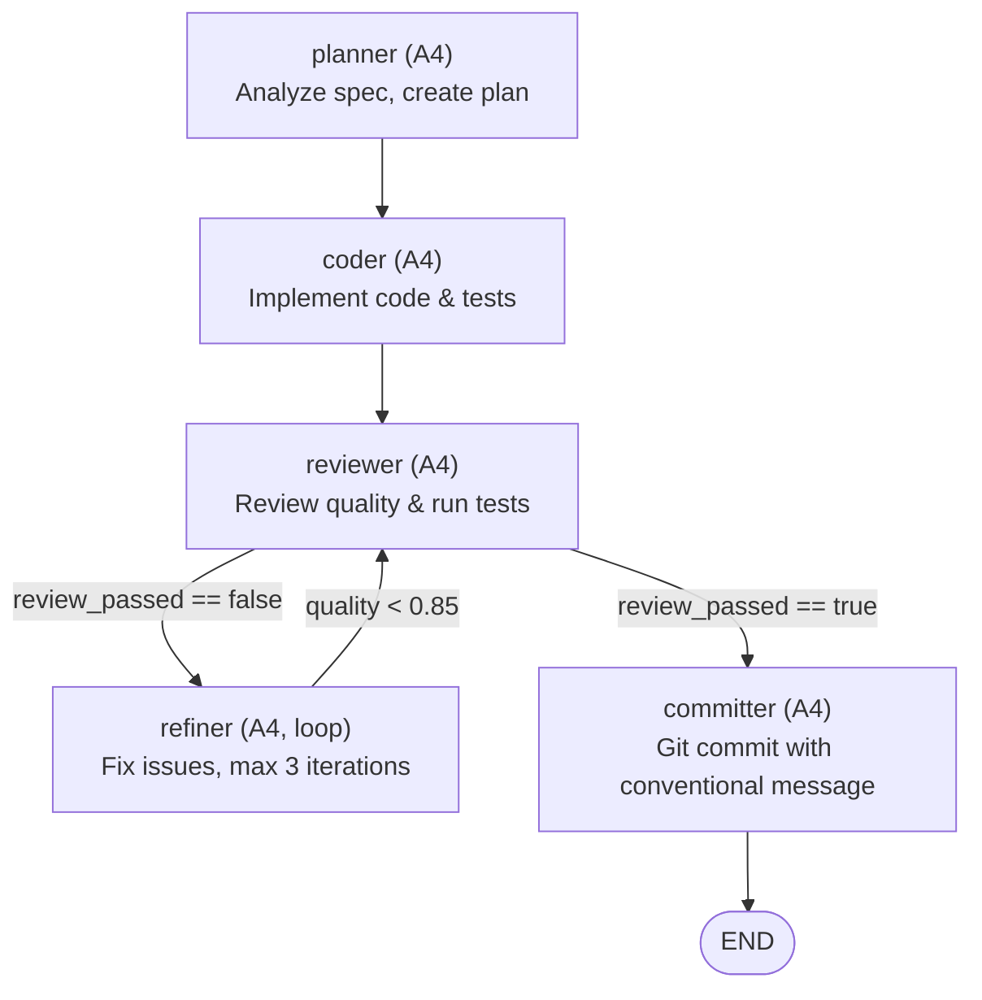

# Autonomous Coding Agent (A4)

A fully autonomous Pylon pipeline that implements a feature from a specification
without human intervention. The agents plan, code, review, refine, and commit
production-quality code end-to-end.

## Workflow DAG



## Agents

| Agent | Autonomy | Tools | Purpose |
|-------|----------|-------|---------|
| `planner` | A4 | `read_file`, `list_files` | Analyze spec, produce implementation plan |
| `coder` | A4 | `read_file`, `write_file`, `list_files` | Write code and tests |
| `reviewer` | A4 | `read_file`, `list_files`, `run_tests` | Review code quality, run test suite |
| `refiner` | A4 | `read_file`, `write_file`, `list_files`, `run_tests` | Iterative fixes based on review feedback |
| `committer` | A4 | `git_diff`, `git_commit` | Create conventional commit |

## How It Works

1. **Plan** -- The planner reads the feature spec and breaks it down into files,
   functions, and test cases.
2. **Implement** -- The coder writes the code and unit tests following the plan.
3. **Review** -- The reviewer checks code quality, runs the test suite, and
   produces a pass/fail verdict with feedback.
4. **Refine** (loop) -- If the review fails, the refiner addresses the feedback.
   This loops back to review, up to 3 iterations or until quality reaches 0.85.
5. **Commit** -- Once the review passes, the committer creates a git commit with
   a conventional commit message.

## Guardrails

- **Cost cap**: $5.00 USD
- **Time cap**: 30 minutes
- **Max file changes**: 30
- **Max refinement loops**: 3 iterations
- **Blocked actions**: `git push --force`, `git branch -D main`, `rm -rf /`
- **Failure policy**: escalate (notifies operator on unrecoverable failure)
- **Sandbox**: All agents run in gvisor isolation

## Running This Example

```bash
# Run with a feature spec file as input
pylon run examples/autonomous-coding-agent/pylon.yaml \
  --input spec=./feature-spec.md

# Run with inline spec
pylon run examples/autonomous-coding-agent/pylon.yaml \
  --input spec="Add a /health endpoint that returns JSON {status: ok}"

# Dry run (validate the pipeline without executing)
pylon validate examples/autonomous-coding-agent/pylon.yaml
```

## Customization

- Adjust `loop_max_iterations` and `loop_threshold` in the `refine` node to
  control how aggressively the pipeline pursues quality.
- Change `policy.max_cost_usd` and `goal.constraints.timeout` for larger
  features that need more budget.
- Set `failure_policy: request_approval` if you want a human gate on failures
  instead of automatic escalation.
