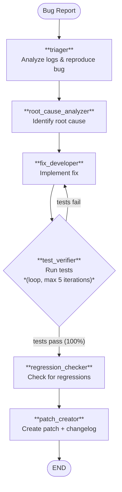

# Autonomous Debugging Swarm

A fully autonomous debugging pipeline that diagnoses and fixes production bugs through multi-agent collaboration with iterative refinement loops.

## Overview

Given a bug report or error log, six specialized agents collaborate in sequence to triage, analyze, fix, verify, and patch the issue — without human intervention.

| Agent | Role | Tools |
|-------|------|-------|
| **triager** | Analyzes logs, reproduces the bug | `read_logs`, `search_code`, `reproduce_bug` |
| **root_cause_analyzer** | Deep analysis to identify root cause | `read_file`, `search_code`, `git_log` |
| **fix_developer** | Implements the minimal correct fix | `read_file`, `write_file` |
| **test_verifier** | Runs tests in a loop (up to 5x) | `run_tests`, `read_file` |
| **regression_checker** | Checks for side effects | `run_tests`, `git_diff` |
| **patch_creator** | Produces a merge-ready patch | `git_diff`, `write_file` |

## Workflow



## Key Design Decisions

### Iterative Test Loop

The `test_verifier` node is configured as a `loop` node with:

- **`loop_max_iterations: 5`** — prevents infinite fix-test cycles
- **`loop_criterion: test_pass`** — evaluates test pass rate each iteration
- **`loop_threshold: 1.0`** — requires 100% test pass to exit the loop

If tests fail, the loop feeds back to the fix developer for another attempt. After 5 failed iterations, the pipeline escalates per `failure_policy: escalate`.

### Safety Guardrails

- **`max_file_changes: 20`** — debugging fixes should be small and focused
- **Blocked actions** — prevents force pushes, branch deletions, and destructive operations
- **`max_cost_usd: 8.0`** — cost ceiling for the entire pipeline run
- **`audit_log: required`** — full audit trail for compliance

### Success Criteria

The pipeline succeeds only when all three conditions are met:

1. **`test_pass`** (threshold: 1.0) — all tests pass
2. **`regression_free`** (threshold: 1.0) — no regressions detected
3. **`root_cause_identified`** (threshold: 0.9) — root cause clearly documented

## Usage

```bash
pylon run --project examples/autonomous-debugging-swarm/pylon.yaml \
  --input '{"bug_report": "Users report 500 errors on /api/orders endpoint after deploy v2.3.1"}'
```

## Constraints

| Parameter | Value |
|-----------|-------|
| Max iterations | 30 |
| Max cost | $8.00 |
| Timeout | 45 minutes |
| Max replans | 5 |
| Failure policy | escalate |
| All agents | A4 (fully autonomous) |
