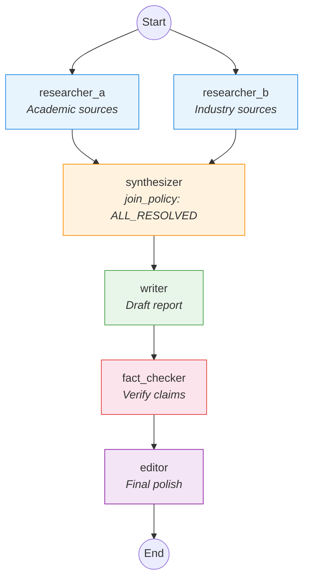

# Autonomous Research Report Pipeline

A fully autonomous (A4) multi-agent example that researches a topic from
academic and industry sources, synthesizes findings, and produces a
publication-ready report.

## Architecture

Six specialised agents collaborate in a DAG workflow with parallel fan-out
at the research stage and a sequential editorial pipeline.



## Agents

| Agent | Autonomy | Role |
|-------|----------|------|
| `researcher_a` | A4 | Searches academic databases and journals |
| `researcher_b` | A4 | Searches industry reports and whitepapers |
| `synthesizer` | A4 | Merges and reconciles findings from both researchers |
| `writer` | A4 | Writes the structured research report |
| `fact_checker` | A4 | Verifies every claim and citation |
| `editor` | A4 | Final grammar, style, and formatting pass |

## Guardrails

- **Cost cap**: $3.00 USD
- **Timeout**: 20 minutes
- **Max iterations**: 15
- **Factual accuracy threshold**: 95%
- **Coverage threshold**: 80%
- **Effect scope**: agents may only write under `report/`
- **Audit log**: required

## Usage

```bash
pylon run --file pylon.yaml --input "topic: Large Language Model Alignment"
```
