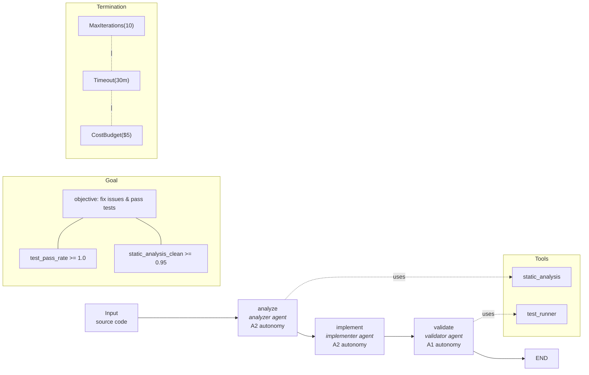

# Autonomous SDK Usage Example

End-to-end demonstration of Pylon's Python SDK for defining and running fully autonomous agent workflows.

## Sections

### Section 1 -- Decorator-based workflow definition

Uses `@agent`, `@tool`, and `@workflow` decorators to register handlers in global registries. Decorated functions are automatically discovered when a project is materialized for execution.

- Three agents: **analyzer**, **implementer**, **validator**
- Two tools: **static_analysis**, **test_runner**
- One workflow: **code-review-pipeline**

### Section 2 -- Programmatic project definition

Builds a `PylonProject` entirely in Python using DSL models (`AgentDef`, `WorkflowDef`, `WorkflowNodeDef`, `GoalDef`, `GoalCriterionDef`, `GoalConstraintsDef`, `PolicyDef`, `SafetyDef`). This is equivalent to writing a `pylon.yaml` file but constructed programmatically for dynamic or generated workflows. The project is serialized via `model_dump(mode="json")`.

### Section 3 -- Direct in-process execution

Compiles a project into a `WorkflowGraph` with `compile_project_graph()` and executes it synchronously with `execute_project_sync()`. Custom node handlers substitute for real LLM calls, making the example runnable without API keys. The result provides access to the run status, checkpoints, and approvals.

### Section 4 -- HTTP client usage

Shows `PylonHTTPClient` connecting to a remote Pylon server. Demonstrates the full control-plane API surface: project registration, workflow runs, approval management, checkpoint replay, and observability headers (`last_trace_id`, `last_request_id`).

### Section 5 -- Autonomy and termination primitives

Composes `GoalSpec` with `SuccessCriterion` and `GoalConstraints`. Demonstrates composable termination conditions using `|` (any-of) and `&` (all-of) operators across `MaxIterations`, `Timeout`, `CostBudget`, and `QualityThreshold`. Configures a `ModelRouter` with custom `ModelProfile` entries and routes requests based on latency sensitivity, quality requirements, and remaining budget.

## Workflow architecture



## Running

```bash
# Sections 1-3 and 5 run without a server
python examples/autonomous-sdk-usage/main.py

# Section 4 requires a running Pylon server (illustrative only)
```

## Key imports

| Section | Primary imports |
|---------|----------------|
| 1 | `pylon.sdk.decorators.agent`, `tool`, `workflow` |
| 2 | `pylon.dsl.parser.PylonProject`, `AgentDef`, `WorkflowDef`, `GoalDef` |
| 3 | `pylon.runtime.execution.compile_project_graph`, `execute_project_sync` |
| 4 | `pylon.sdk.http_client.PylonHTTPClient` |
| 5 | `pylon.autonomy.GoalSpec`, `MaxIterations`, `Timeout`, `CostBudget`, `ModelRouter` |
